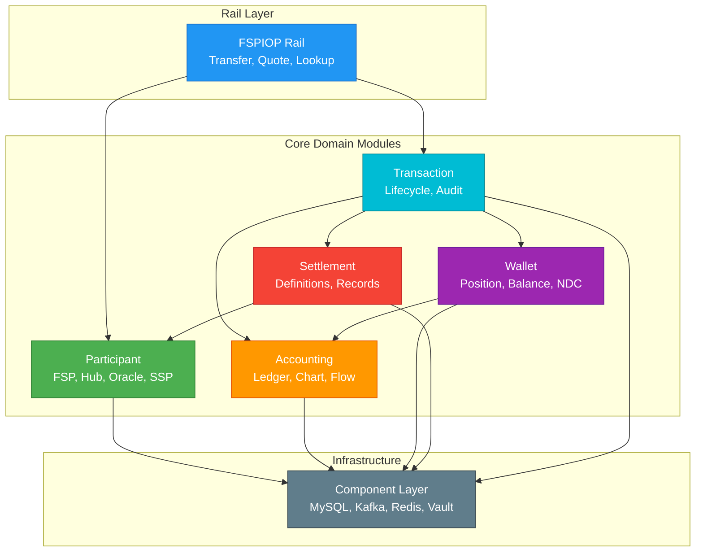

# Mojave

<div align="center">

**A Production-Ready Instant Payment Switch**

[](https://openjdk.java.net/)
[](https://spring.io/projects/spring-boot)
[](LICENSE)
[](https://mojaloop.io/)

*Open-source, interoperable payment infrastructure implementing FSPIOP v2.0*

[Documentation](docs/README.md) • [Architecture](docs/technical/01-architecture/high-level-architecture.md) • [Getting Started](#getting-started) • [Contributing](#contributing)

</div>

---

## Overview

**Mojave** is an enterprise-grade instant payment switch that enables real-time, irrevocable fund transfers between financial institutions. Built with modern Java technologies and clean architecture principles, Mojave provides a robust foundation for implementing national or regional instant payment systems.

Inspired by [Mojaloop](https://mojaloop.io/), Mojave implements the **FSPIOP v2.0** (Financial Services Provider Interoperability Protocol) specification with plans to support **ISO 20022** messaging standards.

### Key Features

✅ **Real-Time Processing** - Sub-second transaction execution with immediate finality
✅ **Multi-FSP Support** - Connect banks, mobile money operators, and fintech providers
✅ **Double-Entry Accounting** - Complete ledger with audit trails and balance tracking
✅ **Liquidity Management** - Position tracking with Net Debit Cap (NDC) enforcement
✅ **Flexible Settlement** - Support for DFN, CGS, and RTGS settlement models
✅ **FSPIOP v2.0 Compliant** - Full implementation of party lookup, quoting, and transfers
✅ **Event-Driven Architecture** - Kafka-based messaging for scalability
✅ **Production-Ready** - Battle-tested patterns with comprehensive security

---

## Architecture

Mojave follows Domain-Driven Design (DDD) and Hexagonal Architecture principles, organized into **83 modules** across **7 categories**:



### Core Modules

| Module | Purpose | Admin API | Intercom API |
|--------|---------|-----------|--------------|
| **Participant** | FSP/Hub/Oracle/SSP management | `/participant/*` | `/participant-intercom/*` |
| **Accounting** | Double-entry ledger | `/accounting/*` | `/accounting-intercom/*` |
| **Wallet** | Position/balance tracking | `/wallet/*` | `/wallet-intercom/*` |
| **Settlement** | Settlement processing | `/settlement/*` | `/settlement-intercom/*` |
| **Transaction** | Transaction lifecycle | `/transaction/*` | `/transaction-intercom/*` |

📖 [Complete Architecture Documentation](docs/technical/01-architecture/high-level-architecture.md)

---

## Technology Stack

### Core Technologies
- **Java 25** - Modern Java with records, pattern matching, and virtual threads
- **Spring Boot 4.0.2** - Enterprise application framework
- **Maven** - Multi-module build system (83 modules)

### Data & Messaging
- **MySQL** - Primary data store with read/write splitting
- **Apache Kafka** - Event streaming and cross-module messaging
- **Redis (Redisson)** - Distributed caching with multi-tier strategy
- **Flyway** - Database migrations and versioning

### Security & Operations
- **HashiCorp Vault** - Secrets management
- **JWS Signatures** - FSPIOP request authentication
- **Retrofit** - Type-safe HTTP client for inter-service communication

---

## Getting Started

### Prerequisites

- **Java 25** or higher
- **Maven 3.9+**
- **Docker & Docker Compose** (for infrastructure)
- **MySQL 8.0+**
- **Apache Kafka 3.x**
- **Redis 7.x**

### Quick Start

```bash
# Clone the repository
git clone https://github.com/yourusername/mojave.git
cd mojave

# Start infrastructure services
docker-compose up -d

# Build the project
mvn clean install

# Run a specific module (e.g., Accounting Admin)
cd modules/core/accounting/admin
mvn spring-boot:run

# Or run the mono module (all services)
cd modules/operation/mono
mvn spring-boot:run
```

### Service Ports

| Service | Admin Port | Intercom Port | Service Port |
|---------|-----------|---------------|--------------|
| Accounting | 4101 | 4102 | - |
| Wallet | 4801 | 4802 | 4803 |
| Participant | 4101 | 4102 | - |
| Settlement | 4401 | 4402 | - |
| Transaction | 4301 | 4302 | - |
| FSPIOP Lookup | - | - | 4503 |
| FSPIOP Quoting | - | - | 4603 |
| FSPIOP Transfer | - | - | 4703 |

---

## Documentation

### For Business Stakeholders

📘 **[Product Documentation](docs/product/README.md)**
- [What is an Instant Payment System?](docs/product/01-overview/instant-payment-concept.md)
- [Mojave Introduction](docs/product/01-overview/mojave-introduction.md)
- [Core Concepts](docs/product/02-core-concepts/)
- [Features by Module](docs/product/03-features/)
- [FSPIOP v2.0 Implementation](docs/product/04-payment-specifications/fspiop-v2-implementation.md)

### For Developers

🔧 **[Technical Documentation](docs/technical/README.md)**
- [High-Level Architecture](docs/technical/01-architecture/high-level-architecture.md)
- [Module Structure](docs/technical/01-architecture/module-structure.md)
- [Bounded Contexts (DDD)](docs/technical/01-architecture/bounded-contexts.md)
- [Hexagonal Architecture](docs/technical/01-architecture/hexagonal-architecture.md)
- [Complete Transfer Flow](docs/technical/03-flows/transfer-flow.md)
- [Core Module Deep Dives](docs/technical/02-core-modules/)

### Quick Links

- 🏗️ [Architecture Overview](docs/product/01-overview/architecture-overview.md)
- 💰 [Accounting Model](docs/product/02-core-concepts/accounting-model.md)
- 💼 [Wallet & Positions](docs/product/02-core-concepts/wallet-and-positions.md)
- 🤝 [Participants & Roles](docs/product/02-core-concepts/participants-and-roles.md)
- 📊 [Settlement Framework](docs/product/02-core-concepts/settlement-framework.md)

---

## Project Structure

```
mojave/
├── docs/                          # Comprehensive documentation
│   ├── product/                   # Business-focused documentation
│   └── technical/                 # Developer-focused documentation
├── modules/                       # Source code (83 modules)
│   ├── component/                 # Infrastructure layer
│   ├── core/                      # Domain contexts
│   │   ├── accounting/
│   │   ├── wallet/
│   │   ├── participant/
│   │   ├── settlement/
│   │   └── transaction/
│   ├── rail/                      # Protocol implementations
│   │   └── fspiop/
│   ├── provider/                  # Storage implementations
│   ├── connector/                 # External integrations
│   ├── operation/                 # Admin operations
│   └── scheme/                    # Protocol definitions
├── assets/                        # Code styles and resources
├── docker-compose.yml             # Infrastructure setup
└── pom.xml                        # Parent POM
```

---

## Use Cases

### Person-to-Person (P2P) Transfers
Alice at Bank A sends money to Bob at Bank B instantly through the Mojave switch with immediate confirmation.

### Merchant Payments
Customers pay merchants at point of sale with instant settlement and real-time confirmation.

### Bulk Disbursements
Government agencies or employers process salary payments with individual instant transfers to multiple recipients.

### Bill Payments
Automated recurring payments to utility companies with instant credit and confirmation.

---

## FSPIOP Protocol Support

Mojave fully implements FSPIOP v2.0 specification:

### ✅ Implemented Flows

- **Party Lookup** - `GET /participants`, `GET /parties`
- **Quoting** - `POST /quotes`, `PUT /quotes`
- **Transfer Processing** - `POST /transfers`, `PUT /transfers`
- **Error Handling** - Complete error code support
- **Security** - JWS signature verification
- **Idempotency** - Duplicate request handling

### 🔜 Roadmap

- **ISO 20022** messaging standard support
- **Bulk transfers** optimization
- **FX providers** integration
- **Advanced reporting** and analytics

---

## Development

### Build Commands

```bash
# Build all modules
mvn clean install

# Build specific module
mvn clean install -pl modules/core/accounting/admin -am

# Run tests
mvn test

# Skip tests
mvn clean install -DskipTests

# Run specific service
cd modules/core/accounting/admin
mvn spring-boot:run
```

### Code Standards

- **CQRS Pattern** - Clear separation of commands and queries
- **Validation by Construction** - Use `Objects.requireNonNull()` at construction
- **Strongly-Typed IDs** - Custom types extending `EntityId<Long>`
- **Hexagonal Architecture** - Port and adapters pattern per module
- **Event-Driven** - Kafka for cross-context communication

### Testing

```bash
# Run all tests
mvn test

# Run tests for specific module
cd modules/core/accounting
mvn test

# Integration tests
mvn verify
```

---

## Specifications

### Current Implementation
- **FSPIOP v2.0** - Full protocol implementation
- **REST APIs** - OpenAPI/Swagger documented
- **Event Streaming** - Kafka-based messaging
- **JWS Security** - Request signature verification

### Planned Support
- **ISO 20022** - International messaging standard
- **API Versioning** - Multiple protocol versions
- **GraphQL APIs** - Alternative query interface
- **gRPC** - High-performance RPC

---

## Contributing

We welcome contributions from the community!

### How to Contribute

1. **Report Issues** - Open an issue for bugs or feature requests
2. **Submit PRs** - Fork the repo, create a feature branch, and submit a pull request
3. **Improve Documentation** - Help us improve our docs
4. **Share Feedback** - Tell us about your experience using Mojave

### Development Guidelines

- Follow existing code style (see `assets/codestyle/`)
- Write tests for new features
- Update documentation for API changes
- Use conventional commit messages
- Ensure CI/CD checks pass

### Areas for Contribution

- 🐛 Bug fixes and improvements
- 📚 Documentation enhancements
- ✨ New features (check roadmap)
- 🧪 Test coverage improvements
- 🌐 Internationalization
- 📊 Performance optimizations

---

## Community & Support

### Resources

- 📖 [Documentation](docs/README.md)
- 🏗️ [Architecture Assessment](modules/Mojave_Architecture_Assessment.md)
- 🔍 [FSPIOP Specification](modules/scheme/fspiop/interface/fspiop_v2.0.yaml)
- 🌐 [Mojaloop Project](https://mojaloop.io/)

### Get Help

- Open an [issue](https://github.com/yourusername/mojave/issues) for bugs or questions
- Check [existing documentation](docs/README.md)
- Review [architecture documentation](docs/technical/README.md)

---

## License

Mojave is licensed under the **Apache License 2.0**.

```
Copyright (C) 2025 Open Source

Licensed under the Apache License, Version 2.0 (the "License");
you may not use this file except in compliance with the License.
You may obtain a copy of the License at

    http://www.apache.org/licenses/LICENSE-2.0

Unless required by applicable law or agreed to in writing, software
distributed under the License is distributed on an "AS IS" BASIS,
WITHOUT WARRANTIES OR CONDITIONS OF ANY KIND, either express or implied.
See the License for the specific language governing permissions and
limitations under the License.
```

See the [LICENSE](LICENSE) file for full details.

---

## Acknowledgments

- **Mojaloop** - Inspiration and FSPIOP protocol
- **Spring Community** - Framework and ecosystem
- **Open Source Contributors** - Community support and contributions

---

<div align="center">

**Built with ❤️ for the instant payment community**

[⬆ Back to Top](#mojave)

</div>
