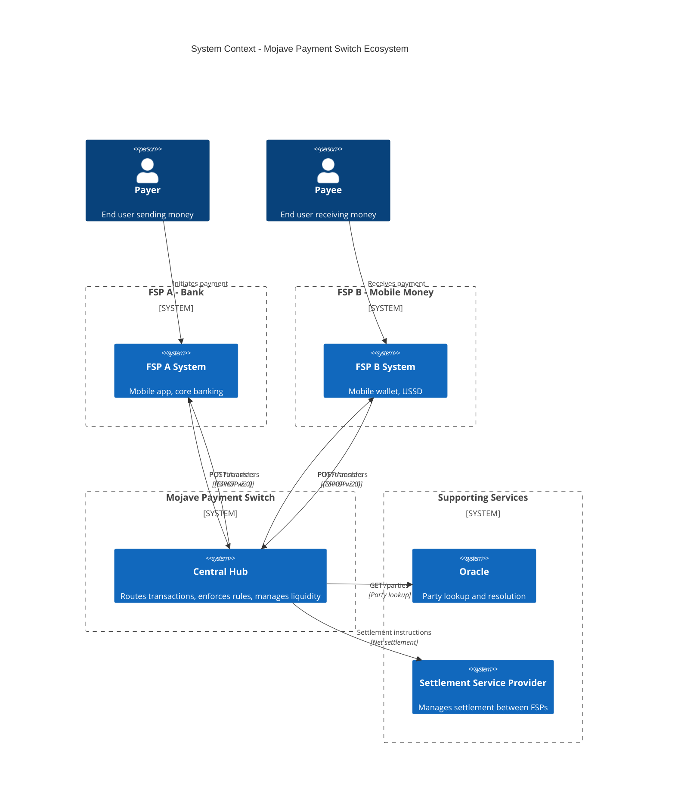
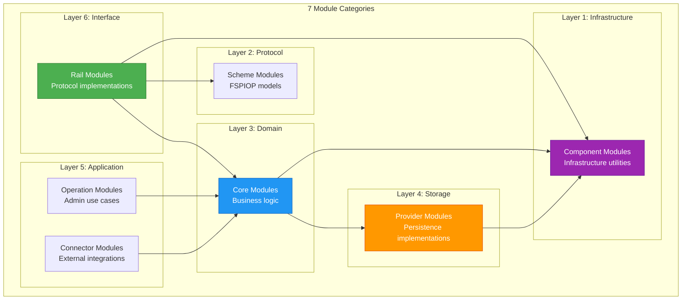
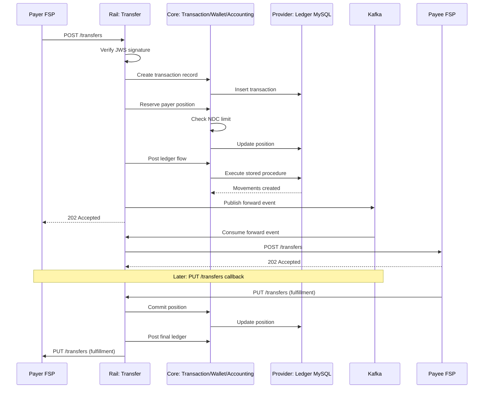
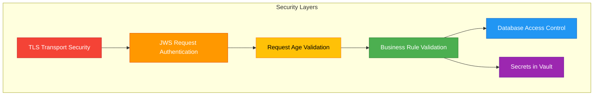

# Architecture Overview

## Overview

Mojave's architecture is built on Domain-Driven Design principles with clear separation between infrastructure, domain logic, and protocol implementations. The system consists of 83 modules organized into 7 categories, creating a flexible, maintainable payment switch that can scale from development to production environments.

## High-Level System Components



## Participant Roles

### Hub (Central Switch)
The central payment switch that orchestrates all transactions:

**Responsibilities:**
- Route transfers between FSPs
- Validate transaction requests
- Enforce business rules (NDC limits, overdraft checks)
- Manage participant liquidity positions
- Coordinate settlement
- Maintain complete audit trail
- Provide transaction tracking

**Capabilities:**
- Multi-currency support
- Real-time position management
- Double-entry accounting
- Settlement provider matching
- Event-driven architecture

### Financial Service Provider (FSP)
Banks, mobile money operators, fintech companies, and other financial institutions:

**Responsibilities:**
- Maintain customer accounts
- Execute debits and credits
- Implement FSPIOP protocol
- Maintain liquidity in the hub
- Handle customer-facing operations

**Integration Points:**
- **Inbound**: Receive transfers, quotes from hub
- **Outbound**: Send transfers, quotes to hub
- **Lookup**: Party resolution requests
- **Settlement**: Receive settlement instructions

### Oracle
Directory service for party lookup and resolution:

**Responsibilities:**
- Map identifiers (phone, email, account) to FSP
- Provide party information
- Enable cross-FSP discovery
- Support multiple identifier types

**Integration:**
- Hub queries oracle for party lookup
- Oracle returns FSP routing information
- Cached for performance

### Settlement Service Provider (SSP)
Manages settlement of net positions between FSPs:

**Responsibilities:**
- Provide settlement accounts
- Execute settlement instructions
- Support multiple settlement models
- Provide settlement confirmations

**Settlement Types:**
- **DFN**: Deferred Net Settlement
- **CGS**: Continuous Gross Settlement
- **RTGS**: Real-Time Gross Settlement

## Module Categories

Mojave's 83 modules are organized into 7 logical categories, each serving a specific architectural purpose:



### 1. Component Modules (Infrastructure)
Foundation infrastructure shared across all modules:

| Module | Purpose | Key Features |
|--------|---------|--------------|
| **flyway** | Database migrations | Versioned schema changes, stored procedures |
| **jpa** | Persistence framework | Read/write splitting, HikariCP, entity mappings |
| **kafka** | Message streaming | Producer/consumer factories, JSON serialization |
| **redis** | Caching layer | Redisson client, LZ4 compression, dual-client setup |
| **vault** | Secrets management | HashiCorp Vault integration, KV v2 engine |
| **misc** | Utilities | Crypto, JWT, DDD base classes, event publishing |
| **web** | HTTP utilities | REST controllers, error handling |

### 2. Scheme Modules (Protocol Definitions)
Protocol models and specifications:

| Module | Purpose |
|--------|---------|
| **fspiop** | FSPIOP v2.0 OpenAPI models generated from specification |

### 3. Core Modules (Domain Bounded Contexts)
Business logic organized by bounded context:

| Module | Bounded Context | Key Aggregates |
|--------|----------------|----------------|
| **participant** | Participant management | Fsp, Hub, Oracle, Ssp, FspCurrency, FspEndpoint |
| **accounting** | Double-entry ledger | Chart, Account, FlowDefinition, PostingDefinition |
| **wallet** | Position & balance | Position, Balance, PositionUpdate |
| **settlement** | Settlement rules | SettlementDefinition, FilterGroup, SettlementRecord |
| **transaction** | Transaction lifecycle | Transaction, TransactionStep |
| **common** | Shared datatypes | Identifiers, enumerations, value objects |

Each core module follows hexagonal architecture:
- **contract/**: API contracts, commands, queries
- **domain/**: Entities, value objects, business logic
- **admin/**: Administrative REST APIs
- **intercom/**: Service-to-service APIs
- **producer/**: Kafka event publishers
- **consumer/**: Kafka event listeners
- **store/**: Read-optimized caching
- **admin-client/**: Client libraries

### 4. Provider Modules (Storage Implementations)
Concrete implementations of storage interfaces:

| Module | Purpose | Implementation |
|--------|---------|----------------|
| **ledger-mysql** | Ledger persistence | MySQL stored procedures for atomic posting |
| **forex** | Exchange rates | Foreign exchange rate provider |
| **settlement** | Settlement storage | Settlement record persistence |

### 5. Operation Modules (Administrative Use Cases)
Administrative and operational workflows:
- System configuration
- Participant onboarding
- Monitoring and reporting
- Data management

### 6. Connector Modules (External Integrations)
Integration with external systems:

| Module | Purpose |
|--------|---------|
| **adapter** | Protocol adapters for non-FSPIOP systems |
| **gateway** | API gateway functionality |

### 7. Rail Modules (Protocol Implementations)
FSPIOP protocol service implementations:

| Module | FSPIOP Flow | Endpoints |
|--------|-------------|-----------|
| **lookup** | Party lookup | GET/PUT /participants, GET/PUT /parties |
| **quoting** | Quote request | POST/PUT /quotes |
| **transfer** | Transfer processing | POST/PUT /transfers |

Each rail module includes:
- **bootstrap/**: Controllers, security, configuration
- **component/**: FSPIOP-specific utilities (headers, signatures)
- **contract/**: Command interfaces
- **domain/**: Command handlers and orchestration

## How Modules Compose Together

### Transaction Flow Example

Here's how modules interact during a transfer:



### Key Integration Patterns

#### 1. Command Pattern
Core modules expose commands as interfaces:
```java
public interface ReservePositionCommand {
    Output execute(Input input);
}
```

Rails and operations invoke these commands, keeping domain logic isolated.

#### 2. Event Publishing
Modules publish events to Kafka for asynchronous processing:
- Transaction state changes
- Position updates
- Accounting movements
- Settlement triggers

#### 3. Caching Strategy
Redis cache sits between core logic and database:
- **AccountCache**: Chart of accounts lookup
- **FlowDefinitionCache**: Transaction type → flow mappings
- **ParticipantStore**: FSP endpoint and currency data

#### 4. Database Read/Write Splitting
JPA routing aspect directs:
- **Writes**: Primary database
- **Reads**: Replica databases (when annotated with `@Read`)

## Communication Patterns

### Synchronous Communication
- **REST APIs**: FSPIOP protocol, admin interfaces
- **Direct method calls**: Within same JVM process
- **Database queries**: JPA repositories

### Asynchronous Communication
- **Kafka topics**: Cross-context events
- **Message publishing**: Fire-and-forget event emission
- **Consumer listeners**: Event-driven processing

### Data Storage
- **MySQL**: Source of truth for all entities
- **Redis**: Caching frequently accessed data
- **Kafka**: Event log and message broker

## Port Allocation Strategy

Mojave uses a systematic port allocation scheme:

### Admin APIs (8000-8999)
Management and administrative interfaces:
- **8001**: Participant admin
- **8002**: Accounting admin
- **8003**: Wallet admin
- **8004**: Settlement admin
- **8005**: Transaction admin

### Intercom APIs (9000-9999)
Service-to-service communication:
- **9001**: Participant intercom
- **9002**: Accounting intercom
- **9003**: Wallet intercom
- **9004**: Settlement intercom
- **9005**: Transaction intercom

### Rail Services (10000+)
FSPIOP protocol endpoints:
- **10001**: Lookup service
- **10002**: Quoting service
- **10003**: Transfer service

## Deployment Architecture

### Development Environment
Single JVM running all modules:
- Simplified debugging
- Fast development cycle
- Reduced resource requirements

### Production Environment
Options for deployment:

#### Option 1: Modular Monolith
- Deploy all modules together
- Single deployment unit
- Shared JVM and resources
- Simpler operations

#### Option 2: Selective Services
- Deploy core as one service
- Deploy each rail separately
- Scale rails independently
- More operational complexity

#### Option 3: Full Microservices
- Deploy each bounded context separately
- Maximum scalability
- Highest operational complexity
- Requires service mesh

## Scalability Considerations

### Horizontal Scaling
- **Stateless design**: All modules are stateless
- **Kafka partitioning**: Partition by entity ID for ordering
- **Database connection pooling**: HikariCP optimization
- **Redis clustering**: Distributed cache

### Vertical Scaling
- **JVM tuning**: Heap size, GC configuration
- **Connection pools**: Sized for workload
- **Thread pools**: Kafka consumer threads

### Performance Optimizations
- **Stored procedures**: Atomic ledger operations in database
- **Caching**: Reduce database load
- **Read replicas**: Scale read operations
- **Batch processing**: Settlement and reporting

## Security Architecture

### Defense in Depth



### Security Controls
1. **Transport**: TLS 1.3 for all communications
2. **Authentication**: JWS signatures on FSPIOP requests
3. **Authorization**: FSP source/destination validation
4. **Secrets**: HashiCorp Vault for keys and credentials
5. **Replay Protection**: Request age verification
6. **Audit**: Complete transaction trail

## Technology Decisions

### Why Java 25?
- Modern language features (records, pattern matching, text blocks)
- Strong type safety
- Mature ecosystem
- Excellent tooling
- Production-proven performance

### Why MySQL?
- ACID guarantees for financial transactions
- Stored procedure support for atomic operations
- Wide operational expertise
- Excellent replication support

### Why Kafka?
- High-throughput event streaming
- Reliable message delivery
- Event log persistence
- Horizontal scalability

### Why Redis?
- Microsecond latency for cache hits
- Rich data structures
- Cluster support
- Wide adoption

### Why Hexagonal Architecture?
- Clean separation of concerns
- Testable business logic
- Technology independence
- Clear dependency direction

## See Also

- [Mojave Introduction](mojave-introduction.md) - Project overview and goals
- [Instant Payment Concept](instant-payment-concept.md) - IIPS fundamentals
- [High-Level Architecture](../../technical/01-architecture/high-level-architecture.md) - Detailed technical architecture
- [Module Structure](../../technical/01-architecture/module-structure.md) - Module organization details
- [Participants and Roles](../02-core-concepts/participants-and-roles.md) - Detailed participant information
