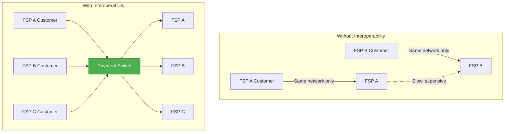
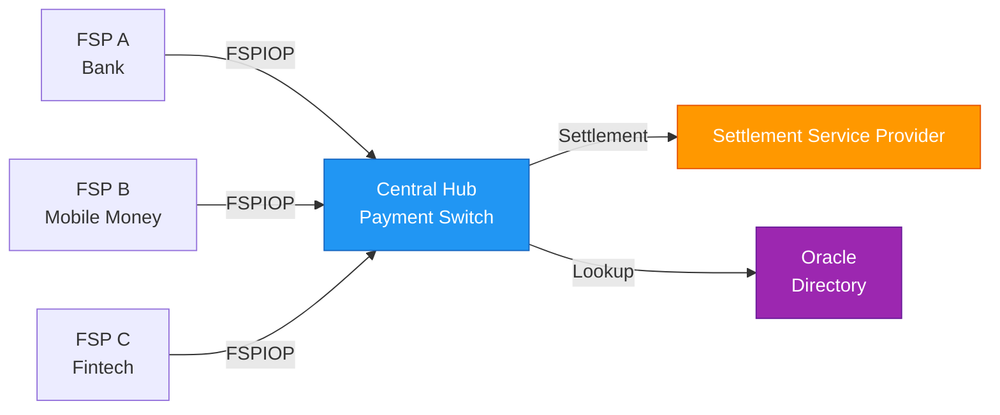

# Instant Payment Concept

## Overview

An **Interoperable Instant Payment System (IIPS)** enables real-time, irrevocable fund transfers between financial institutions with immediate availability to the recipient. Mojave implements this concept through the FSPIOP v2.0 protocol, providing a production-ready payment switch infrastructure.

## What is Instant Payment?

Instant payment systems provide three core characteristics:

### 1. Real-Time Processing
- Payments are processed immediately upon submission
- No batch windows or delayed settlement
- 24/7/365 availability
- Sub-second transaction completion

### 2. Immediate Finality
- Funds are irrevocably transferred once confirmed
- No reversal or chargeback mechanisms
- Recipient has immediate access to funds
- Reduces counterparty risk

### 3. Direct Account-to-Account
- Transfers directly between accounts
- No intermediate holding or escrow
- Full transparency of transaction status
- Real-time position updates

## The Need for Interoperability

Traditional payment systems often operate in silos, where:
- Each Financial Service Provider (FSP) has its own closed network
- Customers can only send money within the same provider
- Cross-provider transfers require slow, expensive correspondent banking
- Limited financial inclusion for underserved populations

### Interoperability Benefits



Interoperable systems provide:

1. **Universal Reach**: Send money to any account at any participating FSP
2. **Cost Efficiency**: Shared infrastructure reduces per-transaction costs
3. **Competition**: Level playing field for all FSPs regardless of size
4. **Financial Inclusion**: Smaller FSPs can participate in national payment systems
5. **Innovation**: Standard protocols enable new services and use cases

## IIPS Architecture Components

An interoperable instant payment system consists of several key components:

### Central Payment Switch (Hub)
- Routes transactions between FSPs
- Enforces business rules and policies
- Provides audit and compliance capabilities
- Manages liquidity and settlement

### Financial Service Providers (FSPs)
- Banks, mobile money operators, fintech companies
- Connect to the hub via standard protocols
- Maintain customer accounts
- Execute debits and credits

### Settlement Service Providers (SSPs)
- Handle net settlement between FSPs
- Provide settlement accounts
- Support different settlement models (DFN, CGS, RTGS)

### Oracles
- Resolve party identifiers across FSPs
- Enable lookup by phone number, email, etc.
- Provide directory services



## How Mojave Implements IIPS

Mojave provides a complete instant payment switch implementation:

### Core Capabilities

1. **Participant Management**
   - FSP onboarding and lifecycle
   - Multi-currency support per FSP
   - Endpoint configuration and routing

2. **Real-Time Accounting**
   - Double-entry ledger for all transactions
   - Configurable chart of accounts
   - Atomic posting with MySQL stored procedures

3. **Liquidity Management**
   - Position tracking per FSP and currency
   - Net Debit Cap (NDC) enforcement
   - Reserve and commit workflow

4. **Settlement Framework**
   - Flexible settlement definitions
   - Multi-tier FSP filtering
   - Support for multiple settlement types

5. **Transaction Lifecycle**
   - Complete audit trail
   - Step-by-step tracking
   - Event-driven architecture

### Protocol Compliance

Mojave implements the **FSPIOP v2.0** (Financial Services Provider Interoperability Protocol):
- Standard message formats
- JWS signature verification
- Idempotency guarantees
- Error handling and retry logic

## Use Cases

### Person-to-Person (P2P) Transfers
Alice (FSP A) sends money to Bob (FSP B):
1. Alice initiates transfer via FSP A mobile app
2. FSP A sends transfer request to hub
3. Hub validates, reserves funds, posts to ledger
4. Hub forwards to FSP B
5. FSP B credits Bob's account
6. Confirmation sent back through hub to Alice

### Merchant Payments
Customer pays merchant at point of sale:
1. Merchant generates QR code or payment request
2. Customer scans and approves payment
3. Instant transfer from customer FSP to merchant FSP
4. Merchant receives immediate confirmation
5. Goods/services released immediately

### Bill Payments
Automated recurring payments:
1. Utility company requests payment
2. Customer FSP processes automatically
3. Instant credit to utility company account
4. Receipt and confirmation to customer

### Bulk Disbursements
Government or employer salary payments:
1. Payer submits batch of transfers
2. Hub processes each individually
3. Each recipient receives funds instantly
4. Complete audit trail for compliance

## Economic Model

### Liquidity Requirements

FSPs must maintain sufficient liquidity:
- **Position**: Available funds in the system
- **Net Debit Cap (NDC)**: Maximum allowed negative position
- **Reservation**: Funds locked for in-flight transactions

Example:
```
Initial Position: $1,000,000
NDC Limit: -$500,000
Reserved: $200,000
Available: $800,000 (can process up to this amount)
```

### Settlement

Multiple settlement models supported:

**1. Deferred Net Settlement (DFN)**
- Net positions calculated periodically
- Settlement at end of day/week
- Reduces settlement transactions
- Requires higher NDC limits

**2. Continuous Gross Settlement (CGS)**
- Each transaction settled individually
- Continuous throughout the day
- Lower liquidity requirements
- More settlement transactions

**3. Real-Time Gross Settlement (RTGS)**
- Immediate settlement per transaction
- Central bank money
- Zero credit risk
- Requires high liquidity

## Benefits for Stakeholders

### For Financial Service Providers
- Access to national payment infrastructure
- Reduced infrastructure costs
- Competitive advantage through faster payments
- New revenue opportunities

### For Consumers
- Send money to anyone, anywhere
- Instant availability of funds
- Lower transaction costs
- 24/7 service availability

### For Merchants
- Immediate payment confirmation
- Reduced payment risk
- Lower processing fees
- Better cash flow management

### For Regulators
- Complete audit trail
- Real-time monitoring
- Financial inclusion metrics
- Anti-money laundering capabilities

## Security and Risk Management

### Transaction Security
- JWS signatures for authentication
- TLS encryption for transport
- Non-repudiation through cryptographic proof
- Request age verification

### Financial Risk Controls
- Net Debit Cap enforcement
- Real-time position monitoring
- Insufficient fund validation
- Overdraft limit checks

### Operational Risk
- High availability architecture
- Disaster recovery capabilities
- Transaction audit trail
- Idempotency protection

## Industry Standards

Mojave aligns with global instant payment initiatives:

- **FSPIOP**: Mojaloop protocol for interoperability
- **ISO 20022**: International messaging standard (roadmap)
- **API Standards**: RESTful APIs with OpenAPI specifications
- **Security Standards**: JWS, OAuth, TLS 1.3

## See Also

- [Mojave Introduction](mojave-introduction.md) - Mojave-specific implementation
- [Architecture Overview](architecture-overview.md) - System components and design
- [Participants and Roles](../02-core-concepts/participants-and-roles.md) - Detailed participant types
- [FSPIOP v2.0 Implementation](../04-payment-specifications/fspiop-v2-implementation.md) - Protocol details
