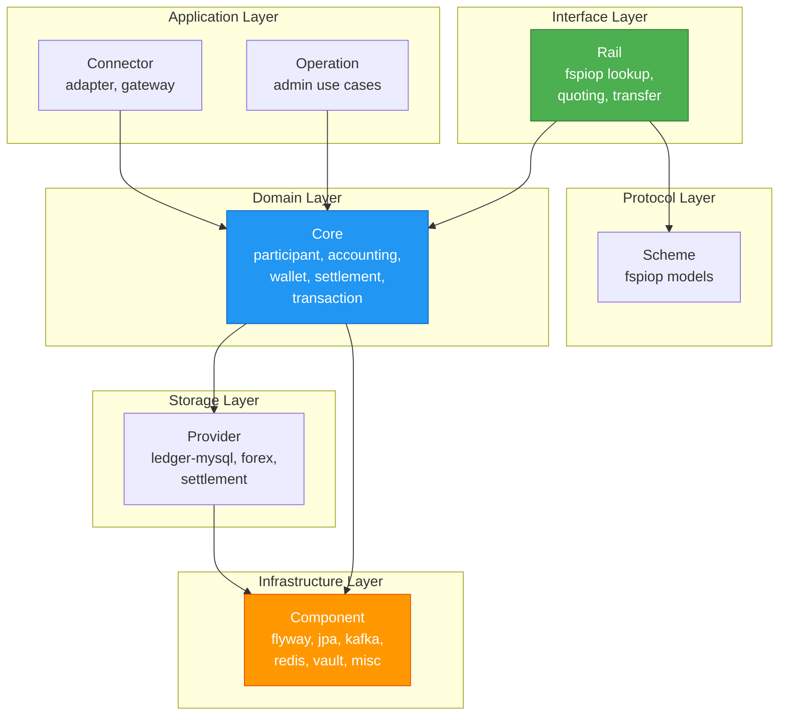

# Mojave Introduction

## Overview

Mojave is an open-source, production-ready instant payment switch built with modern Java technologies. Inspired by Mojaloop, Mojave provides a complete implementation of the FSPIOP v2.0 protocol, enabling real-time, interoperable payments between financial service providers. The project serves both as a practical foundation for building national payment systems and as a learning platform for understanding instant payment architecture.

## Project Goals

### 1. Practical Foundation
Provide a simple, production-oriented foundation for building an instant payment switch with:
- Enterprise-grade architecture patterns
- Production-ready infrastructure components
- Comprehensive security implementation
- Scalable and maintainable codebase

### 2. Learning Platform
Serve as a reference implementation for understanding:
- How instant payment systems work end-to-end
- Domain-Driven Design in financial systems
- FSPIOP protocol implementation details
- Real-world payment switch architecture

## Technology Stack

Mojave leverages cutting-edge Java ecosystem technologies:

### Core Platform
- **Java 25** - Latest Java LTS with modern language features
- **Spring Boot 4.0.2** - Application framework and dependency injection
- **Maven** - Build and dependency management

### Data Persistence
- **MySQL 8** - Primary relational database
- **HikariCP** - Production-optimized connection pooling
- **JPA/Hibernate** - ORM with custom entity mappings
- **Flyway** - Versioned database migrations

### Messaging & Events
- **Apache Kafka** - Event streaming and asynchronous messaging
- **Kafka Streams** - Stream processing capabilities

### Caching & Performance
- **Redis** - Distributed caching layer
- **Redisson** - Redis client with advanced features
- **LZ4 Compression** - Cache payload optimization

### Security & Secrets
- **HashiCorp Vault** - Secrets management
- **JWS (JSON Web Signature)** - Request authentication
- **TLS 1.3** - Transport security

### Protocol & API
- **FSPIOP v2.0** - Financial services interoperability protocol
- **OpenAPI 3.0** - API specification and documentation
- **RESTful APIs** - HTTP-based service interfaces

## Key Features and Capabilities

### 1. Multi-Tenant Participant Management
- Support for unlimited Financial Service Providers (FSPs)
- Hub-based routing and orchestration
- Oracle integration for party lookup
- Settlement Service Provider (SSP) management
- Multi-currency support per participant

### 2. Real-Time Accounting System
- Double-entry bookkeeping for all transactions
- Configurable chart of accounts
- Flow definitions for transaction types
- Atomic ledger posting with MySQL stored procedures
- Complete audit trail and movement tracking

### 3. Advanced Liquidity Management
- Position tracking per FSP and currency
- Net Debit Cap (NDC) enforcement
- Reserve-commit-rollback workflow
- Real-time balance calculations
- Concurrent update handling with optimistic locking

### 4. Flexible Settlement Framework
- Multiple settlement types (DFN, CGS, RTGS)
- Multi-tier FSP filtering rules
- Dynamic settlement provider matching
- Settlement lifecycle management
- Batch and individual settlement support

### 5. Complete Transaction Lifecycle
- End-to-end transaction tracking
- Step-by-step audit trail
- Phase-based state management
- Event-driven architecture
- Comprehensive error handling

### 6. FSPIOP v2.0 Protocol Implementation
- Party lookup (participants, parties)
- Quote request/response
- Transfer prepare/fulfill
- JWS signature verification
- Idempotency guarantees
- Standard error handling

## System Architecture

Mojave consists of **83 modules** organized into **7 categories**:

### Module Categories



### 1. Component (Infrastructure)
Cross-cutting infrastructure concerns:
- **flyway** - Database schema migrations
- **jpa** - JPA configuration with read/write splitting
- **kafka** - Kafka producer/consumer factories
- **redis** - Redis/Redisson client configuration
- **vault** - HashiCorp Vault integration
- **misc** - Utilities (crypto, JWT, DDD base classes)
- **web** - HTTP/REST utilities

### 2. Scheme (Protocol Definitions)
- **fspiop** - FSPIOP v2.0 OpenAPI-generated models

### 3. Core (Domain Bounded Contexts)
Business logic and domain models:
- **participant** - FSP, Hub, Oracle, SSP management
- **accounting** - Chart of accounts, ledger, flow definitions
- **wallet** - Position and balance management
- **settlement** - Settlement definitions and records
- **transaction** - Transaction lifecycle and audit trail
- **common** - Shared datatypes (identifiers, enumerations)

### 4. Provider (Storage Implementations)
- **ledger-mysql** - MySQL-based ledger with stored procedures
- **forex** - Foreign exchange rate provider
- **settlement** - Settlement provider implementation

### 5. Operation (Administrative Use Cases)
- Administrative operations and workflows
- Management interfaces

### 6. Connector (External Integrations)
- **adapter** - Protocol adapters
- **gateway** - API gateway functionality

### 7. Rail (Protocol Implementations)
FSPIOP service implementations:
- **lookup** - Party and participant lookup
- **quoting** - Quote request/response
- **transfer** - Transfer prepare/fulfill

## Comparison to Mojaloop

Mojave is inspired by Mojaloop but takes a different architectural approach:

| Aspect | Mojaloop | Mojave |
|--------|----------|--------|
| **Language** | TypeScript/Node.js | Java 25 |
| **Architecture** | Microservices | Modular monolith with bounded contexts |
| **Database** | MySQL (per service) | MySQL with shared schema (multi-tenancy) |
| **Deployment** | Kubernetes-native | Flexible (VM, container, K8s) |
| **Protocol** | FSPIOP v1.x → v2.0 | FSPIOP v2.0 (native) |
| **Domain Model** | Service-oriented | DDD with rich domain models |
| **Event Store** | Event sourcing | Event-driven with Kafka |
| **Complexity** | Higher (many services) | Lower (fewer moving parts) |
| **Learning Curve** | Steep | Moderate |
| **Production Ready** | Yes | Yes |

### When to Use Mojave vs Mojaloop

**Choose Mojave if you:**
- Prefer Java ecosystem and tooling
- Want a simpler deployment model
- Need strong typing and compile-time safety
- Value comprehensive code examples
- Want to learn payment systems deeply
- Have Java expertise in your team

**Choose Mojaloop if you:**
- Prefer Node.js/TypeScript ecosystem
- Need battle-tested production deployments
- Require extensive community support
- Want Kubernetes-native architecture
- Need complete event sourcing

## Design Principles

### 1. Domain-Driven Design (DDD)
- Clear bounded contexts for each domain
- Rich domain models with behavior
- Aggregate roots and value objects
- Ubiquitous language
- Context mapping

### 2. Hexagonal Architecture
- Core domain isolated from infrastructure
- Port and adapter pattern
- Dependency inversion
- Testable business logic
- Clean separation of concerns

### 3. CQRS Pattern
- Command/Query segregation
- Type-safe contracts with Java records
- Single responsibility per handler
- Clear input/output boundaries

### 4. Event-Driven Architecture
- Asynchronous processing with Kafka
- Event publishing for cross-context communication
- Eventual consistency where appropriate
- Audit trail through events

### 5. Security by Design
- JWS signature verification
- Request age validation
- Secrets in Vault (never in code)
- TLS for all communications
- Principle of least privilege

## Getting Started

### Prerequisites
- Java 25 or later
- Maven 3.9+
- MySQL 8.0+
- Kafka 3.0+
- Redis 7.0+
- HashiCorp Vault (optional for development)

### Project Structure
```
mojave/
├── assets/          # Code styles and assets
├── docs/            # Documentation (you are here)
├── modules/         # Java source code
│   ├── component/   # Infrastructure
│   ├── core/        # Domain logic
│   ├── rail/        # FSPIOP implementation
│   ├── provider/    # Storage implementations
│   └── ...
├── pom.xml          # Root Maven configuration
└── README.md        # Quick start guide
```

### Development Workflow
1. **Build**: Standard Maven build (`mvn clean install`)
2. **Database**: Flyway migrations run automatically
3. **Configuration**: Environment-specific properties
4. **Run**: Spring Boot applications per module
5. **Test**: JUnit 5 tests (to be implemented)

### Port Allocation Strategy
- **8000-8999**: Admin APIs (management interfaces)
- **9000-9999**: Intercom APIs (service-to-service)
- **Service modules**: Various ports per rail/service

## Use Cases Supported

### 1. Person-to-Person Transfers
Real-time money transfer between individuals at different FSPs.

### 2. Merchant Payments
Point-of-sale and e-commerce instant payments.

### 3. Bill Payments
Utility, telecom, and service provider bill settlements.

### 4. Bulk Disbursements
Salary, pension, and government benefit payments.

### 5. Request to Pay
Merchant-initiated payment requests.

## Roadmap

### Current (v1.0)
- FSPIOP v2.0 implementation
- Core domain modules (participant, accounting, wallet, settlement, transaction)
- MySQL ledger with stored procedures
- Kafka event streaming
- Redis caching
- JWS authentication

### Near-Term (v1.1)
- Comprehensive test suite (unit, integration, e2e)
- Performance benchmarking
- Circuit breakers and retry logic
- Distributed tracing (OpenTelemetry)
- Enhanced monitoring and metrics

### Medium-Term (v2.0)
- ISO 20022 message support
- Additional settlement models
- GraphQL API layer
- Advanced fraud detection
- Multi-region support

### Long-Term (v3.0)
- Event sourcing option
- CQRS with separate read models
- Machine learning integration
- Blockchain settlement option

## Community and Support

### Contributing
Contributions are welcome! Please see:
- Open an **issue** for bugs or feature requests
- Submit a **pull request** for code changes
- Follow the project coding standards
- Add tests for new functionality

### License
Mojave is licensed under **Apache License 2.0**, allowing:
- Commercial use
- Modification and distribution
- Patent grant
- No warranty or liability

## See Also

- [Architecture Overview](architecture-overview.md) - System components and design
- [Instant Payment Concept](instant-payment-concept.md) - IIPS fundamentals
- [High-Level Architecture](../../technical/01-architecture/high-level-architecture.md) - Technical architecture details
- [FSPIOP v2.0 Implementation](../04-payment-specifications/fspiop-v2-implementation.md) - Protocol details
