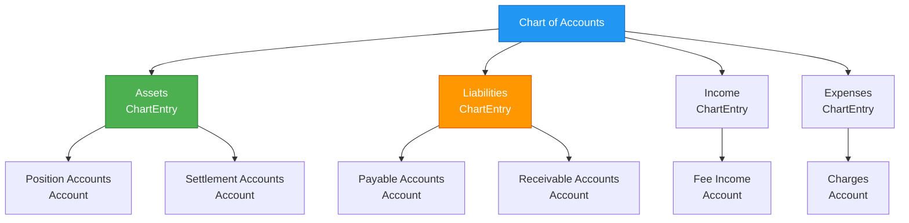
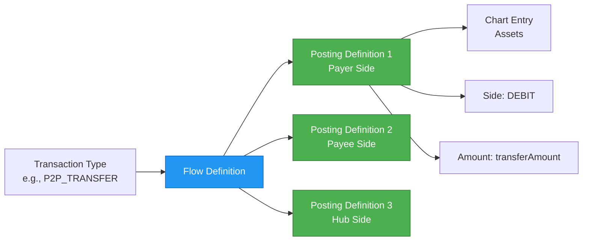
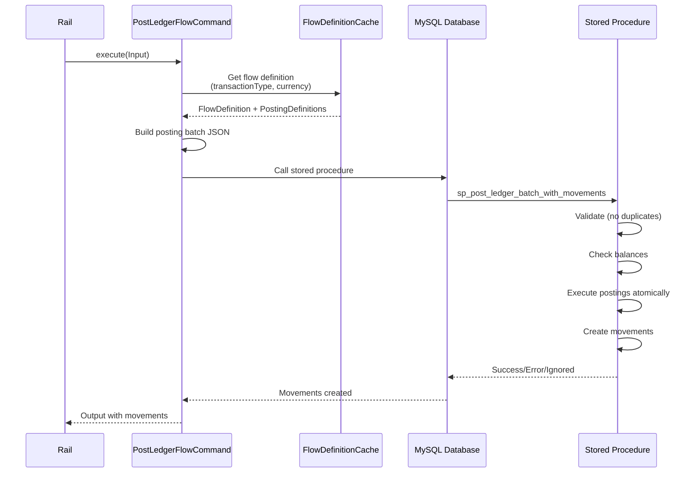

# Accounting Model

## Overview

Mojave implements a complete double-entry bookkeeping system to ensure accurate financial record-keeping for all payment transactions. The accounting model uses configurable flow definitions to map transaction types to ledger postings, providing flexibility while maintaining strict financial controls.

## Double-Entry Bookkeeping Principles

### Fundamental Concept

Every financial transaction affects at least two accounts, with equal debits and credits:

```
Debits = Credits (always)
```

**Example Transfer:**
```
Payer FSP sends $100 to Payee FSP

Debit:  Payer FSP Payable Account    $100
Credit: Payer FSP Position Account   $100

Debit:  Payee FSP Position Account   $100
Credit: Payee FSP Receivable Account $100
```

### Benefits

1. **Mathematical Accuracy**: Self-balancing system catches errors
2. **Complete Audit Trail**: Every movement is recorded
3. **Financial Integrity**: Cannot lose or create money
4. **Regulatory Compliance**: Standard accounting practice
5. **Reconciliation**: Easy to verify balances

## Chart of Accounts

The Chart of Accounts defines the structure of the ledger.

### Account Hierarchy



### Chart Structure

**Chart:**
- Root container for the entire accounting structure
- Unique chart code (e.g., "STANDARD_CHART")
- Name and description
- Contains chart entries

**Chart Entry:**
- Category in the chart (Assets, Liabilities, Income, Expenses)
- Account type classification
- Groups related accounts

**Account:**
- Individual ledger account
- Unique account code
- Associated with specific owner (FSP, Hub, etc.)
- Tracks debits and credits
- Maintains running balance

### Account Types

| Type | Category | Normal Balance | Examples |
|------|----------|----------------|----------|
| **Position** | Asset | Debit | FSP liquidity position |
| **Settlement** | Asset | Debit | Settlement clearing accounts |
| **Payable** | Liability | Credit | Amounts owed to FSPs |
| **Receivable** | Liability | Credit | Amounts receivable from FSPs |
| **Fee Income** | Income | Credit | Transaction fees earned |
| **Fee Expense** | Expense | Debit | Transaction fees paid |

## Flow Definitions

Flow definitions map transaction types to accounting entries, automating the ledger posting process.

### Flow Definition Components



**Flow Definition:**
- Links to a transaction type (P2P_TRANSFER, MERCHANT_PAYMENT, etc.)
- Links to a currency (USD, EUR, etc.)
- Contains multiple posting definitions
- Active/inactive status

**Posting Definition:**
- Specifies which chart entry to use
- Specifies debit or credit side
- Identifies the account owner (participant role)
- References amount variable (from transaction)
- Can use formulas for calculated amounts

### Example Flow Definition

**Transaction Type:** P2P_TRANSFER (Person-to-Person Transfer)
**Currency:** USD
**Amount:** $100 from FSP A to FSP B

**Posting Definitions:**

| Step | Chart Entry | Owner | Side | Amount | Description |
|------|-------------|-------|------|--------|-------------|
| 1 | Position | Payer FSP | CREDIT | transferAmount | Reduce payer FSP position |
| 2 | Payable | Payer FSP | DEBIT | transferAmount | Record amount payable |
| 3 | Position | Payee FSP | DEBIT | transferAmount | Increase payee FSP position |
| 4 | Receivable | Payee FSP | CREDIT | transferAmount | Record amount receivable |

**Result:**
```
FSP A (Payer):
  Credit: Position Account         $100
  Debit:  Payable Account          $100

FSP B (Payee):
  Debit:  Position Account         $100
  Credit: Receivable Account       $100
```

## Ledger Posting Process

### PostLedgerFlowCommand

The core command for posting to the ledger:

```java
public interface PostLedgerFlowCommand {
    Output execute(Input input);

    record Input(
        TransactionType transactionType,
        Currency currency,
        TransactionId transactionId,
        Instant transactionAt,
        Map<String, AccountOwnerId> participants,
        Map<String, BigDecimal> amounts
    ) {}

    record Output(
        TransactionId transactionId,
        FlowDefinitionId flowDefinitionId,
        List<Movement> movements
    ) {}
}
```

**Source:** `/Users/aungthawaye/Development/Jdev/mojave/modules/core/accounting/contract/src/main/java/org/mojave/core/accounting/contract/command/ledger/PostLedgerFlowCommand.java`

### Posting Flow



### Movement Tracking

Each ledger posting creates **movements** that track the change:

```java
record Movement(
    LedgerMovementId ledgerMovementId,
    AccountId accountId,
    AccountOwnerId ownerId,
    ChartEntryId chartEntryId,
    Side side,              // DEBIT or CREDIT
    Currency currency,
    BigDecimal amount,
    DrCr oldDrCr,          // Before state
    DrCr newDrCr,          // After state
    MovementStage movementStage,
    MovementResult movementResult,
    Instant createdAt
) {}

record DrCr(
    BigDecimal debits,
    BigDecimal credits
) {}
```

**Movement States:**

**MovementStage:**
- `POSTED`: Successfully posted
- `REVERSED`: Reversed (error correction)
- `RESTORED`: Restored after reversal

**MovementResult:**
- `SUCCESS`: Posting succeeded
- `ERROR`: Posting failed (insufficient funds, overdraft)
- `IGNORED`: Duplicate posting ignored

## MySQL Stored Procedure

The ledger uses a MySQL stored procedure for atomic execution:

### sp_post_ledger_batch_with_movements

**Purpose:**
- Execute multiple postings atomically
- Validate account balances
- Check overdraft limits
- Detect duplicate postings
- Create movement records

**Inputs:**
- JSON array of posting requests

**Processing:**
1. Parse JSON input
2. Validate each posting:
   - Check for duplicate transaction ID
   - Verify account exists
   - Validate sufficient balance (for debits)
   - Check overdraft limit
3. Execute postings:
   - Update account debits/credits
   - Record old and new balances
4. Create movement records
5. Return results (SUCCESS, ERROR, IGNORED)

**Guarantees:**
- **Atomicity**: All postings succeed or all fail
- **Consistency**: Debits always equal credits
- **Isolation**: Concurrent transactions don't interfere
- **Durability**: Committed transactions are permanent

## Account Balance Calculation

### Balance Types

**1. Book Balance (DrCr)**
```
Book Balance = Total Credits - Total Debits
```

For asset accounts:
- Positive balance = Debit > Credit
- Negative balance = Credit > Debit

For liability accounts:
- Positive balance = Credit > Debit
- Negative balance = Debit > Credit

**2. Available Balance**
```
Available Balance = Book Balance - Reserved Amounts - Holds
```

### Example Calculation

**FSP Position Account (Asset):**
```
Initial: $0

Transaction 1: Credit $1,000,000 (funding)
DrCr: Debits: $0, Credits: $1,000,000
Balance: -$1,000,000 (inverted for asset)
Display: $1,000,000 (actual position)

Transaction 2: Debit $100 (send payment)
DrCr: Debits: $100, Credits: $1,000,000
Balance: -$999,900
Display: $999,900

Transaction 3: Credit $50 (receive payment)
DrCr: Debits: $100, Credits: $1,000,050
Balance: -$999,950
Display: $999,950
```

## Financial Controls

### Overdraft Protection

Accounts can have overdraft limits:

```java
Account {
    BigDecimal overdraftLimit;  // Maximum negative balance allowed
}
```

**Validation:**
```java
if (newBalance < -overdraftLimit) {
    throw new OverdraftLimitReachedException();
}
```

### Insufficient Balance Check

Before debiting an account:

```java
BigDecimal availableBalance = currentBalance - reserved;
if (debitAmount > availableBalance) {
    throw new InsufficientBalanceException();
}
```

### Duplicate Posting Prevention

Each posting has a unique transaction ID:

```java
if (movementExists(transactionId, accountId)) {
    return MovementResult.IGNORED;  // Idempotent
}
```

## Reconciliation

### Daily Reconciliation

**1. Internal Balance Check:**
```
Sum of all debits = Sum of all credits
```

**2. Position vs Ledger:**
```
Position.amount = Position Account Book Balance
```

**3. FSP Statement:**
```
Generate statement of all movements per FSP
Provide to FSP for reconciliation
```

### Movement Query

Movements can be queried by:
- Transaction ID
- Account ID
- Owner ID
- Date range
- Movement stage
- Movement result

## Accounting Reports

### Transaction Summary
- Total debits
- Total credits
- Net position change
- Transaction count

### FSP Statement
- Opening balance
- All movements (debits and credits)
- Closing balance
- Reserved amounts

### Chart of Accounts Report
- All accounts with balances
- Organized by chart entry
- Drill-down capability

## Caching Strategy

### FlowDefinitionCache

Frequently accessed flow definitions cached in Redis:

**Cache Key:**
```
flow:{transactionType}:{currency}
```

**Cache Value:**
```java
FlowDefinition {
    flowDefinitionId,
    transactionType,
    currency,
    List<PostingDefinition> postings
}
```

**Benefits:**
- Reduce database load
- Faster transaction processing
- Lower latency

### AccountCache

Account information cached for quick lookups:

**Cache Keys:**
- By account ID
- By account code
- By chart entry and owner
- By currency and owner

## Example: Complete Transfer Accounting

**Scenario:** FSP A sends $100 to FSP B

**Step 1: Reserve (Prepare Phase)**
```
FSP A Position Account:
  Credit: $100 (reduce position)
FSP A Payable Account:
  Debit: $100 (owe to system)
```

**Step 2: Forward (Prepare Phase)**
```
FSP B Position Account:
  Debit: $100 (increase position)
FSP B Receivable Account:
  Credit: $100 (system owes FSP)
```

**Step 3: Commit (Fulfill Phase)**
```
(No additional postings - already recorded)
```

**Net Effect:**
```
FSP A: Position reduced by $100
FSP B: Position increased by $100
System: Balanced (debits = credits)
```

## See Also

- [Wallet and Positions](wallet-and-positions.md) - Position management
- [Transaction Lifecycle](transaction-lifecycle.md) - Transaction phases
- [Accounting Capabilities](../03-features/accounting-capabilities.md) - Detailed accounting features
- [Accounting Module](../../technical/02-core-modules/accounting-module.md) - Technical implementation
