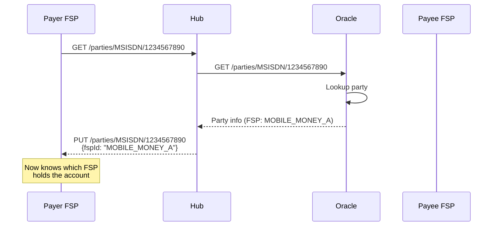
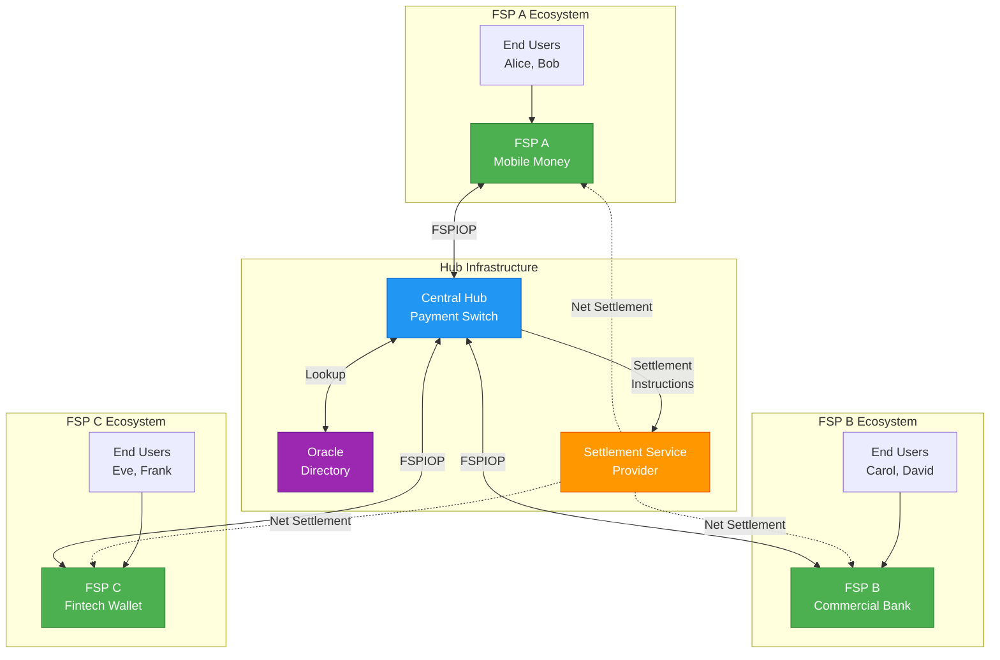
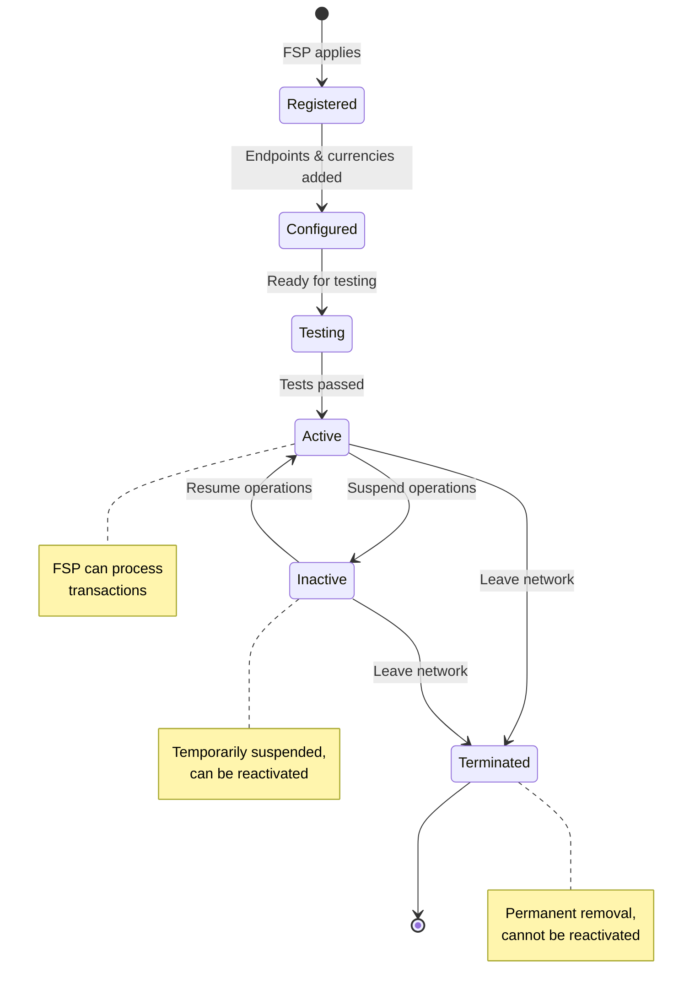

# Participants and Roles

## Overview

The Mojave payment switch ecosystem consists of four primary participant types, each playing a specific role in enabling interoperable instant payments. Understanding these roles and their interactions is fundamental to comprehending how the system operates.

## Participant Types

### Financial Service Provider (FSP)

A Financial Service Provider is any institution that provides financial services to end users and participates in the payment network.

**Examples:**
- Commercial banks
- Mobile money operators
- Microfinance institutions
- Fintech payment companies
- Digital wallets
- Credit unions

**Responsibilities:**

1. **Customer Account Management**
   - Maintain customer accounts and balances
   - Execute debits and credits
   - Provide customer-facing interfaces (mobile apps, USSD, web)
   - Handle customer authentication and authorization

2. **Protocol Implementation**
   - Implement FSPIOP v2.0 endpoints
   - Generate and verify JWS signatures
   - Handle idempotent requests
   - Process callbacks and confirmations

3. **Liquidity Management**
   - Maintain sufficient position in the hub
   - Monitor Net Debit Cap (NDC) limits
   - Fund positions when needed
   - Manage settlement obligations

4. **Transaction Processing**
   - Validate customer requests
   - Check available funds
   - Process quote requests
   - Execute transfers
   - Send confirmations

**FSP Configuration in Mojave:**

Each FSP in Mojave has:
- **Unique FSP Code**: Identifier in the network (e.g., "BANK001")
- **Name**: Human-readable name
- **Supported Currencies**: One or more currencies (USD, EUR, etc.)
- **Endpoints**: URLs for different operation types
- **Activation Status**: ACTIVE or INACTIVE
- **Termination Status**: ALIVE or TERMINATED

**Endpoint Types:**
- **INBOUND**: Receive transfers from hub
- **OUTBOUND**: Send transfers to hub
- **TRANSFERS**: Handle transfer callbacks
- **QUOTES**: Handle quote requests/responses
- **PARTIES**: Party lookup requests

### Hub (Central Payment Switch)

The Hub is the central component that orchestrates all payment transactions between FSPs.

**Responsibilities:**

1. **Transaction Routing**
   - Route transfers from payer FSP to payee FSP
   - Look up party information via Oracle
   - Forward requests and callbacks
   - Manage request/response flow

2. **Business Rule Enforcement**
   - Validate transaction requests
   - Enforce NDC limits
   - Check currency support
   - Validate FSP participation
   - Verify endpoint availability

3. **Liquidity Management**
   - Track FSP positions per currency
   - Reserve funds during transfers
   - Commit or rollback reservations
   - Enforce Net Debit Cap limits
   - Prevent overdrafts

4. **Accounting and Settlement**
   - Maintain double-entry ledger
   - Record all financial movements
   - Match settlement providers
   - Generate settlement instructions
   - Track settlement lifecycle

5. **Audit and Compliance**
   - Record complete transaction trail
   - Track every step of every transaction
   - Provide query capabilities
   - Support regulatory reporting
   - Enable dispute resolution

6. **Security**
   - Verify JWS signatures
   - Validate request age (prevent replay attacks)
   - Authenticate FSP requests
   - Secure communication channels

**Hub Configuration:**

The Hub maintains:
- **Registry of FSPs**: All participating institutions
- **Currency Support**: Multi-currency capabilities
- **Business Rules**: Configurable policies
- **Settlement Definitions**: Settlement provider matching rules
- **Chart of Accounts**: Accounting structure
- **Flow Definitions**: Transaction type handling

### Oracle (Directory Service)

The Oracle provides party lookup and resolution services, enabling FSPs to discover which institution holds a specific account.

**Responsibilities:**

1. **Party Resolution**
   - Map party identifiers to FSPs
   - Support multiple identifier types:
     - Phone numbers
     - Email addresses
     - Account numbers
     - National IDs
     - Custom identifiers

2. **Directory Services**
   - Maintain party-to-FSP mappings
   - Provide lookup API
   - Return party information
   - Support bulk lookups

3. **Privacy Protection**
   - Return only necessary information
   - Respect data protection regulations
   - Audit lookup requests

**Lookup Flow:**



**Oracle Configuration:**

Multiple oracles can be registered:
- **Oracle Code**: Unique identifier
- **Name**: Human-readable name
- **Endpoints**: Lookup API URLs
- **Supported Identifier Types**: What identifiers it can resolve
- **Activation Status**: ACTIVE or INACTIVE

### Settlement Service Provider (SSP)

Settlement Service Providers manage the settlement of net positions between FSPs, ensuring that actual money moves between institutions.

**Responsibilities:**

1. **Settlement Accounts**
   - Maintain settlement accounts for each FSP
   - Hold funds for settlement purposes
   - Execute settlement instructions

2. **Settlement Processing**
   - Receive settlement instructions from hub
   - Process debits and credits
   - Confirm settlement completion
   - Handle settlement failures

3. **Settlement Models**
   - **DFN (Deferred Net Settlement)**: Batch settlement at scheduled intervals
   - **CGS (Continuous Gross Settlement)**: Ongoing settlement throughout the day
   - **RTGS (Real-Time Gross Settlement)**: Immediate settlement per transaction

4. **Reporting**
   - Provide settlement confirmations
   - Generate settlement reports
   - Support reconciliation

**SSP Configuration:**

Each SSP has:
- **SSP Code**: Unique identifier
- **Name**: Institution name
- **Settlement Types**: Supported settlement models (DFN, CGS, RTGS)
- **Endpoints**: Settlement instruction URLs
- **Activation Status**: ACTIVE or INACTIVE

## Participant Relationships



## Participant Lifecycle

### FSP Onboarding

1. **Registration**
   - FSP applies to join network
   - Hub operator reviews application
   - Compliance checks performed
   - Agreement signed

2. **Configuration**
   - FSP code assigned
   - Currencies configured
   - Endpoints registered
   - Keys exchanged (for JWS)

3. **Testing**
   - Test transactions executed
   - Protocol compliance verified
   - Performance validated
   - Error handling tested

4. **Activation**
   - FSP marked as ACTIVE
   - Production traffic enabled
   - Monitoring configured
   - Support channels established

5. **Operations**
   - Process transactions
   - Monitor liquidity
   - Manage settlement
   - Handle exceptions

6. **Deactivation** (if needed)
   - FSP marked as INACTIVE
   - No new transactions accepted
   - Existing transactions completed
   - Settlement finalized

7. **Termination** (if needed)
   - FSP marked as TERMINATED
   - All operations ceased
   - Final settlement completed
   - Data archived

### State Transitions



## Participant Communication Patterns

### Synchronous Flows

**Transfer Request:**
```
Payer FSP → Hub: POST /transfers
Hub → Payee FSP: POST /transfers
Payee FSP → Hub: PUT /transfers (fulfillment)
Hub → Payer FSP: PUT /transfers (fulfillment)
```

**Quote Request:**
```
Payer FSP → Hub: POST /quotes
Hub → Payee FSP: POST /quotes
Payee FSP → Hub: PUT /quotes
Hub → Payer FSP: PUT /quotes
```

**Party Lookup:**
```
FSP → Hub: GET /parties/{type}/{id}
Hub → Oracle: GET /parties/{type}/{id}
Oracle → Hub: PUT /parties/{type}/{id}
Hub → FSP: PUT /parties/{type}/{id}
```

### Asynchronous Flows

**Settlement:**
```
Hub → SSP: Settlement instruction
SSP: Process settlement (async)
SSP → Hub: Settlement confirmation
Hub → FSPs: Settlement notification
```

## Multi-Currency Support

FSPs can support multiple currencies:

**Example:**
```
FSP A supports: USD, EUR
FSP B supports: USD, KES
FSP C supports: EUR, GBP
```

**Rules:**
- Transfer currency must be supported by both payer and payee FSP
- Hub validates currency support before processing
- Separate positions maintained per FSP per currency
- Settlement can be per currency or combined

## Position and Liquidity

Each FSP maintains a **position** in the hub for each supported currency:

**Position Formula:**
```
Position = Initial Funding + Credits Received - Debits Sent
```

**Net Debit Cap (NDC):**
```
Available Liquidity = Position - Reserved + NDC Limit
```

**Example:**
```
FSP A USD Position:
- Initial Funding: $1,000,000
- Credits Received: $250,000
- Debits Sent: $300,000
- Reserved (in-flight): $50,000
- NDC Limit: -$500,000

Current Position: $950,000
Reserved: $50,000
Available: $1,400,000 (can send up to this amount)
```

## Participant Security

### FSP Security Requirements

1. **JWS Signing**
   - Sign all outgoing requests
   - Verify all incoming requests
   - Use strong cryptographic keys
   - Rotate keys periodically

2. **HTTPS/TLS**
   - Use TLS 1.3
   - Valid certificates
   - Strong cipher suites

3. **Request Validation**
   - Verify request age
   - Check idempotency keys
   - Validate message structure

### Hub Security Controls

1. **Authentication**
   - Verify JWS signatures
   - Validate FSP source/destination
   - Check activation status

2. **Authorization**
   - Verify FSP can perform operation
   - Check currency support
   - Validate endpoint access

3. **Audit**
   - Log all requests
   - Track all transactions
   - Enable forensic analysis

## See Also

- [Accounting Model](accounting-model.md) - How financial movements are recorded
- [Wallet and Positions](wallet-and-positions.md) - FSP liquidity management
- [Settlement Framework](settlement-framework.md) - How settlement works
- [Participant Management](../03-features/participant-management.md) - Managing FSPs, oracles, SSPs
- [FSPIOP v2.0 Implementation](../04-payment-specifications/fspiop-v2-implementation.md) - Protocol details
