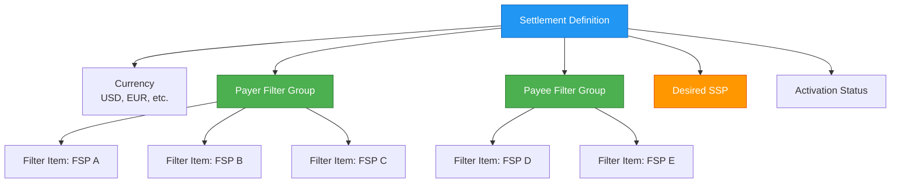
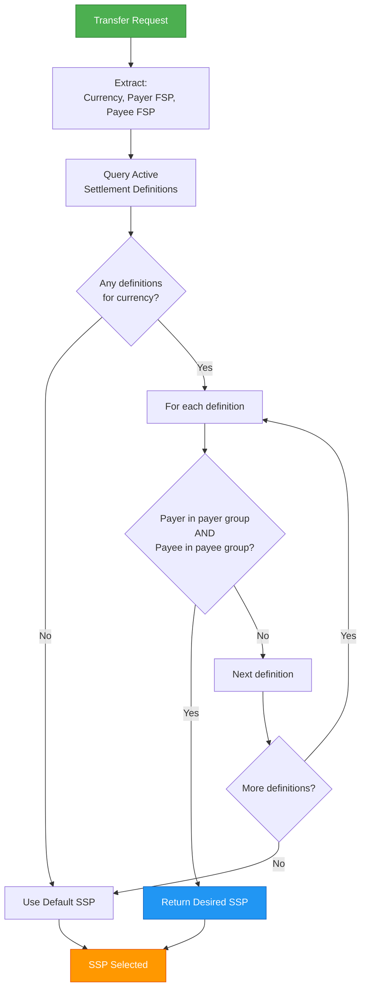
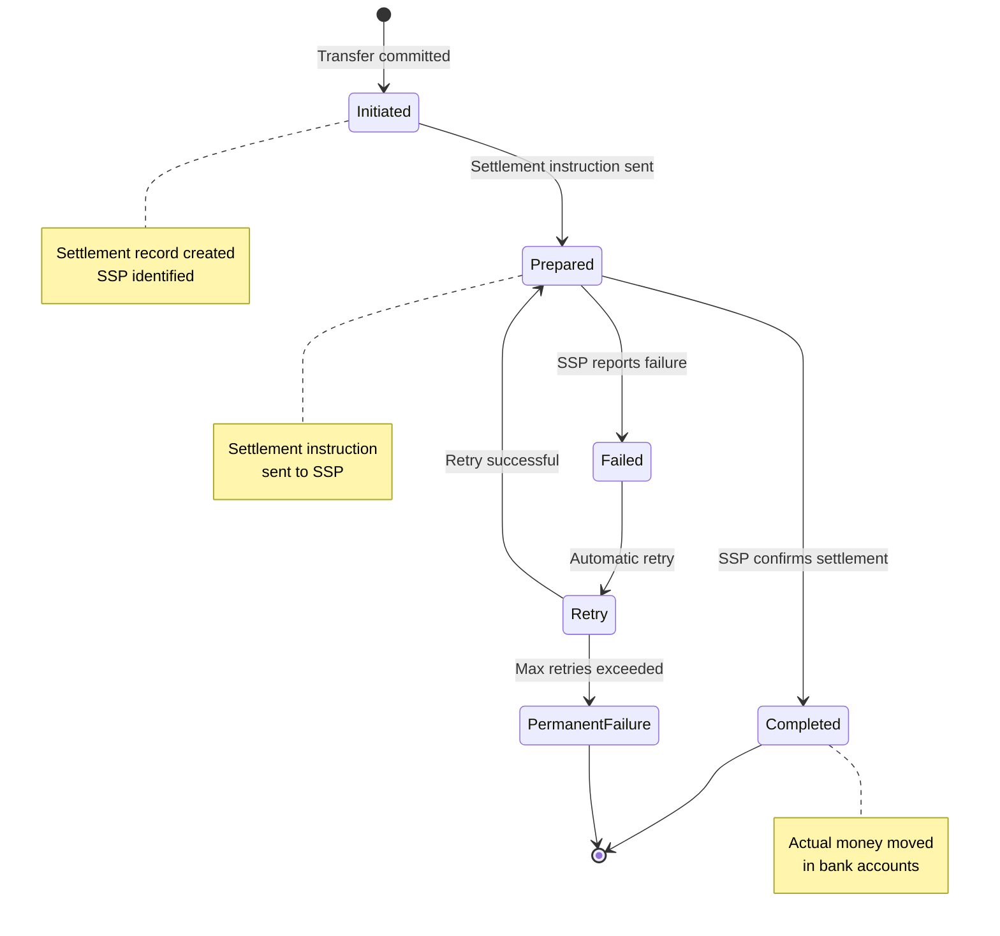
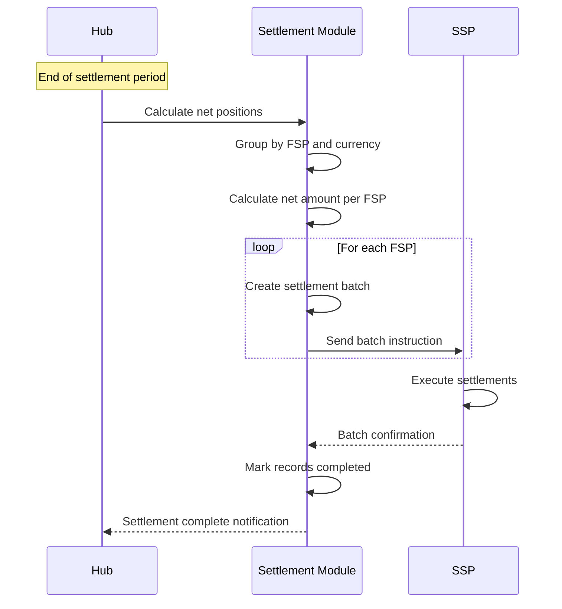

# Settlement Framework

## Overview

The settlement framework manages the actual movement of money between FSPs and the payment switch. While positions and transfers happen in real-time within the switch, settlement is the process of reconciling these positions with actual bank accounts through Settlement Service Providers (SSPs).

## Settlement Types

Mojave supports three settlement models, each with different characteristics:

### 1. Deferred Net Settlement (DFN)

**Characteristics:**
- Net positions calculated periodically
- Settlement occurs at scheduled intervals (daily, weekly)
- All debits and credits netted
- Single settlement transaction per period

**Benefits:**
- Minimizes number of settlement transactions
- Reduces settlement costs
- Lower liquidity requirements during the day
- Simpler reconciliation

**Drawbacks:**
- Higher credit risk
- Requires higher NDC limits
- Delayed finality
- Potential for larger settlement amounts

**Example:**
```
FSP A - End of Day Net Position
  Credits Received: $500,000
  Debits Sent:      $450,000
  Net Position:     +$50,000 (owed by SSP)

Settlement at 5 PM:
  SSP credits FSP A's bank account: $50,000
```

### 2. Continuous Gross Settlement (CGS)

**Characteristics:**
- Each transaction settled individually
- Ongoing throughout the business day
- No netting, gross settlement
- Multiple settlement transactions per day

**Benefits:**
- Lower credit risk
- Smaller individual settlement amounts
- Better liquidity management
- More frequent reconciliation

**Drawbacks:**
- Higher settlement transaction volume
- More processing overhead
- Higher settlement costs
- More complex reconciliation

**Example:**
```
FSP A Transactions:
  10:00 AM - Send $100,000 → Settle immediately
  10:15 AM - Receive $50,000 → Settle immediately
  10:30 AM - Send $75,000 → Settle immediately

  Each triggers separate settlement instruction
```

### 3. Real-Time Gross Settlement (RTGS)

**Characteristics:**
- Immediate settlement per transaction
- Uses central bank money
- Gross settlement (no netting)
- Instantaneous finality

**Benefits:**
- Zero credit risk
- Immediate finality
- No NDC needed
- Ultimate security

**Drawbacks:**
- Highest liquidity requirements
- Most expensive
- Requires central bank integration
- Complex operational requirements

**Example:**
```
Transfer: FSP A → FSP B: $100,000

Simultaneous Actions:
  1. Hub debits FSP A position: $100,000
  2. Central Bank debits FSP A account: $100,000
  3. Central Bank credits FSP B account: $100,000
  4. Hub credits FSP B position: $100,000

  All happen atomically
```

## Settlement Definitions

Settlement definitions determine which SSP handles settlement for specific transaction scenarios.

### Settlement Definition Components



**Settlement Definition:**
- Unique name
- Currency (USD, EUR, KES, etc.)
- Payer filter group
- Payee filter group
- Desired SSP
- Start date
- Activation status (ACTIVE/INACTIVE)

**Filter Group:**
- Collection of filter items
- Defines which FSPs match this group
- Linked to either payer or payee side

**Filter Item:**
- Individual FSP reference
- Part of a filter group
- Enables multi-tier filtering

### Multi-Tier Filtering

The filtering hierarchy enables sophisticated settlement routing:

**Example Configuration:**

```
Settlement Definition: "Tier 1 Banks USD"
  Currency: USD
  Payer Filter Group: [BANK_A, BANK_B, BANK_C]
  Payee Filter Group: [BANK_A, BANK_B, BANK_C]
  Desired SSP: CENTRAL_BANK_SSP

Settlement Definition: "Mobile Money USD"
  Currency: USD
  Payer Filter Group: [MOBILE_A, MOBILE_B]
  Payee Filter Group: [MOBILE_A, MOBILE_B]
  Desired SSP: MOBILE_MONEY_SSP

Settlement Definition: "Cross-Tier USD"
  Currency: USD
  Payer Filter Group: [BANK_A, BANK_B]
  Payee Filter Group: [MOBILE_A, MOBILE_B]
  Desired SSP: COMMERCIAL_SSP
```

## Settlement Provider Matching

The matching algorithm determines which SSP handles a specific transfer:



### Matching Algorithm

**Code Reference:**

```java
@Entity
public class SettlementDefinition {
    private Currency currency;
    private FilterGroup payerFilterGroup;
    private FilterGroup payeeFilterGroup;
    private SspId desiredProviderId;
    private ActivationStatus activationStatus;

    public boolean matches(Currency currency,
                          FspId payerFspId,
                          FspId payeeFspId) {
        return this.currency.equals(currency)
            && this.payerFilterGroup.fspExists(payerFspId)
            && this.payeeFilterGroup.fspExists(payeeFspId);
    }
}
```

**Source:** `/Users/aungthawaye/Development/Jdev/mojave/modules/core/settlement/domain/src/main/java/org/mojave/core/settlement/domain/model/SettlementDefinition.java`

**Process:**
1. Extract currency, payer FSP, payee FSP from transfer
2. Query active settlement definitions for currency
3. Iterate through definitions in priority order
4. Check if payer FSP exists in payer filter group
5. Check if payee FSP exists in payee filter group
6. If both match, return desired SSP
7. If no match, use default SSP

**Example Matching:**

```
Transfer: BANK_A (payer) → MOBILE_A (payee), Currency: USD

Settlement Definitions:
  1. "Tier 1 Banks USD" - No match (MOBILE_A not in payee group)
  2. "Mobile Money USD" - No match (BANK_A not in payer group)
  3. "Cross-Tier USD" - MATCH! (BANK_A in payer, MOBILE_A in payee)

Result: COMMERCIAL_SSP selected
```

## Settlement Lifecycle



### Settlement Phases

#### 1. Initiated

**Trigger:** Transfer successfully committed

**Actions:**
- Create settlement record
- Link to transaction
- Identify SSP via matching algorithm
- Record FSPs involved
- Record amount and currency
- Set status to INITIATED
- Timestamp initiated_at

**Settlement Record:**
```java
record SettlementRecord(
    SettlementRecordId settlementRecordId,
    TransactionId transactionId,
    SspId sspId,
    FspId payerFspId,
    FspId payeeFspId,
    Currency currency,
    BigDecimal amount,
    SettlementStatus status,
    Instant initiatedAt,
    Instant preparedAt,
    Instant completedAt
) {}
```

#### 2. Prepared

**Actions:**
- Send settlement instruction to SSP
- Include transaction details
- Specify debit and credit accounts
- Set status to PREPARED
- Timestamp prepared_at
- Wait for SSP confirmation

**Settlement Instruction Format:**
```json
{
  "settlementId": "SETTLE_123456",
  "transactionId": "TXN_789012",
  "settlementType": "DFN",
  "currency": "USD",
  "amount": "100.00",
  "payerFsp": "BANK_A",
  "payeeFsp": "MOBILE_A",
  "settlementDate": "2026-02-04T23:59:59Z"
}
```

#### 3. Completed

**Trigger:** SSP confirms settlement

**Actions:**
- Update status to COMPLETED
- Timestamp completed_at
- Record SSP confirmation reference
- Update FSP settlement positions
- Trigger reconciliation
- Generate confirmation notifications

#### 4. Failed

**Trigger:** SSP reports failure

**Actions:**
- Update status to FAILED
- Record failure reason
- Timestamp failed_at
- Trigger retry logic or alert
- Notify operators

## Batch Settlement

For DFN (Deferred Net Settlement), multiple transactions are batched:

### Batch Settlement Process



### Net Position Calculation

**Example:**

```
FSP A - USD Transactions (over 24 hours)
  Credits (received): $1,250,000
  Debits (sent):      $1,180,000
  Net Position:       +$70,000

Settlement Instruction:
  SSP credits FSP A bank account: $70,000
  Hub credits FSP A position: $70,000

FSP B - USD Transactions (over 24 hours)
  Credits (received): $890,000
  Debits (sent):      $920,000
  Net Position:       -$30,000

Settlement Instruction:
  SSP debits FSP B bank account: $30,000
  Hub debits FSP B position: $30,000
```

### Settlement Batch

```java
record SettlementBatch(
    SettlementBatchId batchId,
    SspId sspId,
    Currency currency,
    Instant settlementDate,
    List<SettlementRecord> records,
    BigDecimal totalAmount,
    SettlementBatchStatus status
) {}
```

## Settlement Reconciliation

### Daily Reconciliation

**1. Internal Reconciliation:**
```
Sum of settlement records = Net change in hub positions
```

**2. SSP Reconciliation:**
```
Hub settlement records = SSP settlement confirmations
```

**3. FSP Bank Account Reconciliation:**
```
FSP bank statement = FSP settlement records
```

### Discrepancy Handling

If reconciliation fails:
1. Identify missing or duplicate settlements
2. Compare hub records with SSP confirmations
3. Check FSP bank statements
4. Investigate timing differences
5. Create adjustment if needed
6. Document resolution

## Settlement Reports

### FSP Settlement Statement

```
FSP: BANK_A
Currency: USD
Period: 2026-02-04

Opening Position: $1,000,000

Transactions:
  Credits Received:  $1,250,000
  Debits Sent:       $1,180,000
  Net Activity:      +$70,000

Settlement:
  Net Settlement Amount: +$70,000
  Settlement Date: 2026-02-04 23:59:59
  SSP: CENTRAL_BANK_SSP
  Status: COMPLETED

Closing Position: $1,070,000
```

### SSP Settlement Summary

```
SSP: CENTRAL_BANK_SSP
Currency: USD
Period: 2026-02-04

Settlement Instructions:
  Total Credit Settlements:  5 FSPs, $345,000
  Total Debit Settlements:   3 FSPs, $345,000
  Net SSP Position:          $0 (balanced)

Status: All completed successfully
```

## Settlement Configuration

### FSP Settlement Configuration

Each FSP can be configured with:
- Preferred SSP (optional)
- Settlement frequency (DFN, CGS, RTGS)
- Settlement currency preferences
- Settlement account details
- Notification preferences

### System-Wide Settings

- Default SSP for unmatched transactions
- Settlement cutoff times
- Retry policies
- Reconciliation schedules
- Alert thresholds

## Settlement Monitoring

### Real-Time Monitoring

**Metrics:**
- Pending settlement count
- Settlement success rate
- Average settlement time
- Failed settlement count
- SSP response time

### Alerts

**Settlement Delay Alert:**
```
if (settlementAge > maxSettlementAge) {
    alert("Settlement delayed: " + settlementId);
}
```

**Settlement Failure Alert:**
```
if (settlementStatus == FAILED) {
    alert("Settlement failed: " + settlementId + " - " + failureReason);
}
```

**Reconciliation Mismatch Alert:**
```
if (hubTotal != sspTotal) {
    alert("Settlement reconciliation mismatch");
}
```

## See Also

- [Participants and Roles](participants-and-roles.md) - SSP role details
- [Transaction Lifecycle](transaction-lifecycle.md) - How settlement fits in transaction flow
- [Settlement Processing](../03-features/settlement-processing.md) - Detailed settlement features
- [Settlement Module](../../technical/02-core-modules/settlement-module.md) - Technical implementation
- [Settlement Flow](../../technical/03-flows/settlement-flow.md) - Technical flow details
