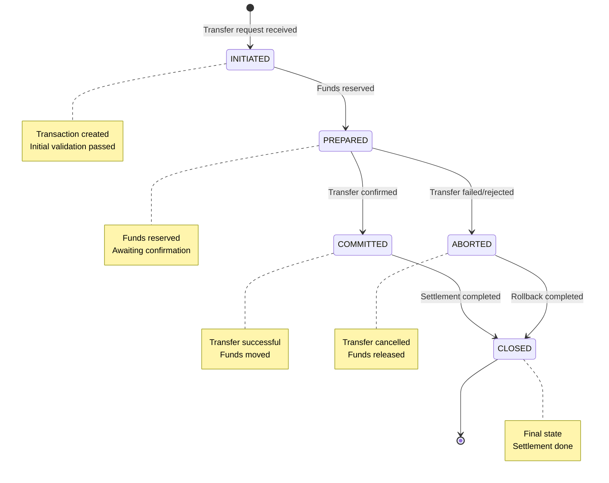
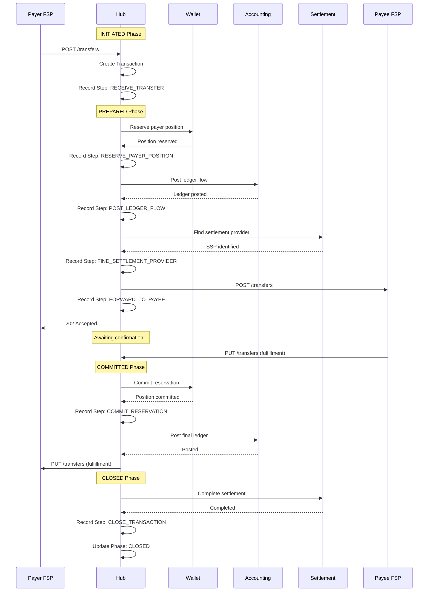

# Transaction Lifecycle

## Overview

Every payment transaction in Mojave follows a well-defined lifecycle with distinct phases, ensuring traceability, auditability, and consistency. The transaction module provides comprehensive tracking from initiation through completion, with detailed step-by-step recording of all actions.

## Transaction Phases



### Phase Details

#### INITIATED

**Trigger:** Transfer request received by hub

**Characteristics:**
- First phase of transaction lifecycle
- Transaction record created
- Basic validation completed
- Transaction ID assigned
- No funds moved yet

**Activities:**
1. Validate request format
2. Verify FSP participation
3. Check currency support
4. Create transaction record
5. Record payer and payee FSPs
6. Timestamp transaction initiation

**Transition Conditions:**
- Move to PREPARED: Funds successfully reserved
- Move to ABORTED: Validation failure

**Example:**
```
Transaction ID: TXN_123456789
Phase: INITIATED
Payer FSP: BANK_A
Payee FSP: MOBILE_B
Amount: $100.00 USD
Initiated At: 2026-02-04T10:30:00Z
```

#### PREPARED

**Trigger:** Payer position successfully reserved

**Characteristics:**
- Funds locked but not yet transferred
- Payer position reserved
- Payee position reserved (for credit)
- Awaiting final confirmation
- Can still be rolled back

**Activities:**
1. Reserve payer position
2. Check NDC limits
3. Post preparatory ledger entries
4. Reserve payee position
5. Forward to payee FSP
6. Timestamp preparation

**Transition Conditions:**
- Move to COMMITTED: Payee FSP confirms (PUT /transfers)
- Move to ABORTED: Timeout, rejection, or error

**Example:**
```
Transaction ID: TXN_123456789
Phase: PREPARED
Payer Position Reserved: $100.00
Payee Position Reserved: $100.00 (credit)
Prepared At: 2026-02-04T10:30:01.234Z
Expiration: 2026-02-04T10:30:30Z (30 seconds)
```

#### COMMITTED

**Trigger:** Payee FSP accepts transfer (fulfillment)

**Characteristics:**
- Transfer is final and irrevocable
- Funds have moved
- Reservations released
- Position updates finalized
- Ledger entries committed

**Activities:**
1. Receive fulfillment from payee FSP
2. Verify ILP fulfillment condition
3. Commit payer position reservation
4. Commit payee position reservation
5. Post final ledger entries
6. Send fulfillment to payer FSP
7. Timestamp commitment

**Transition Conditions:**
- Move to CLOSED: Settlement completed

**Example:**
```
Transaction ID: TXN_123456789
Phase: COMMITTED
Payer Position: -$100.00 (debited)
Payee Position: +$100.00 (credited)
Committed At: 2026-02-04T10:30:05.678Z
```

#### ABORTED

**Trigger:** Transfer cannot be completed

**Characteristics:**
- Transfer cancelled
- Funds returned to original state
- Reservations rolled back
- Error recorded
- Final state (terminal)

**Activities:**
1. Rollback payer position reservation
2. Rollback payee position reservation
3. Reverse ledger entries if needed
4. Record abort reason
5. Send error response to payer FSP
6. Timestamp abortion

**Abort Reasons:**
- Timeout (expiration exceeded)
- Rejection by payee FSP
- Insufficient funds
- Position limit exceeded
- Technical error
- Validation failure

**Example:**
```
Transaction ID: TXN_123456789
Phase: ABORTED
Abort Reason: TRANSFER_EXPIRED
Abort Details: Transfer expired after 30 seconds
Aborted At: 2026-02-04T10:30:35Z
```

#### CLOSED

**Trigger:** Settlement completed

**Characteristics:**
- Final terminal state
- All processing complete
- Settlement recorded
- Full audit trail available
- No further changes

**Activities:**
1. Record settlement completion
2. Update settlement records
3. Finalize all audit logs
4. Timestamp closure

**Example:**
```
Transaction ID: TXN_123456789
Phase: CLOSED
Settlement ID: SETTLE_456789
Settlement Status: COMPLETED
Closed At: 2026-02-04T23:59:59Z
```

## Transaction Step Tracking

Each action within a transaction is recorded as a step, providing granular audit trails.

### Transaction Step Structure

```java
record TransactionStep(
    TransactionStepId stepId,
    TransactionId transactionId,
    String stepName,
    String stepDescription,
    TransactionPhase phaseBefore,
    TransactionPhase phaseAfter,
    StepStatus status,
    String errorCode,
    String errorMessage,
    Instant startedAt,
    Instant completedAt,
    Long durationMs
) {}
```

### Step Examples

**Example Transfer Steps:**

```
Transaction: TXN_123456789

Step 1: RECEIVE_TRANSFER
  Phase Before: null
  Phase After: INITIATED
  Status: SUCCESS
  Started: 2026-02-04T10:30:00.000Z
  Completed: 2026-02-04T10:30:00.100Z
  Duration: 100ms

Step 2: RESERVE_PAYER_POSITION
  Phase Before: INITIATED
  Phase After: PREPARED
  Status: SUCCESS
  Started: 2026-02-04T10:30:00.100Z
  Completed: 2026-02-04T10:30:00.250Z
  Duration: 150ms

Step 3: POST_LEDGER_FLOW
  Phase Before: PREPARED
  Phase After: PREPARED
  Status: SUCCESS
  Started: 2026-02-04T10:30:00.250Z
  Completed: 2026-02-04T10:30:00.500Z
  Duration: 250ms

Step 4: FORWARD_TO_PAYEE
  Phase Before: PREPARED
  Phase After: PREPARED
  Status: SUCCESS
  Started: 2026-02-04T10:30:00.500Z
  Completed: 2026-02-04T10:30:01.000Z
  Duration: 500ms

Step 5: COMMIT_RESERVATION
  Phase Before: PREPARED
  Phase After: COMMITTED
  Status: SUCCESS
  Started: 2026-02-04T10:30:05.000Z
  Completed: 2026-02-04T10:30:05.200Z
  Duration: 200ms

Step 6: CLOSE_TRANSACTION
  Phase Before: COMMITTED
  Phase After: CLOSED
  Status: SUCCESS
  Started: 2026-02-04T23:59:59.000Z
  Completed: 2026-02-04T23:59:59.050Z
  Duration: 50ms
```

### Step Categories

**Processing Steps:**
- RECEIVE_TRANSFER
- UNWRAP_REQUEST (ILP decryption)
- VALIDATE_REQUEST
- RESERVE_PAYER_POSITION
- POST_LEDGER_FLOW
- FIND_SETTLEMENT_PROVIDER
- FORWARD_TO_PAYEE
- COMMIT_RESERVATION
- CLOSE_TRANSACTION

**Error Handling Steps:**
- ABORT_TRANSFER
- ROLLBACK_RESERVATION
- SEND_ERROR_RESPONSE

**Settlement Steps:**
- INITIATE_SETTLEMENT
- PREPARE_SETTLEMENT
- COMPLETE_SETTLEMENT

## Complete Transaction Flow



## Transaction Audit Trail

### Complete Audit Information

For each transaction, the system maintains:

**Transaction Details:**
- Transaction ID
- Transaction type (P2P_TRANSFER, MERCHANT_PAYMENT, etc.)
- Currency
- Amount
- Payer FSP
- Payee FSP
- Current phase
- All timestamps

**Position Changes:**
- Payer position before/after
- Payee position before/after
- Reserved amounts
- Position update IDs

**Accounting Movements:**
- All ledger entries
- Account IDs
- Debit/credit amounts
- Movement IDs

**Settlement Information:**
- Settlement record ID
- SSP used
- Settlement status
- Settlement timestamps

**Step-by-Step Record:**
- All steps executed
- Step status (success/failure)
- Error details if failed
- Duration of each step

### Audit Query Capabilities

**By Transaction ID:**
```sql
SELECT * FROM transaction WHERE transaction_id = ?
SELECT * FROM transaction_step WHERE transaction_id = ? ORDER BY started_at
```

**By FSP:**
```sql
SELECT * FROM transaction
WHERE payer_fsp_id = ? OR payee_fsp_id = ?
AND transaction_at BETWEEN ? AND ?
```

**By Phase:**
```sql
SELECT * FROM transaction WHERE current_phase = ?
```

**By Date Range:**
```sql
SELECT * FROM transaction
WHERE transaction_at BETWEEN ? AND ?
```

**Failed Transactions:**
```sql
SELECT * FROM transaction WHERE current_phase = 'ABORTED'
```

**Long-Running Transactions:**
```sql
SELECT * FROM transaction
WHERE current_phase = 'PREPARED'
AND prepared_at < (NOW() - INTERVAL 1 MINUTE)
```

## Transaction Monitoring

### Real-Time Metrics

**Transaction Volume:**
- Transactions per second
- Transactions per hour
- Transactions per day

**Success Rate:**
```
Success Rate = (COMMITTED + CLOSED) / TOTAL * 100%
```

**Average Duration:**
```
Average Duration = AVG(committed_at - initiated_at)
```

**Phase Distribution:**
- Count by phase
- Identify bottlenecks

### Alerts

**Stuck Transaction Alert:**
```
if (phase == PREPARED && age > maxAge) {
    alert("Transaction stuck in PREPARED phase");
}
```

**High Failure Rate Alert:**
```
if (failureRate > threshold) {
    alert("High transaction failure rate");
}
```

**Slow Transaction Alert:**
```
if (duration > maxDuration) {
    alert("Slow transaction detected");
}
```

## Transaction Reconciliation

### End-of-Day Reconciliation

**1. Transaction Count:**
```
Count of transactions by phase
Count of transactions by type
Count of transactions by FSP
```

**2. Amount Validation:**
```
Sum of committed transactions = Sum of position changes
Sum of ledger movements = Sum of position changes
```

**3. Settlement Validation:**
```
Committed transactions = Settlement records created
```

### Discrepancy Resolution

If reconciliation fails:
1. Identify missing or orphaned transactions
2. Check for stuck transactions in PREPARED
3. Verify all steps completed
4. Review error logs
5. Reconcile with FSP records
6. Create manual adjustment if needed

## Transaction Types

Mojave supports multiple transaction types:

**P2P_TRANSFER:**
- Person-to-person transfer
- Most common type
- Individual amounts

**MERCHANT_PAYMENT:**
- Customer to merchant
- May include fees
- May have refund capability

**BULK_DISBURSEMENT:**
- One payer, multiple payees
- Salary, pension payments
- Batch processing

**BILL_PAYMENT:**
- Utility, telecom bills
- Recurring capability
- Reference numbers

**REFUND:**
- Reversal of previous payment
- Links to original transaction
- May have different amount

Each type has its own flow definition for accounting.

## See Also

- [Accounting Model](accounting-model.md) - How transactions are recorded
- [Wallet and Positions](wallet-and-positions.md) - How positions change
- [Settlement Framework](settlement-framework.md) - How transactions settle
- [Transaction Tracking](../03-features/transaction-tracking.md) - Query and monitoring features
- [Transaction Module](../../technical/02-core-modules/transaction-module.md) - Technical implementation
- [Transfer Flow](../../technical/03-flows/transfer-flow.md) - Detailed transfer processing
