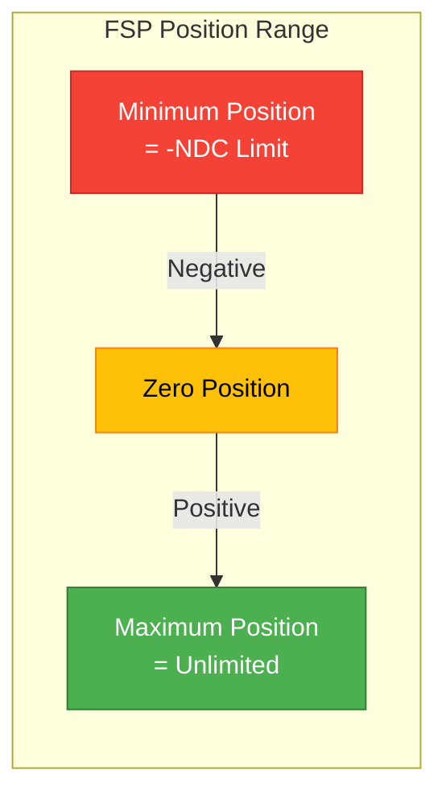
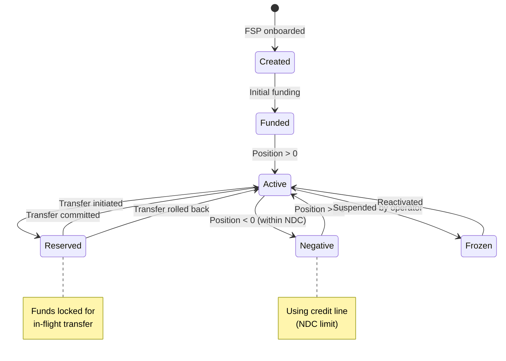

# Wallet and Positions

## Overview

The wallet module manages FSP liquidity through position tracking and Net Debit Cap (NDC) enforcement. It provides the critical reserve-commit-rollback workflow that ensures FSPs have sufficient funds before executing transfers, preventing overdrafts and maintaining financial stability in the payment network.

## Position vs Balance

### Position

A **position** represents an FSP's current liquidity in the payment switch for a specific currency.

**Characteristics:**
- Real-time tracking of available funds
- Updated with every transaction
- Separate position per FSP per currency
- Can be negative (up to NDC limit)
- Includes reserved amounts

**Position Formula:**
```
Position = Initial Funding
         + Credits Received
         - Debits Sent
         - Amounts Currently Reserved
```

### Balance

A **balance** represents the accounting book balance in the ledger.

**Characteristics:**
- Double-entry accounting balance
- Debits and credits tracked separately
- Historical record of all movements
- Used for reconciliation
- May differ from position due to timing

### Key Difference

```
Position = "How much can I spend right now?"
Balance  = "What does the accounting ledger say?"
```

**Example:**
```
FSP A starts with $1,000,000 funding

Transfer 1: Send $100 (in-flight, not yet committed)
  Position:  $999,900 (reserved $100)
  Balance:   $1,000,000 (not yet posted)

Transfer 1: Committed
  Position:  $999,900 (reservation released, debit applied)
  Balance:   $999,900 (debit posted)
```

## Net Debit Cap (NDC)

The Net Debit Cap is the maximum negative position an FSP is allowed to have.

### Concept



### NDC Limit

**Purpose:**
- Credit line for FSPs
- Allows temporary negative positions
- Facilitates liquidity management
- Reduces funding requirements

**Example:**
```
FSP Configuration:
  Initial Funding: $500,000
  NDC Limit: $500,000

Allowed Position Range:
  Minimum: -$500,000 (can owe up to this amount)
  Maximum: Unlimited (can have any positive amount)

Available Liquidity:
  Current Position: $300,000
  Reserved: $50,000
  Available: $750,000

  Calculation: $300,000 - $50,000 + $500,000 = $750,000
```

### NDC Enforcement

Before reserving funds for a transfer:

```java
BigDecimal newPosition = currentPosition - transferAmount;
BigDecimal effectivePosition = newPosition - currentReserved;

if (effectivePosition < -netDebitCap) {
    throw new PositionLimitExceededException();
}
```

**Real-world Example:**
```
FSP A wants to send $800,000

Current State:
  Position: $300,000
  Reserved: $50,000
  NDC Limit: $500,000

Check:
  New Position: $300,000 - $800,000 = -$500,000
  Effective: -$500,000 - $50,000 = -$550,000
  NDC Limit: -$500,000

  Result: REJECTED (-$550,000 < -$500,000)

  Available: Only $750,000 can be sent
```

## Position Lifecycle



## Reserve-Commit-Rollback Workflow

The three-phase workflow ensures atomicity and consistency:

### 1. Reserve Phase

**Purpose:** Lock funds for a transfer before it's confirmed

**ReservePositionCommand Interface:**

```java
public interface ReservePositionCommand {
    Output execute(Input input);

    record Input(
        WalletOwnerId walletOwnerId,    // FSP ID
        Currency currency,
        BigDecimal amount,
        TransactionId transactionId,
        Instant transactionAt,
        String description
    ) {}

    record Output(
        PositionUpdateId positionUpdateId,
        PositionId positionId,
        PositionAction action,          // RESERVE
        BigDecimal oldPosition,
        BigDecimal newPosition,
        BigDecimal oldReserved,
        BigDecimal newReserved,
        BigDecimal netDebitCap,
        Instant transactionAt
    ) {}
}
```

**Source:** `/Users/aungthawaye/Development/Jdev/mojave/modules/core/wallet/contract/src/main/java/org/mojave/core/wallet/contract/command/position/ReservePositionCommand.java`

**Process:**
1. Fetch current position for FSP and currency
2. Calculate new position: `newPosition = currentPosition - amount`
3. Check NDC limit: `newPosition - currentReserved >= -ndcLimit`
4. If valid, increment reserved amount
5. Record position update with action = RESERVE
6. Return position update ID for later commit/rollback

**Database Updates:**
```sql
UPDATE position SET
    reserved = reserved + amount,
    updated_at = transaction_at
WHERE position_id = ? AND version = ?
```

**Optimistic Locking:**
Uses version number to prevent concurrent update conflicts.

### 2. Commit Phase

**Purpose:** Finalize the transfer and release the reservation

**Process:**
1. Fetch position update by ID
2. Verify it's in RESERVE state
3. Update position: `position = position - amount`
4. Release reservation: `reserved = reserved - amount`
5. Update position update action to COMMIT
6. Record timestamp

**Database Updates:**
```sql
UPDATE position SET
    amount = amount - transfer_amount,
    reserved = reserved - transfer_amount,
    updated_at = transaction_at
WHERE position_id = ? AND version = ?

UPDATE position_update SET
    action = 'COMMIT',
    committed_at = transaction_at
WHERE position_update_id = ?
```

**Net Effect:**
- Position decreased by transfer amount
- Reserved amount released
- Transfer completed

### 3. Rollback Phase

**Purpose:** Cancel the transfer and release the reservation without moving funds

**Process:**
1. Fetch position update by ID
2. Verify it's in RESERVE state
3. Release reservation: `reserved = reserved - amount`
4. Position unchanged
5. Update position update action to ROLLBACK
6. Record timestamp and reason

**Database Updates:**
```sql
UPDATE position SET
    reserved = reserved - transfer_amount,
    updated_at = transaction_at
WHERE position_id = ? AND version = ?

UPDATE position_update SET
    action = 'ROLLBACK',
    rollback_reason = ?,
    rolled_back_at = transaction_at
WHERE position_update_id = ?
```

**Net Effect:**
- Position unchanged
- Reserved amount released
- Funds available again

## Position Update Tracking

Every position change is tracked:

```java
record PositionUpdate(
    PositionUpdateId positionUpdateId,
    PositionId positionId,
    TransactionId transactionId,
    PositionAction action,         // RESERVE, COMMIT, ROLLBACK
    BigDecimal amount,
    BigDecimal oldPosition,
    BigDecimal newPosition,
    BigDecimal oldReserved,
    BigDecimal newReserved,
    Instant reservedAt,
    Instant committedAt,
    Instant rolledBackAt,
    String rollbackReason
) {}
```

**Benefits:**
- Complete audit trail
- Reconciliation support
- Debugging capability
- Regulatory compliance

## Multi-Currency Position Management

Each FSP can have positions in multiple currencies:

```
FSP A Positions:
  USD: $1,000,000 (NDC: $500,000)
  EUR: €750,000   (NDC: €300,000)
  KES: KSh 50M    (NDC: KSh 20M)
```

**Rules:**
- Separate position per currency
- Separate NDC limit per currency
- Cannot transfer across currencies (requires forex)
- Independent tracking and reservation

## Position Query and Monitoring

### Real-Time Position Query

```java
Position getPosition(WalletOwnerId ownerId, Currency currency);

record Position(
    PositionId positionId,
    WalletOwnerId ownerId,
    Currency currency,
    BigDecimal amount,           // Current position
    BigDecimal reserved,         // Reserved amount
    BigDecimal netDebitCap,      // NDC limit
    BigDecimal available,        // Available = amount - reserved + ndcLimit
    Instant updatedAt
) {}
```

### Position History

Query historical position updates:
- By FSP and currency
- By date range
- By transaction ID
- By action type (RESERVE, COMMIT, ROLLBACK)

## Concurrent Update Handling

### Optimistic Locking

Position updates use optimistic locking to handle concurrency:

```java
@Entity
public class Position {
    @Version
    private Long version;

    // Other fields...
}
```

**Process:**
1. Read position with version N
2. Perform calculations
3. Update with WHERE version = N
4. If version changed, retry

**Retry Strategy:**
- Automatic retry on version conflict
- Exponential backoff
- Maximum retry attempts
- Eventually fail if contention too high

### Example Concurrent Scenario

```
Time  Thread 1              Thread 2
----  ------------------    ------------------
T1    Read position (v1)
T2                           Read position (v1)
T3    Reserve $100
T4    Update (v1→v2) ✓
T5                           Reserve $50
T6                           Update (v1→v2) ✗ VERSION CONFLICT
T7                           Retry: Read (v2)
T8                           Reserve $50
T9                           Update (v2→v3) ✓
```

## Position Reconciliation

### Daily Reconciliation

**1. Position vs Accounting:**
```
Position.amount should equal:
  Account Book Balance (from ledger)
```

**2. Reserved vs In-Flight:**
```
Position.reserved should equal:
  Sum of all RESERVE position updates not yet committed/rolled back
```

**3. Movement Validation:**
```
Sum of all position updates = Current position - Initial position
```

### Discrepancy Resolution

If position and accounting don't match:
1. Identify missing or duplicate movements
2. Review position update audit trail
3. Check for failed commits or rollbacks
4. Reconcile with transaction records
5. Create adjustment entry if needed

## Position Alerts and Monitoring

### Low Position Alert

```
if (position < lowPositionThreshold) {
    alert("FSP position low, funding recommended");
}
```

### High Reserved Alert

```
if (reserved > position * 0.8) {
    alert("High reservation ratio, may impact liquidity");
}
```

### NDC Breach Warning

```
if (position - reserved < -ndcLimit * 0.9) {
    alert("Approaching NDC limit");
}
```

## Balance Operations

### Deposit (Funding)

Add funds to FSP position:

```java
DepositCommand.execute(
    fspId,
    currency,
    amount,
    reference
);
```

**Effect:**
- Increase position
- Record movement
- Update accounting ledger

### Withdraw

Remove funds from FSP position:

```java
WithdrawCommand.execute(
    fspId,
    currency,
    amount,
    reference
);
```

**Effect:**
- Decrease position
- Record movement
- Update accounting ledger

**Validation:**
- Must have sufficient available balance
- Cannot withdraw reserved amounts
- Must respect minimum balance requirements

## Position Adjustment

For reconciliation or corrections:

```java
AdjustPositionCommand.execute(
    fspId,
    currency,
    adjustmentAmount,
    reason,
    approver
);
```

**Controls:**
- Requires special authorization
- Complete audit trail
- Documented reason
- Approval workflow

## Example: Complete Transfer Position Flow

**Scenario:** FSP A sends $100 to FSP B

**Initial State:**
```
FSP A: Position = $1,000, Reserved = $0, NDC = $500
FSP B: Position = $500, Reserved = $0, NDC = $500
```

**Step 1: Reserve Payer Position**
```
FSP A:
  Action: RESERVE
  Amount: $100
  Old Position: $1,000, Old Reserved: $0
  New Position: $1,000, New Reserved: $100
  Available: $1,000 - $100 + $500 = $1,400 ✓
```

**Step 2: Reserve Payee Position** (credit reservation)
```
FSP B:
  Action: RESERVE (credit)
  Amount: $100
  Old Position: $500, Old Reserved: $0
  New Position: $500, New Reserved: $100 (incoming)
```

**Step 3: Commit Both Positions** (on successful transfer)
```
FSP A:
  Action: COMMIT
  Position: $1,000 - $100 = $900
  Reserved: $100 - $100 = $0
  Available: $900 - $0 + $500 = $1,400

FSP B:
  Action: COMMIT
  Position: $500 + $100 = $600
  Reserved: $100 - $100 = $0
  Available: $600 - $0 + $500 = $1,100
```

**Final State:**
```
FSP A: Position = $900, Reserved = $0
FSP B: Position = $600, Reserved = $0
System: Balanced ($900 + $600 = $1,500, same as before)
```

## See Also

- [Accounting Model](accounting-model.md) - How positions relate to accounting
- [Transaction Lifecycle](transaction-lifecycle.md) - How positions change during transfers
- [Wallet Management](../03-features/wallet-management.md) - Detailed wallet features
- [Wallet Module](../../technical/02-core-modules/wallet-module.md) - Technical implementation
- [Position Management Flow](../../technical/03-flows/position-management-flow.md) - Technical flow details
