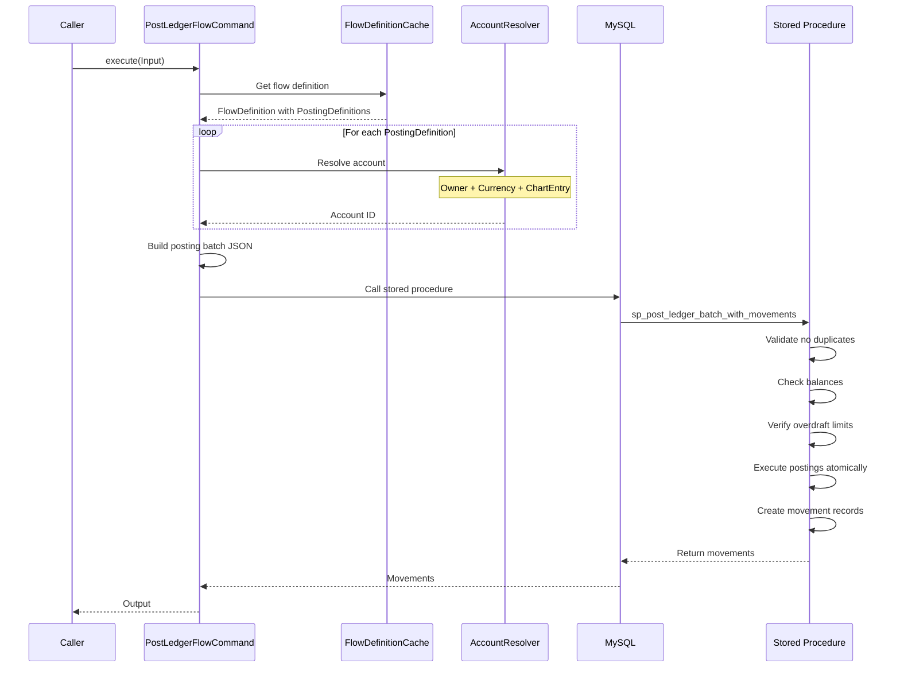

# Accounting Capabilities

## Overview

Mojave's accounting capabilities provide a complete double-entry bookkeeping system with configurable flow definitions, atomic ledger posting, and comprehensive movement tracking. The system ensures financial integrity while providing the flexibility needed for different transaction types and business rules.

## Chart of Accounts Management

### Chart Creation

Create the root accounting structure:

**Chart Attributes:**
- Chart ID (auto-generated)
- Chart code (unique identifier)
- Chart name
- Description
- Creation timestamp

**Example:**
```
Chart Code: STANDARD_CHART
Name: Standard Payment Switch Chart of Accounts
Description: Default chart for all payment switch operations
Created: 2026-01-01T00:00:00Z
```

### Chart Entry Management

Define account categories within the chart:

**Chart Entry Types:**
- **Assets**: Position accounts, settlement accounts
- **Liabilities**: Payable accounts, receivable accounts
- **Income**: Fee income, interest income
- **Expenses**: Processing fees, operational costs

**Example Chart Entries:**
```
STANDARD_CHART:
  ├── ASSETS
  │   ├── FSP_POSITION (Asset account for FSP liquidity)
  │   └── SETTLEMENT_CLEARING (Settlement in progress)
  ├── LIABILITIES
  │   ├── FSP_PAYABLE (Amounts owed to FSPs)
  │   └── FSP_RECEIVABLE (Amounts receivable from FSPs)
  ├── INCOME
  │   └── FEE_INCOME (Transaction fee revenue)
  └── EXPENSES
      └── PROCESSING_FEE (External processing costs)
```

### Account Creation

Create individual ledger accounts:

**Account Attributes:**
- Account ID (auto-generated)
- Account code (unique within chart)
- Chart entry reference
- Owner ID (FSP, Hub, etc.)
- Currency
- Overdraft limit
- Current debits total
- Current credits total
- Creation timestamp

**Example:**
```
Account Code: BANK001_USD_POSITION
Chart Entry: FSP_POSITION
Owner: BANK001
Currency: USD
Overdraft Limit: $500,000
Debits: $100,000
Credits: $1,100,000
Net Balance: $1,000,000 (credit - debit)
```

### Account Query

**Query Methods:**
- Get account by ID
- Get account by code
- Get accounts by owner
- Get accounts by chart entry
- Get accounts by currency
- Get accounts by owner and currency

**Cached Queries:**
All frequent lookups cached in Redis for performance.

## Flow Definition Management

### Flow Definition Creation

Map transaction types to accounting entries:

**Flow Definition Attributes:**
- Flow definition ID
- Transaction type (P2P_TRANSFER, MERCHANT_PAYMENT, etc.)
- Currency
- Description
- Activation status
- List of posting definitions

**Example:**
```
Flow Definition: P2P_TRANSFER_USD
Transaction Type: P2P_TRANSFER
Currency: USD
Description: Person-to-person transfer in USD
Status: ACTIVE
Created: 2026-01-01T00:00:00Z
```

### Posting Definition Configuration

Define individual debit/credit entries for a flow:

**Posting Definition Attributes:**
- Posting definition ID
- Flow definition reference
- Chart entry reference
- Participant role (PAYER, PAYEE, HUB)
- Side (DEBIT or CREDIT)
- Amount variable (transferAmount, feeAmount, etc.)
- Sequence order

**Example Posting Definitions for P2P Transfer:**

```
P2P_TRANSFER_USD Posting Definitions:

1. Posting Definition ID: PD_001
   Chart Entry: FSP_POSITION
   Participant Role: PAYER
   Side: CREDIT
   Amount: transferAmount
   Description: Reduce payer FSP position

2. Posting Definition ID: PD_002
   Chart Entry: FSP_PAYABLE
   Participant Role: PAYER
   Side: DEBIT
   Amount: transferAmount
   Description: Record amount payable by payer FSP

3. Posting Definition ID: PD_003
   Chart Entry: FSP_POSITION
   Participant Role: PAYEE
   Side: DEBIT
   Amount: transferAmount
   Description: Increase payee FSP position

4. Posting Definition ID: PD_004
   Chart Entry: FSP_RECEIVABLE
   Participant Role: PAYEE
   Side: CREDIT
   Amount: transferAmount
   Description: Record amount receivable by payee FSP
```

### Flow Definition Activation

**Activation:**
- Enable flow definition for use
- Validate all posting definitions complete
- Ensure debits equal credits
- Cache for quick lookup

**Deactivation:**
- Disable flow definition
- Prevent new transactions using this flow
- Existing in-flight transactions continue
- Remove from cache

## Ledger Posting

### PostLedgerFlowCommand

The primary command for posting transactions to the ledger:

**Input Parameters:**
```java
record Input(
    TransactionType transactionType,    // Type of transaction
    Currency currency,                   // Transaction currency
    TransactionId transactionId,        // Unique transaction ID
    Instant transactionAt,              // Transaction timestamp
    Map<String, AccountOwnerId> participants,  // Role → Owner mapping
    Map<String, BigDecimal> amounts     // Variable → Amount mapping
) {}
```

**Output:**
```java
record Output(
    TransactionId transactionId,
    FlowDefinitionId flowDefinitionId,
    List<Movement> movements
) {}
```

**Source:** `/Users/aungthawaye/Development/Jdev/mojave/modules/core/accounting/contract/src/main/java/org/mojave/core/accounting/contract/command/ledger/PostLedgerFlowCommand.java`

### Posting Execution Flow



### Atomicity Guarantees

**MySQL Stored Procedure:**
- All postings in a flow execute atomically
- Either all succeed or all fail
- No partial posting possible
- Transaction isolation level: READ_COMMITTED

**Validation Checks:**
1. **Duplicate Prevention:** Same transaction ID cannot post twice
2. **Balance Validation:** Debit only if sufficient balance
3. **Overdraft Check:** Ensure within overdraft limit
4. **Debit-Credit Balance:** Total debits must equal total credits

**Error Handling:**
- `DuplicatePostingException`: Transaction ID already posted (returns IGNORED)
- `InsufficientBalanceException`: Not enough balance for debit
- `OverdraftLimitReachedException`: Would exceed overdraft limit
- `RestoreFailedException`: Error during reversal

### Movement Tracking

Each posting creates movement records:

```java
record Movement(
    LedgerMovementId ledgerMovementId,
    AccountId accountId,
    AccountOwnerId ownerId,
    ChartEntryId chartEntryId,
    Side side,                    // DEBIT or CREDIT
    Currency currency,
    BigDecimal amount,
    DrCr oldDrCr,                // Debits/Credits before
    DrCr newDrCr,                // Debits/Credits after
    MovementStage movementStage, // POSTED, REVERSED, RESTORED
    MovementResult movementResult, // SUCCESS, ERROR, IGNORED
    Instant createdAt
) {}
```

**Movement Result Types:**
- **SUCCESS**: Posting executed successfully
- **ERROR**: Posting failed (insufficient balance, overdraft)
- **IGNORED**: Duplicate posting (idempotent behavior)

**Movement Stage Types:**
- **POSTED**: Initial successful posting
- **REVERSED**: Posting reversed (error correction)
- **RESTORED**: Reversed posting restored

## Balance Validation

### Overdraft Protection

**Overdraft Limit:**
```
Available Balance = Current Balance - Reserved - Holds
Can Debit = Available Balance + Overdraft Limit
```

**Example:**
```
Account: BANK001_USD_POSITION
Current Balance: $500,000
Reserved: $50,000
Overdraft Limit: $200,000
Available: $450,000
Can Debit Up To: $650,000
```

**Validation:**
```java
if (newBalance < -overdraftLimit) {
    throw new OverdraftLimitReachedException(
        accountId, newBalance, overdraftLimit);
}
```

### Insufficient Balance Check

**For Asset Accounts:**
```java
// Debit increases asset accounts
if (side == Side.DEBIT) {
    // No balance check needed
} else {
    // Credit decreases asset accounts
    BigDecimal availableBalance = currentBalance - reserved;
    if (creditAmount > availableBalance) {
        throw new InsufficientBalanceException(
            accountId, creditAmount, availableBalance);
    }
}
```

## Movement Query Capabilities

### Query By Transaction

```java
List<Movement> getMovements(TransactionId transactionId);
```

Returns all ledger movements for a specific transaction.

### Query By Account

```java
List<Movement> getMovements(AccountId accountId, Instant from, Instant to);
```

Returns all movements for an account within date range.

### Query By Owner

```java
List<Movement> getMovements(AccountOwnerId ownerId, Currency currency,
                            Instant from, Instant to);
```

Returns all movements for an owner and currency.

### Movement Statistics

```java
record MovementStatistics(
    BigDecimal totalDebits,
    BigDecimal totalCredits,
    BigDecimal netAmount,
    long movementCount,
    Instant earliestMovement,
    Instant latestMovement
) {}
```

## Account Balance Calculation

### Real-Time Balance

```java
BigDecimal getBalance(AccountId accountId) {
    Account account = accountRepository.findById(accountId);
    return account.getCredits().subtract(account.getDebits());
}
```

**Note:** For asset accounts, a positive book balance is represented as negative (more credits than debits).

### Historical Balance

```java
BigDecimal getBalanceAt(AccountId accountId, Instant timestamp) {
    List<Movement> movements = getMovementsBefore(accountId, timestamp);
    return calculateBalance(movements);
}
```

### Available Balance

```java
BigDecimal getAvailableBalance(AccountId accountId) {
    BigDecimal balance = getBalance(accountId);
    BigDecimal reserved = getReservedAmount(accountId);
    return balance.subtract(reserved);
}
```

## Caching Strategy

### FlowDefinitionCache

**Cache Key:**
```
flow:{transactionType}:{currency}
```

**Cache Value:**
```java
FlowDefinition {
    flowDefinitionId,
    transactionType,
    currency,
    List<PostingDefinition>
}
```

**Cache Operations:**
- **Get:** O(1) lookup by transaction type and currency
- **Invalidate:** On flow definition update
- **Refresh:** On cache miss, load from database
- **TTL:** 1 hour

### AccountCache

**Cache Keys:**
- `account:id:{accountId}` → Account details
- `account:code:{accountCode}` → Account ID
- `account:owner:{ownerId}:{currency}` → Account ID

**Benefits:**
- Reduce database queries
- Faster account resolution
- Lower ledger posting latency

## Reporting

### Account Statement

Generate statement for an account:

```
Account: BANK001_USD_POSITION
Period: 2026-02-01 to 2026-02-28

Opening Balance: $1,000,000

Movements:
Date       Description          Debit        Credit       Balance
2026-02-01 Transfer TXN_001                  $100,000     $900,000
2026-02-01 Transfer TXN_002     $50,000                   $950,000
2026-02-02 Transfer TXN_003                  $200,000     $750,000
...

Closing Balance: $825,000

Summary:
Total Debits:  $1,250,000
Total Credits: $2,075,000
Net Change:    -$175,000
Movement Count: 1,247
```

### Trial Balance

Verify accounting integrity:

```
Trial Balance - 2026-02-28

Account                      Debits        Credits
BANK001_USD_POSITION         $100,000      $1,100,000
MOBILE_A_USD_POSITION        $500,000      $450,000
FSP_PAYABLE                  $800,000      $1,200,000
FSP_RECEIVABLE               $950,000      $550,000
...

Total Debits:                $15,000,000
Total Credits:               $15,000,000
Difference:                  $0 ✓
```

**Validation:**
```
if (totalDebits != totalCredits) {
    alert("Trial balance does not balance!");
}
```

### Movement Audit Report

Complete audit trail of all movements:

```
Movement Audit Report
Period: 2026-02-04

Movement ID    Transaction    Account         Side    Amount      Result   Timestamp
LM_001         TXN_123        BANK001_USD     CR      $100.00     SUCCESS  10:30:00
LM_002         TXN_123        BANK001_PAY     DR      $100.00     SUCCESS  10:30:00
LM_003         TXN_123        MOBILE_A_USD    DR      $100.00     SUCCESS  10:30:00
LM_004         TXN_123        MOBILE_A_REC    CR      $100.00     SUCCESS  10:30:00
...

Summary:
Total Movements: 5,234
Successful: 5,230
Errors: 3
Ignored (Duplicates): 1
```

## Reconciliation

### Daily Reconciliation

**1. Internal Balance:**
```sql
SELECT SUM(debits), SUM(credits) FROM account;
```
Must be equal.

**2. Position vs Ledger:**
```sql
SELECT position.amount, account.balance
FROM position
JOIN account ON position.owner_id = account.owner_id
WHERE position.currency = account.currency;
```
Must match.

**3. Movement Totals:**
```sql
SELECT
  SUM(CASE WHEN side = 'DEBIT' THEN amount ELSE 0 END) as total_debits,
  SUM(CASE WHEN side = 'CREDIT' THEN amount ELSE 0 END) as total_credits
FROM ledger_movement
WHERE DATE(created_at) = CURRENT_DATE;
```
Must be equal.

## Administrative Operations

### Manual Posting

For corrections or adjustments:

```java
ManualPostCommand.execute(
    accountId,
    side,
    amount,
    reason,
    approver
);
```

**Controls:**
- Requires special authorization
- Complete audit trail
- Documented reason
- Dual approval for large amounts

### Account Freeze

Prevent new postings to an account:

```java
FreezeAccount.execute(accountId, reason);
```

**Effect:**
- No new debits or credits
- Existing movements preserved
- Query capabilities maintained
- Can be unfrozen

### Reversal

Reverse an incorrect posting:

```java
ReversePosting.execute(transactionId, reason, approver);
```

**Process:**
1. Find original movements
2. Create offsetting movements
3. Mark original as REVERSED
4. Mark new as RESTORE
5. Audit trail maintained

## See Also

- [Accounting Model](../02-core-concepts/accounting-model.md) - Accounting concepts
- [Transaction Lifecycle](../02-core-concepts/transaction-lifecycle.md) - How transactions are recorded
- [Accounting Module](../../technical/02-core-modules/accounting-module.md) - Technical implementation
