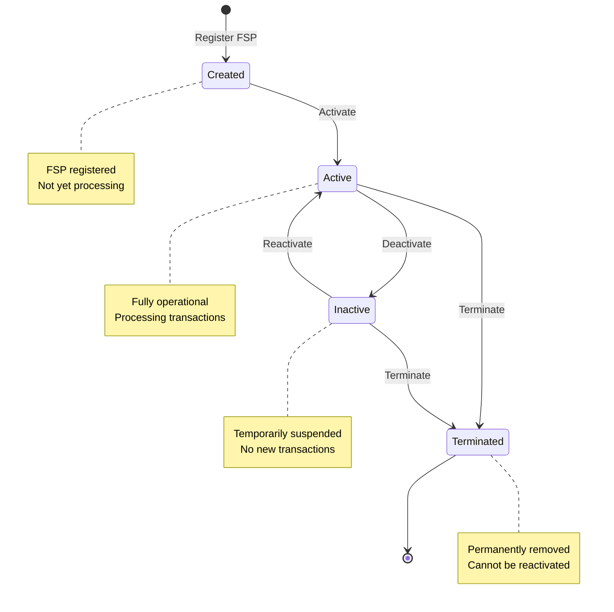
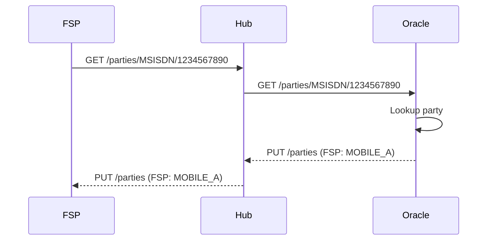

# Participant Management

## Overview

Participant management encompasses the complete lifecycle of all entities that interact with the payment switch: Financial Service Providers (FSPs), the Hub, Oracles, and Settlement Service Providers (SSPs). This module provides comprehensive onboarding, configuration, and lifecycle management capabilities.

## FSP Management

### FSP Onboarding

The process of adding a new FSP to the network:

#### 1. FSP Registration

**Required Information:**
- FSP Code (unique identifier, e.g., "BANK001")
- FSP Name (legal entity name)
- Hub assignment
- Initial activation status

**Example:**
```
FSP Code: BANK001
Name: First Commercial Bank
Hub: NATIONAL_HUB
Status: ACTIVE
Created: 2026-02-04T10:00:00Z
```

**Business Rules:**
- FSP code must be unique within the hub
- FSP code cannot be changed after creation
- Name must be provided and non-empty
- Name cannot exceed 255 characters

#### 2. Currency Configuration

Add currencies that the FSP will support:

**Supported Currencies:**
- Each FSP can support multiple currencies
- Currencies can be added/removed dynamically
- Each currency has independent activation status

**Example:**
```
BANK001 Supported Currencies:
  - USD (ACTIVE)
  - EUR (ACTIVE)
  - KES (INACTIVE)
```

**Commands:**
- Add currency to FSP
- Activate currency
- Deactivate currency
- Remove currency

**Business Rules:**
- Cannot process transfers in unsupported currencies
- Both payer and payee must support the transfer currency
- Currency activation cascades from FSP status

#### 3. Endpoint Configuration

Define how the hub communicates with the FSP:

**Endpoint Types:**

| Type | Purpose | Direction | Example |
|------|---------|-----------|---------|
| **TRANSFERS** | Transfer operations | Bidirectional | https://fsp.example.com/transfers |
| **QUOTES** | Quote requests | Bidirectional | https://fsp.example.com/quotes |
| **PARTIES** | Party lookup | Bidirectional | https://fsp.example.com/parties |
| **PARTICIPANTS** | Participant info | Bidirectional | https://fsp.example.com/participants |
| **INBOUND** | Receive from hub | Inbound | https://fsp.example.com/inbound |
| **OUTBOUND** | Send to hub | Outbound | https://fsp.example.com/outbound |

**Endpoint Configuration:**
```
BANK001 Endpoints:
  TRANSFERS:
    Base URL: https://bank001.example.com/api/transfers
    Status: ACTIVE

  QUOTES:
    Base URL: https://bank001.example.com/api/quotes
    Status: ACTIVE

  PARTIES:
    Base URL: https://bank001.example.com/api/parties
    Status: ACTIVE
```

**Commands:**
- Add endpoint to FSP
- Change endpoint URL
- Activate endpoint
- Deactivate endpoint
- Remove endpoint

**Business Rules:**
- Each endpoint type can only be configured once per FSP
- Endpoint URLs must be valid HTTPS URLs
- Endpoint activation cascades from FSP status

#### 4. Security Configuration

Configure authentication and encryption:

**JWS Key Management:**
- Public key for signature verification
- Private key (FSP holds, not stored in hub)
- Key rotation support
- Key expiration tracking

**Example:**
```
BANK001 Security:
  Public Key ID: KEY_BANK001_2026
  Algorithm: RS256
  Created: 2026-01-01
  Expires: 2027-01-01
  Status: ACTIVE
```

### FSP Lifecycle States



### Activation and Deactivation

#### Activation

**Effect:**
- FSP can send and receive transfers
- All supported currencies activated
- All endpoints activated
- JWS verification enabled

**Cascading Activation:**
When FSP is activated:
1. FSP activation status → ACTIVE
2. All FSP currencies → ACTIVE
3. All FSP endpoints → ACTIVE

**Command:**
```java
ActivateFsp.execute(fspId);
```

#### Deactivation

**Effect:**
- FSP cannot send new transfers
- Cannot receive new transfers
- Existing in-flight transactions completed
- Positions preserved
- Settlement continues

**Cascading Deactivation:**
When FSP is deactivated:
1. FSP activation status → INACTIVE
2. All FSP currencies → INACTIVE
3. All FSP endpoints → INACTIVE

**Command:**
```java
DeactivateFsp.execute(fspId);
```

**Use Cases:**
- Temporary suspension
- Maintenance window
- Compliance hold
- Technical issues

#### Termination

**Effect:**
- FSP permanently removed from network
- Cannot be reactivated
- All positions must be settled
- Historical records preserved
- References remain valid for audit

**Prerequisites:**
- All in-flight transactions completed
- All positions settled to zero
- All reservations released
- Approval from operator

**Command:**
```java
TerminateFsp.execute(fspId, reason, approver);
```

### FSP Domain Model

**Source Reference:**

```java
@Entity
public class Fsp extends JpaEntity<FspId> {
    protected FspId id;
    protected FspCode code;
    protected String name;
    protected ActivationStatus activationStatus;
    protected TerminationStatus terminationStatus;
    protected Set<FspCurrency> currencies;
    protected Set<FspEndpoint> endpoints;
    protected Hub hub;

    // Rich behavior methods
    public void activate() {
        this.activationStatus = ActivationStatus.ACTIVE;
        this.currencies.forEach(FspCurrency::activate);
        this.endpoints.forEach(FspEndpoint::activate);
    }

    public void deactivate() {
        this.activationStatus = ActivationStatus.INACTIVE;
        this.currencies.forEach(FspCurrency::deactivate);
        this.endpoints.forEach(FspEndpoint::deactivate);
    }

    public FspCurrency addCurrency(Currency currency) {
        Objects.requireNonNull(currency);
        final var supportedCurrency = new FspCurrency(this, currency);
        this.currencies.add(supportedCurrency);
        return supportedCurrency;
    }

    public boolean isCurrencySupported(Currency currency) {
        return this.currencies.stream()
            .anyMatch(sc -> sc.getCurrency() == currency && sc.isActive());
    }
}
```

**Source:** `/Users/aungthawaye/Development/Jdev/mojave/modules/core/participant/domain/src/main/java/org/mojave/core/participant/domain/model/fsp/Fsp.java`

## Hub Management

### Hub Configuration

The Hub represents the central payment switch instance.

**Hub Attributes:**
- Hub ID
- Hub code (unique identifier)
- Hub name
- Supported currencies
- Default settings
- Operational parameters

**Example:**
```
Hub ID: HUB_001
Code: NATIONAL_HUB
Name: National Payment Switch
Supported Currencies: USD, EUR, KES
Max Transfer Amount: $100,000
Default NDC: $500,000
Settlement Window: Daily at 23:59
```

### Hub-FSP Relationship

- Each FSP belongs to exactly one hub
- Hub can have multiple FSPs
- Hub enforces network-wide rules
- Hub manages system-wide configuration

## Oracle Management

### Oracle Configuration

**Oracle Attributes:**
- Oracle ID
- Oracle code (unique identifier)
- Oracle name
- Lookup endpoint
- Supported identifier types
- Activation status

**Example:**
```
Oracle ID: ORACLE_001
Code: NATIONAL_ORACLE
Name: National Party Directory
Endpoint: https://oracle.example.com/lookup
Identifier Types: MSISDN, EMAIL, ACCOUNT_ID
Status: ACTIVE
```

### Party Lookup Flow



### Oracle Management Commands

- Create oracle
- Update oracle details
- Change oracle endpoint
- Activate oracle
- Deactivate oracle
- Remove oracle

## Settlement Service Provider (SSP) Management

### SSP Configuration

**SSP Attributes:**
- SSP ID
- SSP code (unique identifier)
- SSP name
- Supported settlement types (DFN, CGS, RTGS)
- Settlement endpoints
- Activation status

**Example:**
```
SSP ID: SSP_001
Code: CENTRAL_BANK_SSP
Name: Central Bank Settlement Service
Settlement Types: RTGS, DFN
Endpoint: https://centralbank.example.com/settlement
Status: ACTIVE
```

### SSP Management Commands

- Create SSP
- Update SSP details
- Add settlement type
- Remove settlement type
- Change settlement endpoint
- Activate SSP
- Deactivate SSP
- Remove SSP

## Multi-Currency Support

### Currency Management

Each participant can support multiple currencies independently:

**FSP Example:**
```
BANK001:
  USD: ACTIVE
  EUR: ACTIVE
  GBP: INACTIVE
  KES: ACTIVE
```

### Currency Validation

Before processing a transfer:
1. Verify payer FSP supports currency (and currency is ACTIVE)
2. Verify payee FSP supports currency (and currency is ACTIVE)
3. Verify hub supports currency
4. Verify settlement provider supports currency

**Validation Logic:**
```java
boolean canProcessTransfer(FspId payerFspId, FspId payeeFspId, Currency currency) {
    Fsp payerFsp = fspRepository.findById(payerFspId);
    Fsp payeeFsp = fspRepository.findById(payeeFspId);

    return payerFsp.isCurrencySupported(currency)
        && payeeFsp.isCurrencySupported(currency)
        && hub.supports(currency);
}
```

## Participant Queries

### Query Capabilities

**Get FSP by Code:**
```java
Fsp getFsp(FspCode code);
```

**Get FSP by ID:**
```java
Fsp getFsp(FspId id);
```

**List all FSPs:**
```java
List<Fsp> getAllFsps();
```

**List active FSPs:**
```java
List<Fsp> getActiveFsps();
```

**Get FSPs supporting currency:**
```java
List<Fsp> getFspsByCurrency(Currency currency);
```

**Get FSP endpoints:**
```java
Map<EndpointType, FspEndpoint> getEndpoints(FspId fspId);
```

### Participant Store (Cache)

Frequently accessed participant data cached in Redis:

**Cache Keys:**
- `participant:fsp:{code}` → Full FSP data
- `participant:endpoints:{code}` → FSP endpoints
- `participant:currencies:{code}` → Supported currencies

**Cache Refresh:**
- Cache-aside pattern
- TTL: 1 hour
- Invalidate on update
- Warm cache on startup

## Participant Reporting

### FSP Directory

Generate list of all FSPs with:
- FSP code and name
- Supported currencies
- Activation status
- Endpoint URLs
- Last activity date

### Participant Activity Report

Track participant usage:
- Transaction volume per FSP
- Transaction value per FSP
- Success rate per FSP
- Average transaction amount
- Peak transaction times

### Participant Status Dashboard

Real-time view:
- Active FSPs count
- Inactive FSPs count
- Total supported currencies
- Endpoint health status
- Recent activations/deactivations

## Administrative Operations

### Bulk Operations

**Bulk Currency Activation:**
```java
activateAllCurrencies(fspId);
```

**Bulk Endpoint Configuration:**
```java
configureEndpoints(fspId, Map<EndpointType, String> urls);
```

### Emergency Procedures

**Emergency Deactivation:**
- Immediate deactivation of FSP
- Stop all new transactions
- Allow in-flight to complete
- Notify all parties
- Log incident

**Emergency Reactivation:**
- Quick reactivation after emergency
- Verify systems operational
- Clear incident flags
- Resume transaction processing

## Validation Rules

### FSP Code Validation

- Length: 3-20 characters
- Format: Alphanumeric and underscore only
- Case: Usually uppercase
- Uniqueness: Must be unique within hub

### FSP Name Validation

- Length: 1-255 characters
- Required: Cannot be null or empty
- Trimmed: Leading/trailing whitespace removed

### Endpoint URL Validation

- Protocol: Must use HTTPS
- Format: Valid URL structure
- Reachability: Optionally verify endpoint is accessible
- Certificate: Valid TLS certificate

## See Also

- [Participants and Roles](../02-core-concepts/participants-and-roles.md) - Participant concepts
- [Participant Module](../../technical/02-core-modules/participant-module.md) - Technical implementation
- [Architecture Overview](../01-overview/architecture-overview.md) - System components
