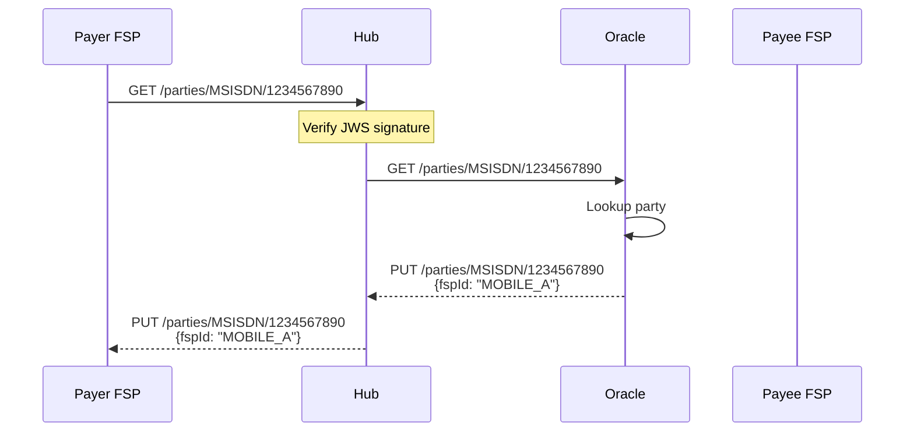
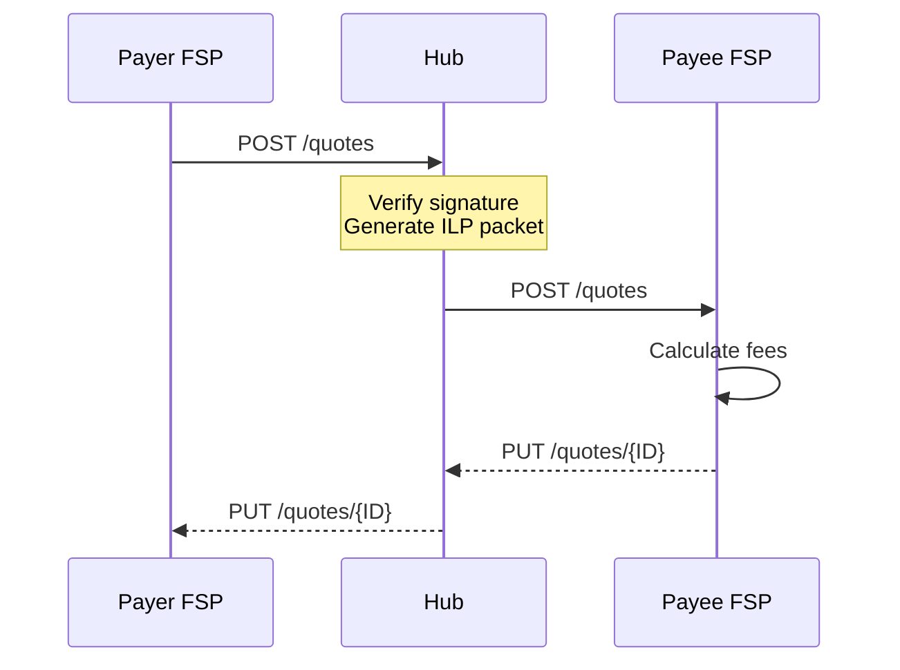
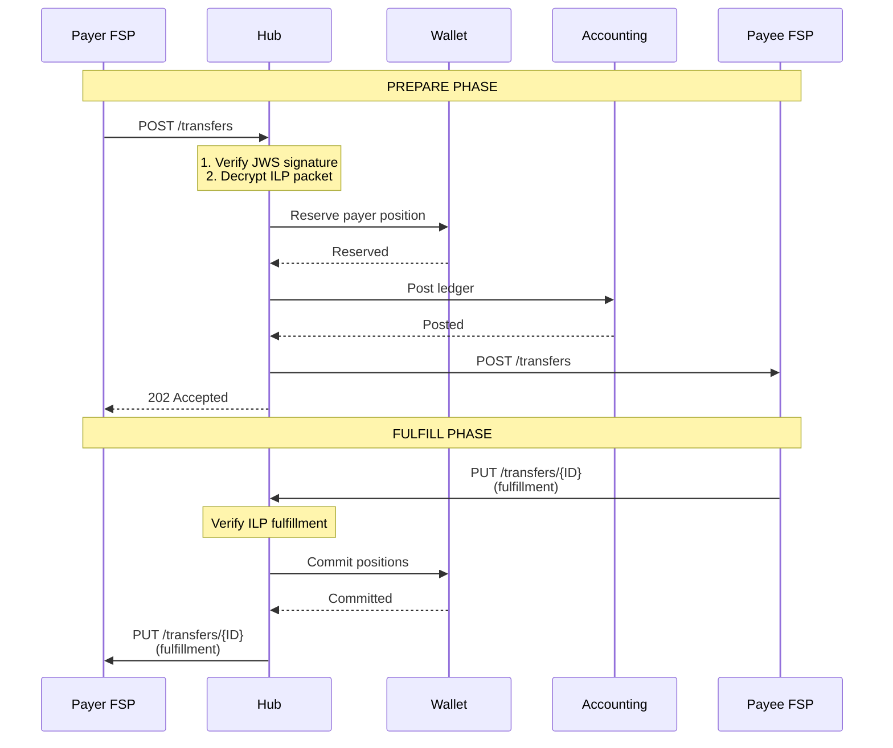

# FSPIOP v2.0 Implementation

## Overview

Mojave implements the Financial Services Provider Interoperability Protocol (FSPIOP) version 2.0, enabling standardized, secure, and interoperable instant payments between financial service providers. This document details Mojave's FSPIOP implementation, supported flows, message formats, and security mechanisms.

## FSPIOP v2.0 Compliance

### Protocol Specification

**Source:** FSPIOP v2.0 OpenAPI Specification
**Location:** `/Users/aungthawaye/Development/Jdev/mojave/modules/scheme/fspiop/interface/fspiop_v2.0.yaml`

**Key Features:**
- RESTful API design
- JSON message format
- JWS signature verification
- Idempotency guarantees
- Standard error handling
- Asynchronous request/response pattern

### Supported FSPIOP Flows

Mojave supports the three core FSPIOP flows:

1. **Party Lookup** - Discover which FSP holds an account
2. **Quoting** - Get quote for transfer including fees
3. **Transfers** - Execute transfer with prepare/fulfill pattern

## Party Lookup Flow

### Purpose

Enable FSPs to discover which institution holds a specific party's account.

### Endpoints

**GET /parties/{Type}/{ID}**
- Request party information
- Type: MSISDN, EMAIL, ACCOUNT_ID, etc.
- ID: The party identifier value

**PUT /parties/{Type}/{ID}**
- Return party information
- Includes FSP identifier

### Sequence Diagram



### Example Messages

**GET /parties/MSISDN/1234567890**
```http
GET /parties/MSISDN/1234567890 HTTP/1.1
Host: hub.example.com
FSPIOP-Source: BANK_A
FSPIOP-Destination: ORACLE
Date: Tue, 04 Feb 2026 10:30:00 GMT
FSPIOP-Signature: {signature}
Content-Type: application/vnd.interoperability.parties+json;version=2.0
```

**PUT /parties/MSISDN/1234567890**
```json
{
  "party": {
    "partyIdInfo": {
      "partyIdType": "MSISDN",
      "partyIdentifier": "1234567890",
      "fspId": "MOBILE_A"
    },
    "name": "Alice Mobile",
    "personalInfo": {
      "complexName": {
        "firstName": "Alice",
        "lastName": "Mobile"
      }
    }
  }
}
```

## Quote Flow

### Purpose

Request fee and exchange rate information before executing a transfer.

### Endpoints

**POST /quotes**
- Request quote for transfer
- Includes payer, payee, amount

**PUT /quotes/{ID}**
- Return quote with fees and total

### Sequence Diagram



### Example Messages

**POST /quotes**
```json
{
  "quoteId": "QUO_123456789",
  "transactionId": "TXN_987654321",
  "payer": {
    "partyIdInfo": {
      "partyIdType": "MSISDN",
      "partyIdentifier": "1234567890",
      "fspId": "BANK_A"
    }
  },
  "payee": {
    "partyIdInfo": {
      "partyIdType": "MSISDN",
      "partyIdentifier": "0987654321",
      "fspId": "MOBILE_A"
    }
  },
  "amountType": "SEND",
  "amount": {
    "currency": "USD",
    "amount": "100.00"
  },
  "transactionType": {
    "scenario": "TRANSFER",
    "initiator": "PAYER",
    "initiatorType": "CONSUMER"
  }
}
```

**PUT /quotes/{ID}**
```json
{
  "transferAmount": {
    "currency": "USD",
    "amount": "100.00"
  },
  "payeeReceiveAmount": {
    "currency": "USD",
    "amount": "98.50"
  },
  "payeeFspFee": {
    "currency": "USD",
    "amount": "1.50"
  },
  "ilpPacket": "base64_encoded_ilp_packet",
  "condition": "ilp_condition_hash",
  "expiration": "2026-02-04T10:31:00Z"
}
```

## Transfer Flow

### Purpose

Execute irrevocable transfer of funds between FSPs.

### Endpoints

**POST /transfers**
- Prepare transfer (reserve funds)
- Includes ILP packet and condition

**PUT /transfers/{ID}**
- Fulfill transfer (commit funds)
- Includes ILP fulfillment

### Sequence Diagram



### Example Messages

**POST /transfers**
```json
{
  "transferId": "TRF_123456789",
  "payerFsp": "BANK_A",
  "payeeFsp": "MOBILE_A",
  "amount": {
    "currency": "USD",
    "amount": "100.00"
  },
  "ilpPacket": "base64_encoded_ilp_packet",
  "condition": "ilp_condition_hash",
  "expiration": "2026-02-04T10:31:00Z"
}
```

**PUT /transfers/{ID}**
```json
{
  "fulfilment": "ilp_fulfilment_value",
  "completedTimestamp": "2026-02-04T10:30:05Z",
  "transferState": "COMMITTED"
}
```

## Message Format

### Content Type

All FSPIOP messages use interoperability content types:

```
application/vnd.interoperability.parties+json;version=2.0
application/vnd.interoperability.quotes+json;version=2.0
application/vnd.interoperability.transfers+json;version=2.0
```

### JSON Structure

- CamelCase field names
- ISO 8601 timestamps
- Decimal amounts as strings
- Required vs optional fields per spec

## FSPIOP Headers

### Required Headers

**FSPIOP-Source**
- FSP code of the sender
- Example: `BANK_A`

**FSPIOP-Destination**
- FSP code of the receiver
- Example: `MOBILE_A`

**Date**
- RFC 7231 format
- Example: `Tue, 04 Feb 2026 10:30:00 GMT`

**FSPIOP-Signature**
- JWS signature of request
- Includes protected headers and payload

**Content-Type**
- Interoperability content type
- Version specified

### Optional Headers

**FSPIOP-HTTP-Method**
- Original HTTP method (for callbacks)

**FSPIOP-URI**
- Original URI (for callbacks)

**FSPIOP-Encryption**
- Encryption method if used

## JWS Signature Verification

### Signature Generation

```java
public class FspiopSignature {
    public static Header sign(PrivateKey privateKey,
                              Map<String, String> headers,
                              String payload) {
        var token = Jwt.sign(privateKey, headers, payload);
        return new Header(token.signature(), token.header());
    }
}
```

### Signature Verification

```java
public class FspiopServiceGatekeeper {
    public Authentication authenticate(HttpServletRequest request) {
        verifyRequestAge(request);      // Prevent replay attacks
        verifyFsps(request);            // Validate source/destination
        return authenticateUsingJws(request);  // JWS verification
    }
}
```

### Signature Components

**Protected Headers:**
```json
{
  "alg": "RS256",
  "typ": "JWT",
  "kid": "KEY_BANK001_2026"
}
```

**JWS Payload:**
- HTTP method
- URI
- Headers (FSPIOP-Source, FSPIOP-Destination, Date)
- Request body (for POST/PUT)

## Error Handling

### FSPIOP Error Codes

| Code | Category | Description |
|------|----------|-------------|
| 1xxx | Client errors | Validation, malformed requests |
| 2xxx | Server errors | Internal processing failures |
| 3xxx | Payer errors | Payer-specific issues |
| 4xxx | Payee errors | Payee-specific issues |
| 5xxx | Timeout errors | Expiration, timeout |

### Standard Error Response

**PUT /{resource}/{ID}/error**
```json
{
  "errorInformation": {
    "errorCode": "3100",
    "errorDescription": "Payer FSP insufficient liquidity",
    "extensionList": {
      "extension": [
        {
          "key": "cause",
          "value": "POSITION_LIMIT_EXCEEDED"
        }
      ]
    }
  }
}
```

### Common Error Scenarios

**Insufficient Funds:**
```
Error Code: 4001
Description: Payer FSP has insufficient funds
```

**Position Limit Exceeded:**
```
Error Code: 3100
Description: Payer FSP has exceeded position limit
```

**Transfer Expired:**
```
Error Code: 5001
Description: Transfer has expired
```

**Invalid Signature:**
```
Error Code: 1001
Description: JWS signature verification failed
```

## Idempotency

### Duplicate Request Handling

FSPIOP guarantees idempotency for all operations:

**First Request:**
- Process normally
- Return 202 Accepted (for async ops)
- Store result

**Duplicate Request:**
- Detect same transfer ID
- Return 200 OK
- Return original result
- No new processing

### Implementation

```java
if (transferExists(transferId)) {
    return StoredResult.get(transferId);
}

// Process new transfer
var result = processTransfer(transfer);
StoredResult.save(transferId, result);
return result;
```

## Security Controls

### Request Age Verification

Prevent replay attacks:

```java
var requestAge = Duration.between(requestDate, Instant.now());
if (requestAge.compareTo(maxAge) > 0) {
    throw new RequestTooOldException();
}
```

Default max age: 5 seconds (configurable)

### FSP Validation

```java
// Verify source FSP exists and is active
Fsp sourceFsp = getFsp(request.getHeader("FSPIOP-Source"));
if (!sourceFsp.isActive()) {
    throw new InactiveFspException();
}

// Verify destination FSP exists and is active
Fsp destFsp = getFsp(request.getHeader("FSPIOP-Destination"));
if (!destFsp.isActive()) {
    throw new InactiveFspException();
}
```

### ILP Packet Encryption

Transfer details encrypted in ILP packet:

```java
var ilpPacket = IlpPacket.decrypt(encryptedPacket);
var transferAmount = ilpPacket.getAmount();
var condition = ilpPacket.getCondition();
```

## See Also

- [Mojave Introduction](../01-overview/mojave-introduction.md) - Project overview
- [Transfer Flow](../../technical/03-flows/transfer-flow.md) - Detailed transfer implementation
- [FSPIOP Rail Overview](../../technical/04-rails/fspiop-rail-overview.md) - Technical architecture
- [FSPIOP Transfer Processing](../../technical/04-rails/fspiop-transfer-processing.md) - Transfer handler details
