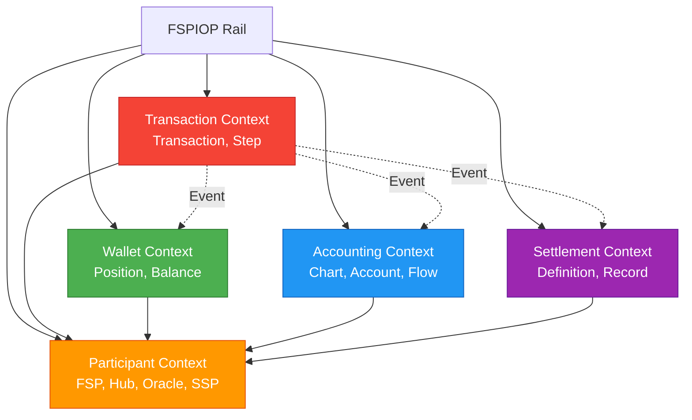

# Bounded Contexts

## Overview

Mojave implements Domain-Driven Design with five clearly defined bounded contexts: Participant, Accounting, Wallet, Settlement, and Transaction. Each context has its own domain model, commands, and responsibilities, with well-defined boundaries and integration points.

## Context Map



## Participant Context

**Responsibility:** Manage all participants in the payment network

**Aggregates:**
- Fsp (Financial Service Provider)
- Hub (Central payment switch)
- Oracle (Party lookup service)
- Ssp (Settlement Service Provider)

**Key Operations:**
- FSP onboarding and lifecycle
- Currency configuration per FSP
- Endpoint management
- Activation/deactivation

**Published Events:**
- FspCreated
- FspActivated
- FspDeactivated
- FspTerminated

**Dependencies:**
- None (foundational context)

## Accounting Context

**Responsibility:** Double-entry bookkeeping for all financial movements

**Aggregates:**
- Chart (Chart of accounts structure)
- Account (Individual ledger account)
- FlowDefinition (Transaction type → posting rules)
- PostingDefinition (Debit/credit rules)

**Key Operations:**
- Chart of accounts management
- Account creation and balance tracking
- Flow definition configuration
- Ledger posting (atomic double-entry)

**Published Events:**
- LedgerPosted
- AccountCreated
- FlowDefinitionActivated

**Dependencies:**
- Participant (for account ownership)

## Wallet Context

**Responsibility:** Manage FSP liquidity positions and Net Debit Cap enforcement

**Aggregates:**
- Position (FSP liquidity per currency)
- Balance (Alternative representation)
- PositionUpdate (Audit trail)

**Key Operations:**
- Position reservation
- Position commitment
- Position rollback
- NDC limit enforcement
- Deposit/withdrawal

**Published Events:**
- PositionReserved
- PositionCommitted
- PositionRolledBack
- NDCLimitApproached

**Dependencies:**
- Participant (for position ownership)

## Settlement Context

**Responsibility:** Settlement provider matching and settlement lifecycle

**Aggregates:**
- SettlementDefinition (Routing rules)
- FilterGroup (FSP grouping)
- FilterItem (Individual FSP in group)
- SettlementRecord (Individual settlement)

**Key Operations:**
- Settlement definition configuration
- Provider matching algorithm
- Settlement initiation
- Settlement completion tracking

**Published Events:**
- SettlementInitiated
- SettlementCompleted
- SettlementFailed

**Dependencies:**
- Participant (for FSP and SSP references)

## Transaction Context

**Responsibility:** Transaction lifecycle and audit trail

**Aggregates:**
- Transaction (Payment transaction)
- TransactionStep (Step-by-step execution)

**Key Operations:**
- Transaction creation
- Phase transitions
- Step recording
- Transaction closure

**Published Events:**
- TransactionCreated
- TransactionCommitted
- TransactionAborted
- TransactionClosed

**Dependencies:**
- Participant (for FSP references)

## Integration Patterns

### Shared Kernel

Common data types shared across contexts:

```
core/common/datatype/
├── identifier/      Strongly-typed IDs
├── enums/          Domain enumerations
└── type/           Value objects
```

**Examples:**
- `Currency` - Used by all contexts
- `TransactionType` - Shared between Transaction and Accounting
- `ActivationStatus` - Used by Participant and Settlement

### Anti-Corruption Layer

Rail modules act as anti-corruption layer between FSPIOP protocol and domain:

```
FSPIOP Request → Rail Adapter → Domain Commands → Core Logic
```

**Example:**
```java
// Rail layer translates FSPIOP to domain
var transferRequest = unwrapFspiopRequest(httpRequest);

// Invoke domain command
var result = receiveTransferCommand.execute(
    new ReceiveTransferCommand.Input(
        payerFsp, payeeFsp, amount, currency
    )
);
```

### Event-Driven Integration

Contexts communicate via domain events published to Kafka:

```java
// Transaction context publishes
transactionCommittedPublisher.publish(new TransactionCommitted(transactionId));

// Settlement context subscribes
@KafkaListener(topics = "transaction-committed")
public void handle(TransactionCommitted event) {
    initiateSettlement(event.transactionId());
}
```

## Context Boundaries

### What Belongs in Each Context

**Participant:**
- FSP identity and configuration
- Endpoint URLs
- Supported currencies
- Public keys for JWS

**Accounting:**
- Account balances
- Ledger movements
- Flow definitions
- Posting rules

**Wallet:**
- Current positions
- Reserved amounts
- NDC limits
- Position history

**Settlement:**
- Settlement rules
- FSP groupings
- Settlement records
- SSP assignments

**Transaction:**
- Transaction metadata
- Execution steps
- Phase transitions
- Audit trail

### What Doesn't Belong

**Participant should NOT:**
- Know about accounting rules
- Track positions
- Manage transactions

**Accounting should NOT:**
- Enforce NDC limits (that's Wallet)
- Route settlements (that's Settlement)
- Track transaction phases (that's Transaction)

**Wallet should NOT:**
- Post to ledger (that's Accounting)
- Create transactions (that's Transaction)
- Match settlement providers (that's Settlement)

## See Also

- [High-Level Architecture](high-level-architecture.md) - System overview
- [Module Structure](module-structure.md) - Module organization
- [Hexagonal Architecture](hexagonal-architecture.md) - Layer patterns
