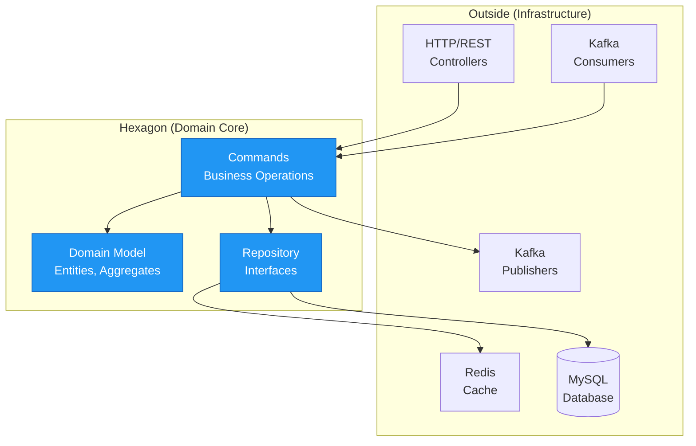

# Hexagonal Architecture

## Overview

Mojave implements hexagonal architecture (also known as ports and adapters) to isolate business logic from infrastructure concerns. Each core module follows a consistent layer structure that enables testability, maintainability, and technology independence.

## Hexagonal Pattern



## Module Layer Structure

Each core bounded context follows this structure:

```
{context}/
├── contract/           PORT: Command/Query interfaces
├── domain/             CORE: Business logic
├── admin/              ADAPTER: Admin REST API
├── admin-client/       ADAPTER: Admin client library
├── intercom/           ADAPTER: Service-to-service API
├── producer/           ADAPTER: Event publishing
├── consumer/           ADAPTER: Event consuming
└── store/              ADAPTER: Caching layer
```

## Layer Details

### contract/ (Port)

**Purpose:** Define contracts without implementation

**Contents:**
- Command interfaces
- Query interfaces
- DTOs (Data Transfer Objects)
- Exception definitions

**Example:**
```java
public interface ReservePositionCommand {
    Output execute(Input input) throws PositionLimitExceededException;

    record Input(
        WalletOwnerId walletOwnerId,
        Currency currency,
        BigDecimal amount,
        TransactionId transactionId,
        Instant transactionAt,
        String description
    ) {}

    record Output(
        PositionUpdateId positionUpdateId,
        BigDecimal oldPosition,
        BigDecimal newPosition
    ) {}
}
```

**Benefits:**
- Technology-agnostic
- Stable API boundary
- Easy to mock for testing
- Clear contracts

### domain/ (Core)

**Purpose:** Implement business logic

**Contents:**
- Entities and aggregates
- Value objects
- Repository interfaces
- Command handlers
- Domain services

**Example Entity:**
```java
@Entity
public class Fsp extends JpaEntity<FspId> {
    protected FspId id;
    protected FspCode code;
    protected String name;
    protected Set<FspCurrency> currencies;
    protected Set<FspEndpoint> endpoints;

    // Rich behavior, not anemic
    public void activate() {
        this.activationStatus = ActivationStatus.ACTIVE;
        this.currencies.forEach(FspCurrency::activate);
        this.endpoints.forEach(FspEndpoint::activate);
    }

    public FspCurrency addCurrency(Currency currency) {
        var supportedCurrency = new FspCurrency(this, currency);
        this.currencies.add(supportedCurrency);
        return supportedCurrency;
    }
}
```

**Example Handler:**
```java
@Service
public class ReservePositionCommandHandler implements ReservePositionCommand {
    private final PositionRepository positionRepository;

    public Output execute(Input input) {
        // Business logic here
        var position = positionRepository.findByOwnerAndCurrency(
            input.walletOwnerId(), input.currency()
        );

        // Check NDC limit
        if (position.wouldExceedNdc(input.amount())) {
            throw new PositionLimitExceededException();
        }

        // Reserve funds
        position.reserve(input.amount(), input.transactionId());

        // Save
        positionRepository.save(position);

        return new Output(positionUpdateId, oldPos, newPos);
    }
}
```

### admin/ (Adapter)

**Purpose:** Administrative REST API

**Port:** 8000-8999

**Contents:**
- REST controllers
- Request/response DTOs
- Validation
- Security configuration

**Example:**
```java
@RestController
@RequestMapping("/admin/fsps")
public class FspAdminController {

    private final CreateFspCommand createFspCommand;

    @PostMapping
    public ResponseEntity<FspResponse> createFsp(
        @RequestBody @Valid CreateFspRequest request
    ) {
        var result = createFspCommand.execute(
            new CreateFspCommand.Input(
                request.code(),
                request.name()
            )
        );

        return ResponseEntity.ok(toResponse(result));
    }
}
```

### admin-client/ (Adapter)

**Purpose:** Client library for admin API

**Contents:**
- Feign clients
- Request/response models
- Client configuration

**Example:**
```java
@FeignClient(name = "participant-admin", url = "${mojave.admin.participant.url}")
public interface ParticipantAdminClient {

    @PostMapping("/admin/fsps")
    FspResponse createFsp(@RequestBody CreateFspRequest request);

    @GetMapping("/admin/fsps/{code}")
    FspResponse getFsp(@PathVariable String code);
}
```

### intercom/ (Adapter)

**Purpose:** Service-to-service communication

**Port:** 9000-9999

**Contents:**
- Internal REST APIs
- Lightweight DTOs
- No heavy validation (trusted callers)

**Example:**
```java
@RestController
@RequestMapping("/intercom/fsps")
public class FspIntercomController {

    private final FspRepository fspRepository;

    @GetMapping("/{code}")
    public FspData getFsp(@PathVariable String code) {
        return fspRepository.findByCode(new FspCode(code))
            .orElseThrow(() -> new FspNotFoundException(code))
            .convert(); // To DTO
    }
}
```

### producer/ (Adapter)

**Purpose:** Publish domain events to Kafka

**Contents:**
- Event publishers
- Kafka templates
- Topic configuration

**Example:**
```java
@Service
public class TransactionCommittedPublisher {

    private final KafkaTemplate<String, TransactionCommitted> kafkaTemplate;

    public void publish(TransactionCommitted event) {
        kafkaTemplate.send(
            TopicNames.TRANSACTION_COMMITTED,
            event.transactionId().toString(),
            event
        );
    }
}
```

### consumer/ (Adapter)

**Purpose:** Listen to domain events from Kafka

**Contents:**
- Event listeners
- Kafka configuration
- Error handling

**Example:**
```java
@Service
public class TransactionCommittedConsumer {

    private final InitiateSettlementCommand initiateSettlement;

    @KafkaListener(topics = TopicNames.TRANSACTION_COMMITTED)
    public void handle(
        TransactionCommitted event,
        Acknowledgment ack
    ) {
        try {
            initiateSettlement.execute(
                new InitiateSettlementCommand.Input(
                    event.transactionId()
                )
            );
            ack.acknowledge();
        } catch (Exception e) {
            // Error handling
            LOGGER.error("Failed to process event", e);
        }
    }
}
```

### store/ (Adapter)

**Purpose:** Read-optimized caching layer

**Contents:**
- Cache implementations
- Redis templates
- Cache key strategies

**Example:**
```java
@Service
public class FspStore {

    private final RedisTemplate<String, FspData> redisTemplate;
    private final FspRepository fspRepository;

    public FspData getFsp(FspCode code) {
        String key = "participant:fsp:" + code.value();

        // Try cache
        FspData cached = redisTemplate.opsForValue().get(key);
        if (cached != null) {
            return cached;
        }

        // Load from DB
        Fsp fsp = fspRepository.findByCode(code)
            .orElseThrow(() -> new FspNotFoundException(code));

        FspData data = fsp.convert();

        // Cache for 1 hour
        redisTemplate.opsForValue().set(key, data, Duration.ofHours(1));

        return data;
    }
}
```

## Dependency Direction

### Core Principle: Dependencies point inward

```
Adapters → Ports → Core
```

**Allowed:**
- admin/ → contract/
- admin/ → domain/ (through contract/)
- domain/ implements contract/

**Not Allowed:**
- contract/ → admin/
- domain/ → producer/
- domain/ → consumer/

## Benefits of Hexagonal Architecture

### 1. Testability

**Unit Test Business Logic:**
```java
@Test
void shouldReservePosition() {
    // Mock repository (adapter)
    var repository = mock(PositionRepository.class);
    when(repository.findByOwnerAndCurrency(...))
        .thenReturn(position);

    // Test core logic
    var handler = new ReservePositionCommandHandler(repository);
    var result = handler.execute(input);

    // Assert
    assertThat(result.newPosition()).isEqualTo(expectedPosition);
}
```

**No need for:**
- HTTP server
- Database
- Kafka
- Redis

### 2. Technology Independence

**Replace Database:**
```java
// Old: MySQL implementation
class MysqlPositionRepository implements PositionRepository { ... }

// New: PostgreSQL implementation
class PostgresPositionRepository implements PositionRepository { ... }

// Core logic unchanged!
```

### 3. Multiple Adapters

Same core, different interfaces:
```
Admin REST API (8003) ────┐
                           ├─→ Wallet Core ←─ Intercom API (9003)
Kafka Consumer ───────────┘
```

### 4. Clear Boundaries

```java
// Port (contract)
public interface PostLedgerFlowCommand {
    Output execute(Input input);
}

// Core (domain)
@Service
public class PostLedgerFlowCommandHandler implements PostLedgerFlowCommand {
    public Output execute(Input input) { ... }
}

// Adapter (admin)
@RestController
public class AccountingAdminController {
    private final PostLedgerFlowCommand command; // Depends on port, not impl
}
```

## See Also

- [High-Level Architecture](high-level-architecture.md) - System overview
- [Module Structure](module-structure.md) - Module organization
- [Bounded Contexts](bounded-contexts.md) - DDD contexts
