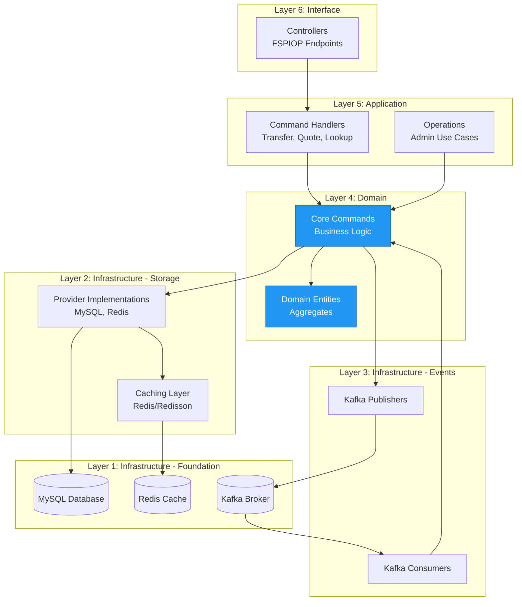
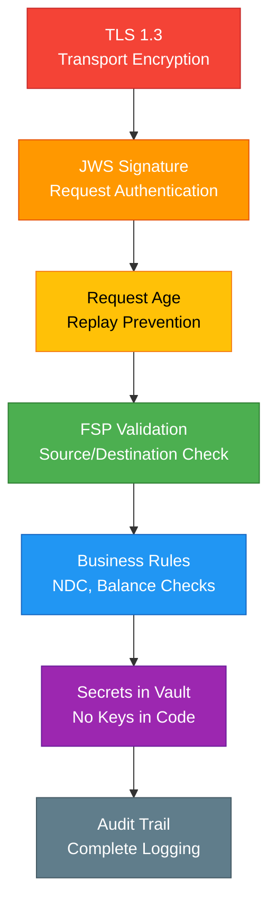

# High-Level Architecture

## Overview

Mojave is architected as a modular monolith with 83 modules organized into 7 categories, following Domain-Driven Design principles and hexagonal architecture patterns. This document provides a comprehensive technical overview of the system's architecture, technology stack, and design decisions.

## Technology Stack

### Core Platform
- **Java 25** - Latest LTS with modern features (records, pattern matching, text blocks)
- **Spring Boot 4.0.2** - Application framework, dependency injection, auto-configuration
- **Maven 3.9+** - Build tool and dependency management

### Data Persistence
- **MySQL 8.0** - Primary relational database
- **HikariCP** - High-performance JDBC connection pooling
- **JPA/Hibernate** - ORM with custom mappings
- **Flyway** - Database schema version control and migrations

### Messaging & Events
- **Apache Kafka 3.0+** - Event streaming platform
- **Kafka Streams** - Stream processing
- **Manual Acknowledgment** - At-least-once delivery guarantees

### Caching & Performance
- **Redis 7.0** - In-memory data store
- **Redisson** - Redis Java client with advanced features
- **LZ4 Compression** - Cache payload compression
- **Dual-client architecture** - Operations vs pub/sub

### Security
- **HashiCorp Vault** - Secrets management (KV v2 engine)
- **JWS (JSON Web Signature)** - Request authentication
- **TLS 1.3** - Transport layer security
- **RS256 Algorithm** - RSA signatures

### Protocol
- **FSPIOP v2.0** - Financial Services Provider Interoperability Protocol
- **OpenAPI 3.0** - API specifications
- **RESTful APIs** - HTTP-based interfaces

## Module Organization

### Total Module Count: 83

```
mojave/
├── component/          # 6 infrastructure modules
├── scheme/             # 1 protocol definition module
├── core/               # 40 domain modules (5 contexts × 8 modules)
├── provider/           # 3 storage implementation modules
├── operation/          # Administrative modules
├── connector/          # 2 integration modules
└── rail/               # 15 FSPIOP implementation modules (3 services × 5)
```

## Layer Architecture



## Communication Patterns

### Synchronous Communication

**REST APIs:**
- FSPIOP protocol endpoints
- Admin APIs (8000-8999 ports)
- Intercom APIs (9000-9999 ports)
- Direct method invocation within JVM

**Database Queries:**
- JPA repositories
- MySQL stored procedures
- Read/write splitting

### Asynchronous Communication

**Kafka Topics:**
```
Topic: close-transaction
Topic: forward-transfer
Topic: abort-transfer
Topic: rollback-reservation
```

**Publishing Pattern:**
```java
@Service
public class CloseTransactionPublisher {
    public void publish(CloseTransactionCommand.Input input) {
        kafkaTemplate.send(
            TopicNames.CLOSE_TRANSACTION,
            input.transactionId().getId().toString(),
            input
        );
    }
}
```

**Consuming Pattern:**
```java
@KafkaListener(topics = TopicNames.CLOSE_TRANSACTION)
public void handle(CloseTransactionCommand.Input input, Acknowledgment ack) {
    closeTransactionCommand.execute(input);
    ack.acknowledge();
}
```

## Port Allocation Strategy

### Admin APIs (8000-8999)
Management and configuration interfaces:
```
8001 - Participant Admin
8002 - Accounting Admin
8003 - Wallet Admin
8004 - Settlement Admin
8005 - Transaction Admin
```

### Intercom APIs (9000-9999)
Service-to-service communication:
```
9001 - Participant Intercom
9002 - Accounting Intercom
9003 - Wallet Intercom
9004 - Settlement Intercom
9005 - Transaction Intercom
```

### Rail Services (10000+)
FSPIOP protocol endpoints:
```
10001 - Lookup Service
10002 - Quoting Service
10003 - Transfer Service
```

## Database Architecture

### Read/Write Splitting

**Aspect-Based Routing:**
```java
@Aspect
public class ReadAspect {
    @Around("@annotation(org.mojave.component.jpa.routing.Read)")
    public Object around(ProceedingJoinPoint pjp) {
        RoutingDataSource.Context.set(RoutingDataSource.Keys.READ);
        try {
            return pjp.proceed();
        } finally {
            RoutingDataSource.Context.clear();
        }
    }
}
```

**Usage:**
```java
@Read  // Routes to read replica
public List<Transaction> findAll() { ... }

// Default routes to primary
public void save(Transaction txn) { ... }
```

### HikariCP Configuration

Production-optimized connection pooling:
```yaml
hikari:
  maximum-pool-size: 20
  minimum-idle: 5
  connection-timeout: 30000
  idle-timeout: 600000
  max-lifetime: 1800000

  # MySQL optimizations
  cache-prep-stmts: true
  prep-stmt-cache-size: 500
  prep-stmt-cache-sql-limit: 4096
  use-server-prep-stmts: true
  rewrite-batched-statements: true
```

### MySQL Stored Procedures

Critical operations use stored procedures for atomicity:

**sp_post_ledger_batch_with_movements:**
- Atomic double-entry posting
- Duplicate detection
- Balance validation
- Overdraft checks
- Movement record creation

## Caching Strategy

### Multi-Tier Caching

**L1 - Application Cache (JVM):**
- Frequently accessed configuration
- Static reference data
- TTL: Application lifetime

**L2 - Redis Cache:**
- Account information
- Flow definitions
- Participant data
- TTL: 1 hour (configurable)

### Cache Patterns

**Cache-Aside (Lazy Loading):**
```java
public FlowDefinition getFlowDefinition(TransactionType type, Currency currency) {
    String key = "flow:" + type + ":" + currency;

    // Try cache first
    FlowDefinition cached = redisTemplate.opsForValue().get(key);
    if (cached != null) {
        return cached;
    }

    // Load from database
    FlowDefinition fromDb = repository.findByTypeAndCurrency(type, currency);

    // Store in cache
    redisTemplate.opsForValue().set(key, fromDb, Duration.ofHours(1));

    return fromDb;
}
```

**Write-Through:**
```java
public void updateFlowDefinition(FlowDefinition flow) {
    // Update database
    repository.save(flow);

    // Update cache
    String key = "flow:" + flow.getType() + ":" + flow.getCurrency();
    redisTemplate.opsForValue().set(key, flow, Duration.ofHours(1));
}
```

## Security Architecture

### Defense in Depth



### JWS Authentication Flow

```java
// 1. Verify request age
var requestAge = Duration.between(requestDate, Instant.now());
if (requestAge.compareTo(MAX_AGE) > 0) {
    throw new RequestTooOldException();
}

// 2. Validate FSP source/destination
Fsp sourceFsp = participantStore.getFspData(sourceCode);
Fsp destFsp = participantStore.getFspData(destCode);

// 3. Verify JWS signature
PublicKey publicKey = sourceFsp.getPublicKey();
boolean valid = Jwt.verify(publicKey, signature, payload);
```

## Deployment Architecture

### Modular Monolith

**Single Deployment Unit:**
- All 83 modules in one JVM
- Shared memory and resources
- Simplified operations
- Fast local method calls

**Benefits:**
- Lower operational complexity
- Easier debugging and tracing
- No network overhead between modules
- Simplified transaction management

**Scalability:**
- Horizontal scaling (multiple instances)
- Load balancer distribution
- Stateless design enables easy scaling

### Alternative: Selective Microservices

**Option for High-Scale Scenarios:**
```
Core Service (Participant, Accounting, Wallet, Settlement, Transaction)
  ↓
Rail Services (Lookup, Quoting, Transfer) - Scale independently
```

## Performance Optimizations

### Database Optimizations

**1. Connection Pooling:**
- HikariCP with tuned settings
- Prepared statement caching
- Batch rewriting enabled

**2. Stored Procedures:**
- Critical operations in database
- Reduced network round-trips
- Atomic execution

**3. Read Replicas:**
- Read/write splitting
- Scale read operations
- Reduce primary load

### Caching Optimizations

**1. Redis Compression:**
- LZ4 compression codec
- Reduce memory footprint
- Faster network transfer

**2. Cache Key Design:**
- Hierarchical keys
- Efficient invalidation
- Namespace separation

**3. TTL Strategy:**
- Static data: Long TTL (24 hours)
- Dynamic data: Short TTL (1 hour)
- Critical data: Cache-aside pattern

### Application Optimizations

**1. Async Processing:**
- Kafka for fire-and-forget
- Non-blocking operations
- Event-driven workflows

**2. Batch Operations:**
- Batch database inserts
- Bulk cache operations
- Reduced overhead

**3. Lazy Loading:**
- Load entities on demand
- Avoid N+1 queries
- Use JOIN FETCH when needed

## Monitoring and Observability

### Metrics Collection

**Application Metrics:**
- Transaction throughput (TPS)
- Success/failure rates
- Average duration
- Phase distribution

**Infrastructure Metrics:**
- JVM heap usage
- Connection pool utilization
- Cache hit/miss ratio
- Kafka lag

**Business Metrics:**
- Transaction volume by FSP
- Settlement amounts
- Position utilization
- NDC breach warnings

### Logging Strategy

**Log Levels:**
- ERROR: Failures requiring attention
- WARN: Potential issues
- INFO: Key business events
- DEBUG: Detailed troubleshooting

**Structured Logging:**
```java
LOGGER.info("Transaction created: transactionId={}, amount={}, currency={}",
    transactionId, amount, currency);
```

## Scalability Considerations

### Horizontal Scaling

**Stateless Design:**
- No session state in memory
- All state in database/cache
- Any instance can handle any request

**Load Distribution:**
- Load balancer (round-robin, least-conn)
- Kafka partition-based routing
- Database connection pooling per instance

### Vertical Scaling

**JVM Tuning:**
```
-Xms4g -Xmx8g
-XX:+UseG1GC
-XX:MaxGCPauseMillis=200
-XX:+UseStringDeduplication
```

**Resource Sizing:**
- CPU: 4-8 cores minimum
- Memory: 8-16 GB
- Disk: SSD for database
- Network: 1 Gbps minimum

## See Also

- [Module Structure](module-structure.md) - Detailed module organization
- [Bounded Contexts](bounded-contexts.md) - DDD context boundaries
- [Hexagonal Architecture](hexagonal-architecture.md) - Port/adapter pattern
- [Architecture Overview](../../product/01-overview/architecture-overview.md) - High-level system view
