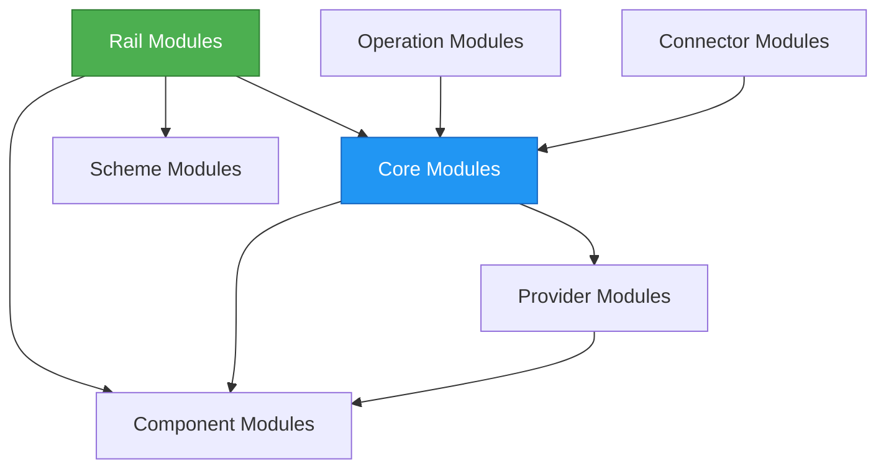

# Module Structure

## Overview

Mojave's 83 modules are organized into 7 categories, each serving a specific architectural purpose. This modular organization follows Domain-Driven Design principles with clear bounded contexts and hexagonal architecture patterns.

## Module Categories

### 1. Component Modules (Infrastructure)

Cross-cutting infrastructure concerns shared across all modules.

**Total:** 6 modules

```
component/
├── flyway/          Database schema migrations
├── jpa/             JPA configuration, read/write splitting
├── kafka/           Kafka producer/consumer factories
├── redis/           Redis/Redisson client configuration
├── vault/           HashiCorp Vault integration
└── misc/            Utilities (crypto, JWT, DDD base classes)
```

#### flyway
**Purpose:** Database schema version control

**Features:**
- Versioned SQL migrations
- Repeatable migrations
- MySQL stored procedure deployment
- Schema initialization

**Migration Example:**
```sql
-- V001__create_participant_tables.sql
CREATE TABLE pcp_fsp (
    fsp_id BIGINT PRIMARY KEY,
    code VARCHAR(20) UNIQUE NOT NULL,
    name VARCHAR(255) NOT NULL,
    ...
);
```

#### jpa
**Purpose:** JPA/Hibernate configuration and utilities

**Features:**
- Read/write data source routing
- Custom entity mappings
- Repository base classes
- Optimistic locking support

**Key Classes:**
```java
@Aspect
public class ReadAspect { ... }

public abstract class JpaEntity<ID> { ... }

public class RoutingDataSource extends AbstractRoutingDataSource { ... }
```

#### kafka
**Purpose:** Kafka integration

**Features:**
- Producer factory configuration
- Consumer factory configuration
- JSON serialization/deserialization
- Manual acknowledgment support

**Configuration:**
```java
@Bean
public ProducerFactory<String, Object> producerFactory() {
    return new DefaultKafkaProducerFactory<>(producerConfigs());
}
```

#### redis
**Purpose:** Redis caching integration

**Features:**
- Redisson client configuration
- Dual-client architecture (ops vs pub/sub)
- LZ4 compression
- Connection pooling

**Configuration:**
```java
@Bean
public RedissonClient redissonClient() {
    Config config = new Config();
    config.useSingleServer()
        .setAddress("redis://" + host + ":" + port)
        .setConnectionPoolSize(poolSize);
    return Redisson.create(config);
}
```

#### vault
**Purpose:** HashiCorp Vault secrets management

**Features:**
- KV v2 engine support
- Token-based authentication
- Secret versioning
- Environment-specific configuration

#### misc
**Purpose:** Common utilities and base classes

**Sub-modules:**
- **crypto:** JWS signing, encryption utilities
- **jwt:** JWT generation and validation
- **ddd:** DDD base classes (Entity, ValueObject, AggregateRoot)
- **event:** Domain event publishing
- **logger:** Structured logging utilities

### 2. Scheme Modules (Protocol Definitions)

Protocol specifications and generated models.

**Total:** 1 module

```
scheme/
└── fspiop/          FSPIOP v2.0 OpenAPI-generated models
```

**Generated Classes:**
- TransfersPostRequest
- TransfersPutRequest
- QuotesPostRequest
- PartiesGetResponse
- ErrorInformation

**Source:** `/Users/aungthawaye/Development/Jdev/mojave/modules/scheme/fspiop/interface/fspiop_v2.0.yaml`

### 3. Core Modules (Domain Bounded Contexts)

Business logic organized by bounded context. Each context has 8 modules following hexagonal architecture.

**Total:** 40 modules (5 contexts × 8 modules each)

**Module Pattern per Context:**
```
{context}/
├── contract/        API contracts (commands, queries, DTOs, exceptions)
├── domain/          Entities, value objects, repositories, handlers
├── admin/           Admin REST APIs (port 800x)
├── admin-client/    Admin client library
├── intercom/        Service-to-service APIs (port 900x)
├── producer/        Kafka event publishers
├── consumer/        Kafka event listeners
└── store/           Read-optimized caching layer
```

#### participant/ (8 modules)

Domain models: Fsp, Hub, Oracle, Ssp, FspCurrency, FspEndpoint

**Commands:**
- CreateFsp, UpdateFsp, ActivateFsp, DeactivateFsp, TerminateFsp
- AddFspCurrency, RemoveFspCurrency
- AddFspEndpoint, ChangeFspEndpoint

**Admin API:** Port 8001
**Intercom API:** Port 9001

#### accounting/ (8 modules)

Domain models: Chart, Account, FlowDefinition, PostingDefinition, Movement

**Commands:**
- CreateChart, CreateAccount
- CreateFlowDefinition, AddPostingDefinition
- PostLedgerFlowCommand
- ManualPostCommand

**Admin API:** Port 8002
**Intercom API:** Port 9002

#### wallet/ (8 modules)

Domain models: Position, Balance, PositionUpdate

**Commands:**
- ReservePositionCommand
- CommitPositionCommand
- RollbackPositionCommand
- DepositCommand, WithdrawCommand

**Admin API:** Port 8003
**Intercom API:** Port 9003

#### settlement/ (8 modules)

Domain models: SettlementDefinition, FilterGroup, FilterItem, SettlementRecord

**Commands:**
- CreateSettlementDefinition
- CreateFilterGroup, AddFilterItem
- InitiateSettlement, PrepareSettlement, CompleteSettlement

**Admin API:** Port 8004
**Intercom API:** Port 9004

#### transaction/ (8 modules)

Domain models: Transaction, TransactionStep

**Commands:**
- CreateTransaction, UpdatePhase
- AddStep, CloseTransaction

**Admin API:** Port 8005
**Intercom API:** Port 9005

### 4. Provider Modules (Storage Implementations)

Concrete implementations of storage interfaces.

**Total:** 3 modules

```
provider/
├── ledger-mysql/    MySQL ledger implementation
├── forex/           Foreign exchange provider
└── settlement/      Settlement provider implementation
```

#### ledger-mysql

**Features:**
- MySQL stored procedure integration
- Atomic double-entry posting
- sp_post_ledger_batch_with_movements
- Balance validation
- Overdraft checks

**Key Classes:**
```java
@Service
public class MysqlLedgerProvider implements LedgerProvider {
    public void postLedgerBatch(List<LedgerPosting> postings) {
        // Call stored procedure
        callableStatement.execute("{call sp_post_ledger_batch_with_movements(?)}");
    }
}
```

### 5. Operation Modules

Administrative use cases and workflows.

**Features:**
- System configuration
- Participant onboarding workflows
- Reporting and analytics
- Data management

### 6. Connector Modules (External Integrations)

Integration with external systems.

**Total:** 2 modules

```
connector/
├── adapter/         Protocol adapters
└── gateway/         API gateway functionality
```

### 7. Rail Modules (Protocol Implementations)

FSPIOP protocol service implementations.

**Total:** 15 modules (3 services × 5 modules each)

**Service Pattern:**
```
{service}/
├── bootstrap/       Controllers, security, configuration
├── component/       FSPIOP-specific utilities
├── contract/        Command interfaces
├── domain/          Command handlers
└── producer/        Event publishers
```

#### lookup/ (5 modules)

**Endpoints:**
- GET /participants/{Type}/{ID}
- PUT /participants/{Type}/{ID}
- GET /parties/{Type}/{ID}
- PUT /parties/{Type}/{ID}

**Port:** 10001

#### quoting/ (5 modules)

**Endpoints:**
- POST /quotes
- GET /quotes/{ID}
- PUT /quotes/{ID}
- PUT /quotes/{ID}/error

**Port:** 10002

#### transfer/ (5 modules)

**Endpoints:**
- POST /transfers
- GET /transfers/{ID}
- PUT /transfers/{ID}
- PUT /transfers/{ID}/error
- PATCH /transfers/{ID}

**Port:** 10003

**Key Classes:**
```java
@RestController
public class TransfersController {
    @PostMapping("/transfers")
    public ResponseEntity<Void> postTransfers(...) { ... }
}

@Service
public class PostTransfersCommandHandler implements PostTransfersCommand {
    public Output execute(Input input) { ... }
}
```

## Module Dependencies

### Dependency Flow



### Dependency Rules

**Allowed:**
- Rails → Core (business logic invocation)
- Core → Provider (storage abstraction)
- All → Component (infrastructure)

**Not Allowed:**
- Core → Rail (domain shouldn't know about protocol)
- Provider → Core (storage shouldn't know about business)
- Horizontal dependencies between core contexts

## Port Allocation

### Admin APIs (8000-8999)

| Port | Module | Purpose |
|------|--------|---------|
| 8001 | Participant Admin | FSP, Hub, Oracle, SSP management |
| 8002 | Accounting Admin | Chart, Account, Flow management |
| 8003 | Wallet Admin | Position, Balance management |
| 8004 | Settlement Admin | Settlement definition management |
| 8005 | Transaction Admin | Transaction queries |

### Intercom APIs (9000-9999)

| Port | Module | Purpose |
|------|--------|---------|
| 9001 | Participant Intercom | Inter-service participant queries |
| 9002 | Accounting Intercom | Inter-service accounting operations |
| 9003 | Wallet Intercom | Inter-service position operations |
| 9004 | Settlement Intercom | Inter-service settlement operations |
| 9005 | Transaction Intercom | Inter-service transaction queries |

### Rail Services (10000+)

| Port | Service | Purpose |
|------|---------|---------|
| 10001 | Lookup | Party and participant lookup |
| 10002 | Quoting | Quote request/response |
| 10003 | Transfer | Transfer prepare/fulfill |

## Module Communication

### Synchronous (Direct Method Call)

Within same bounded context:
```java
@Service
public class SomeCommandHandler {
    private final SomeRepository repository;

    public Output execute(Input input) {
        var entity = repository.findById(input.id());
        entity.doSomething();
        repository.save(entity);
    }
}
```

### Asynchronous (Kafka Events)

Cross-context communication:
```java
// Publisher (in rail module)
@Service
public class CloseTransactionPublisher {
    public void publish(CloseTransactionCommand.Input input) {
        kafkaTemplate.send(TOPIC, input);
    }
}

// Consumer (in transaction module)
@KafkaListener(topics = TOPIC)
public void handle(CloseTransactionCommand.Input input) {
    closeTransactionCommand.execute(input);
}
```

### Intercom APIs

Service-to-service HTTP calls:
```java
@FeignClient(name = "participant-intercom", url = "http://localhost:9001")
public interface ParticipantIntercomClient {
    @GetMapping("/fsps/{code}")
    FspData getFsp(@PathVariable String code);
}
```

## See Also

- [High-Level Architecture](high-level-architecture.md) - System overview
- [Bounded Contexts](bounded-contexts.md) - DDD context boundaries
- [Hexagonal Architecture](hexagonal-architecture.md) - Layer structure per module
