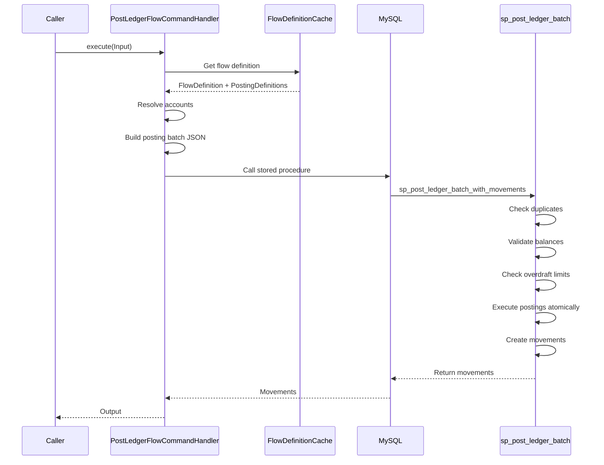

# Accounting Module

## Overview

The Accounting module implements double-entry bookkeeping with configurable flow definitions. It uses MySQL stored procedures for atomic ledger posting and maintains complete audit trails of all financial movements.

## Domain Model

### PostLedgerFlowCommand

**Source:** `/Users/aungthawaye/Development/Jdev/mojave/modules/core/accounting/contract/src/main/java/org/mojave/core/accounting/contract/command/ledger/PostLedgerFlowCommand.java`

```java
public interface PostLedgerFlowCommand {
    Output execute(Input input);

    record Input(
        TransactionType transactionType,
        Currency currency,
        TransactionId transactionId,
        Instant transactionAt,
        Map<String, AccountOwnerId> participants,  // Role → Owner
        Map<String, BigDecimal> amounts            // Variable → Amount
    ) {}

    record Output(
        TransactionId transactionId,
        FlowDefinitionId flowDefinitionId,
        List<Movement> movements
    ) {
        record Movement(
            LedgerMovementId ledgerMovementId,
            AccountId accountId,
            Side side,
            BigDecimal amount,
            DrCr oldDrCr,
            DrCr newDrCr,
            MovementResult movementResult
        ) {}

        record DrCr(BigDecimal debits, BigDecimal credits) {}
    }
}
```

## Ledger Posting Flow



## MySQL Stored Procedure Integration

**sp_post_ledger_batch_with_movements:**

```sql
CREATE PROCEDURE sp_post_ledger_batch_with_movements(
    IN posting_json JSON
)
BEGIN
    -- Parse JSON input
    -- Check for duplicate transaction ID
    -- Validate account balances
    -- Check overdraft limits
    -- Execute UPDATE account SET debits/credits
    -- INSERT INTO ledger_movement
    -- Return movement records
END;
```

**Guarantees:**
- Atomicity: All postings succeed or all fail
- Consistency: Debits always equal credits
- Duplicate detection: Same transaction ID rejected
- Balance validation: Sufficient funds checked

## See Also

- [Accounting Capabilities](../../product/03-features/accounting-capabilities.md) - Features
- [Accounting Model](../../product/02-core-concepts/accounting-model.md) - Concepts
