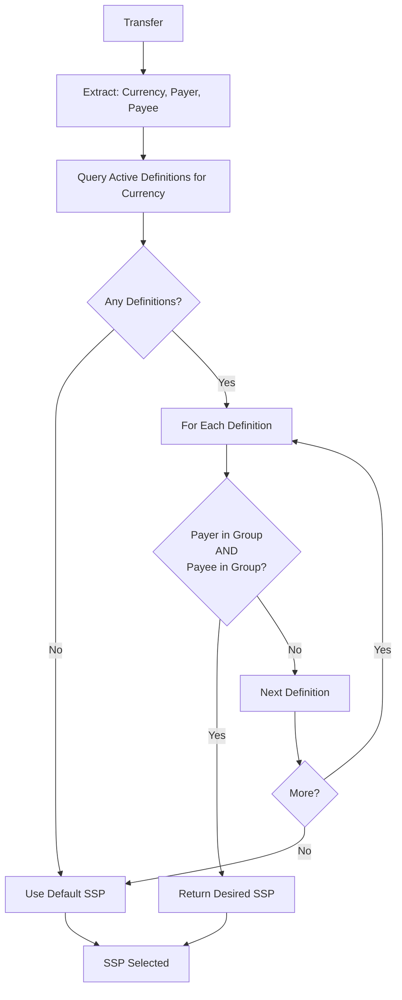

# Settlement Module

## Overview

The Settlement module implements settlement provider matching and settlement lifecycle management with multi-tier FSP filtering.

## Domain Model

### SettlementDefinition

**Source:** `/Users/aungthawaye/Development/Jdev/mojave/modules/core/settlement/domain/src/main/java/org/mojave/core/settlement/domain/model/SettlementDefinition.java`

```java
@Entity
public class SettlementDefinition {
    protected SettlementDefinitionId id;
    protected String name;
    protected FilterGroup payerFilterGroup;
    protected FilterGroup payeeFilterGroup;
    protected Currency currency;
    protected SspId desiredProviderId;
    protected ActivationStatus activationStatus;

    public boolean matches(Currency currency, FspId payerFspId, FspId payeeFspId) {
        return this.currency.equals(currency)
            && this.payerFilterGroup.fspExists(payerFspId)
            && this.payeeFilterGroup.fspExists(payeeFspId);
    }
}
```

## Provider Matching Algorithm



## See Also

- [Settlement Processing](../../product/03-features/settlement-processing.md)
- [Settlement Framework](../../product/02-core-concepts/settlement-framework.md)
