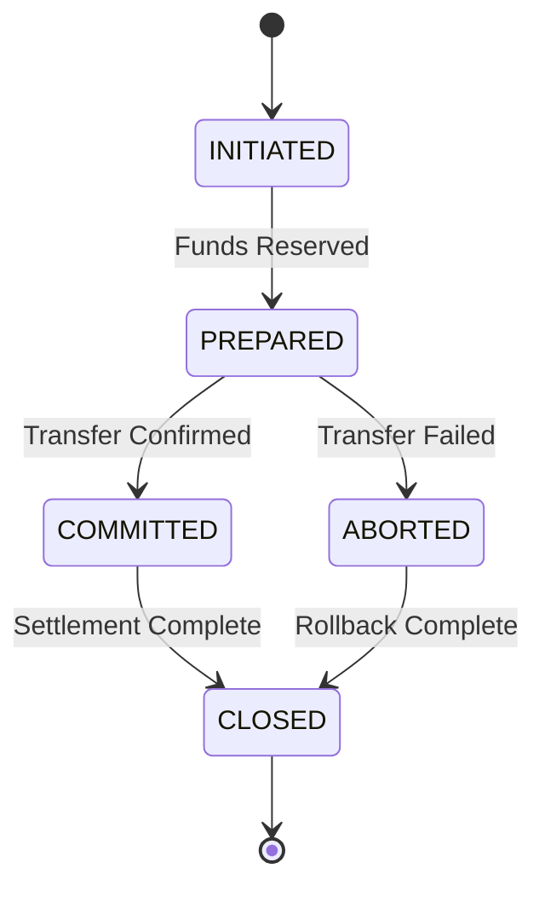

# Transaction Module

## Overview

The Transaction module manages transaction lifecycle with phase tracking and comprehensive audit trails through step-by-step recording.

## Transaction Phases



## Transaction Step Tracking

```java
record TransactionStep(
    TransactionStepId stepId,
    TransactionId transactionId,
    String stepName,
    TransactionPhase phaseBefore,
    TransactionPhase phaseAfter,
    StepStatus status,
    Instant startedAt,
    Instant completedAt,
    Long durationMs
) {}
```

**Example Steps:**
- RECEIVE_TRANSFER
- RESERVE_PAYER_POSITION
- POST_LEDGER_FLOW
- FORWARD_TO_PAYEE
- COMMIT_RESERVATION
- CLOSE_TRANSACTION

## See Also

- [Transaction Tracking](../../product/03-features/transaction-tracking.md)
- [Transaction Lifecycle](../../product/02-core-concepts/transaction-lifecycle.md)
