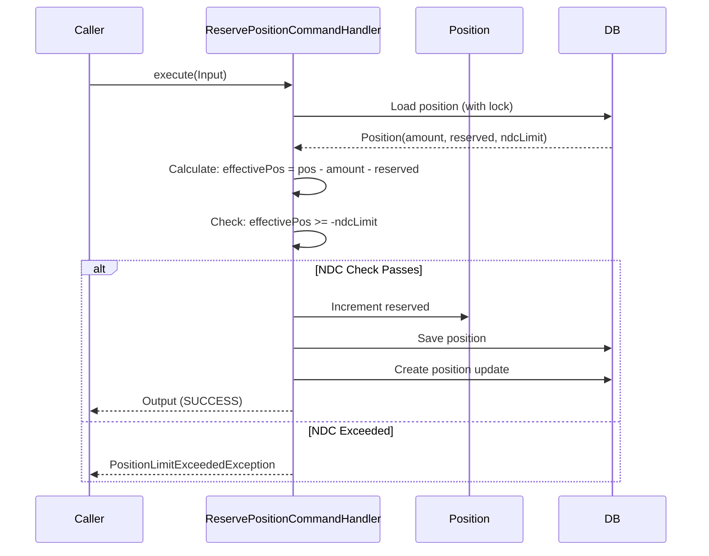

# Wallet Module

## Overview

The Wallet module manages FSP liquidity positions with Net Debit Cap (NDC) enforcement and the reserve-commit-rollback workflow for safe fund management.

## Domain Model

### ReservePositionCommand

**Source:** `/Users/aungthawaye/Development/Jdev/mojave/modules/core/wallet/contract/src/main/java/org/mojave/core/wallet/contract/command/position/ReservePositionCommand.java`

```java
public interface ReservePositionCommand {
    Output execute(Input input);

    record Input(
        WalletOwnerId walletOwnerId,
        Currency currency,
        BigDecimal amount,
        TransactionId transactionId,
        Instant transactionAt,
        String description
    ) {}

    record Output(
        PositionUpdateId positionUpdateId,
        PositionId positionId,
        PositionAction action,
        BigDecimal oldPosition,
        BigDecimal newPosition,
        BigDecimal oldReserved,
        BigDecimal newReserved,
        BigDecimal netDebitCap
    ) {}
}
```

## Position Reservation Flow



### NDC Validation Logic

```java
public class PositionReservationValidator {
    public void validateNdcLimit(
        BigDecimal currentPosition,
        BigDecimal currentReserved,
        BigDecimal reservationAmount,
        BigDecimal ndcLimit
    ) {
        BigDecimal effectivePosition = currentPosition
            .subtract(reservationAmount)
            .subtract(currentReserved);

        if (effectivePosition.compareTo(ndcLimit.negate()) < 0) {
            throw new PositionLimitExceededException(
                "Effective position " + effectivePosition +
                " would exceed NDC limit " + ndcLimit
            );
        }
    }
}
```

## See Also

- [Wallet Management](../../product/03-features/wallet-management.md)
- [Wallet and Positions](../../product/02-core-concepts/wallet-and-positions.md)
