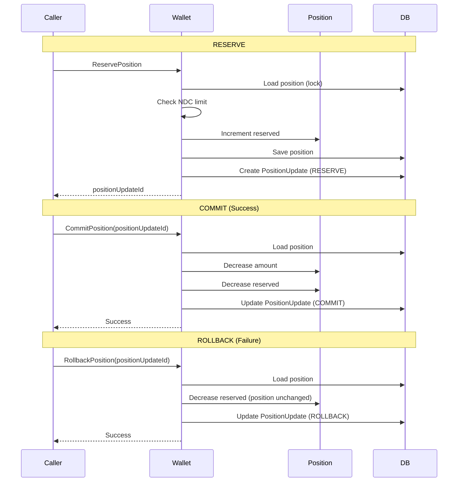

# Position Management Flow

## Overview

Position management flow handles reserve, commit, and rollback operations for FSP liquidity.

## Reserve-Commit-Rollback Workflow

## See Also

- [Wallet Management](../../product/03-features/wallet-management.md)
- [Wallet and Positions](../../product/02-core-concepts/wallet-and-positions.md)
