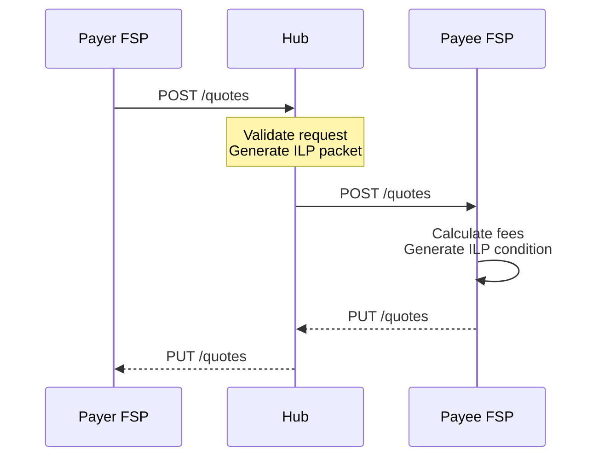

# Quote Flow

## Overview

The quote flow enables FSPs to request fee and exchange rate information before executing a transfer.

## Quote Sequence

## See Also

- [FSPIOP v2 Implementation](../../product/04-payment-specifications/fspiop-v2-implementation.md)
