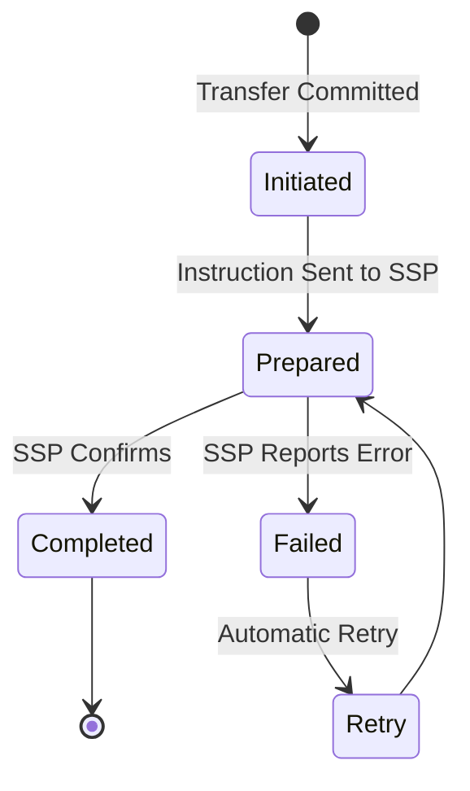

# Settlement Flow

## Overview

Settlement flow manages the lifecycle of settlement from provider matching through completion.

## Settlement Lifecycle

## See Also

- [Settlement Processing](../../product/03-features/settlement-processing.md)
- [Settlement Framework](../../product/02-core-concepts/settlement-framework.md)
