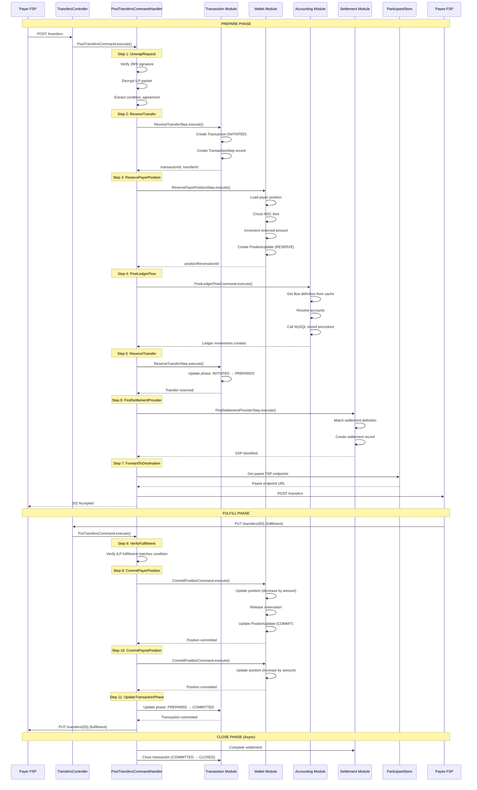

# Transfer Flow

## Overview

The transfer flow is the core payment processing workflow in Mojave. It orchestrates multiple modules to execute a secure, atomic transfer with complete audit trails.

## Complete Transfer Sequence



## Step-by-Step Breakdown

### Step 1: UnwrapRequestStep

**Source:** `/Users/aungthawaye/Development/Jdev/mojave/modules/rail/fspiop/transfer/src/main/java/org/mojave/rail/fspiop/transfer/domain/command/PostTransfersCommandHandler.java`

```java
// 1. Unwrap the request
var unwrapRequestOutput = this.unwrapRequestStep.execute(
    new UnwrapRequestStep.Input(payerFsp, payeeFsp, udfTransferId, request)
);

var ilpCondition = unwrapRequestOutput.ilpCondition();
var ilpPacket = unwrapRequestOutput.ilpPacket();
var agreement = unwrapRequestOutput.agreement();
```

**Actions:**
- Verify JWS signature
- Decrypt ILP packet
- Extract transfer details
- Validate request age
- Check expiration

### Step 2: ReceiveTransferStep

```java
// 2. Open a transaction and receive the transfer
var receiveTransferOutput = this.receiveTransferStep.execute(
    new ReceiveTransferStep.Input(
        payerFsp, payeeFsp, udfTransferId, request.getAmount(),
        ilpCondition, ilpPacket, agreement,
        unwrapRequestOutput.requestExpiration(),
        request.getExtensionList()
    )
);

transactionId = receiveTransferOutput.transactionId();
transferId = receiveTransferOutput.transferId();
```

**Actions:**
- Create Transaction record (phase: INITIATED)
- Store transfer details
- Record timestamp
- Create TransactionStep

### Step 3: ReservePayerPositionStep

```java
// 3. Reserve position of Payer
try {
    reservePayerPositionOutput = this.reservePayerPositionStep.execute(
        new ReservePayerPositionStep.Input(
            udfTransferId, transactionId, transactionAt,
            payerFsp, payeeFsp,
            agreement.transferAmount().getCurrency(),
            new BigDecimal(agreement.transferAmount().getAmount())
        )
    );
    positionReservationId = reservePayerPositionOutput.positionReservationId();

} catch (PositionLimitExceededException e) {
    // Abort and send error to payee
    this.abortTransferStepPublisher.publish(...);
    throw new FspiopException(FspiopErrors.PAYER_LIMIT_ERROR);
}
```

**Actions:**
- Load payer position (with optimistic lock)
- Calculate effective position
- Check NDC limit
- Increment reserved amount
- Create PositionUpdate (RESERVE)

**Error Handling:**
- PositionLimitExceededException → Abort transfer
- NoPositionUpdateForTransactionException → Abort transfer

### Step 4: PostLedgerFlow

Handled by Accounting module:
- Get flow definition from cache
- Resolve participant accounts
- Build posting batch
- Call MySQL stored procedure
- Create ledger movements

### Step 5: ReserveTransferStep

```java
// 4. Update the Transfer as RESERVED
this.reserveTransferStep.execute(
    new ReserveTransferStep.Input(
        udfTransferId, transactionId, transferId, positionReservationId
    )
);
```

**Actions:**
- Update transaction phase: INITIATED → PREPARED
- Link position reservation
- Record timestamp

### Step 6: FindSettlementProvider

Handled by Settlement module:
- Match settlement definition
- Apply filter groups
- Identify SSP
- Create settlement record

### Step 7: ForwardToDestinationStep

```java
// 5. Forward the request to Payee
var payeeBaseUrl = payeeFsp.endpoints().get(EndpointType.TRANSFERS).baseUrl();

this.forwardToDestinationStep.execute(
    new ForwardToDestinationStep.Input(
        udfTransferId, transactionId,
        payeeFspCode.value(), payeeBaseUrl,
        input.request()
    )
);
```

**Actions:**
- Get payee FSP endpoint
- Forward FSPIOP POST /transfers
- Async response expected

**Error Handling:**
- If forwarding fails → Rollback position, abort transfer

### Step 8-11: Fulfillment Phase

When PUT /transfers received from payee:
- Verify ILP fulfillment
- Commit both positions
- Update transaction to COMMITTED
- Forward fulfillment to payer
- Close transaction (async)

## Error Scenarios

### Position Limit Exceeded

```java
catch (PositionLimitExceededException e) {
    this.abortTransferStepPublisher.publish(
        new AbortTransferStep.Input(
            udfTransferId, transactionId, transferId,
            AbortReason.POSITION_LIMIT_EXCEEDED,
            Direction.TO_PAYEE, null
        )
    );
    throw new FspiopException(FspiopErrors.PAYER_LIMIT_ERROR);
}
```

### Transfer Timeout

If payee doesn't respond within expiration:
- Rollback payer position
- Abort transfer
- Send timeout error to payer

### Payee Unreachable

```java
catch (Exception e) {
    this.rollbackReservationStepPublisher.publish(...);
    this.abortTransferStepPublisher.publish(...);
    throw e;
}
```

## Performance Metrics

**Typical Transfer Timeline:**
```
T+0ms    : POST /transfers received
T+100ms  : UnwrapRequest + ReceiveTransfer
T+250ms  : ReservePosition (NDC check)
T+500ms  : PostLedger (stored procedure)
T+600ms  : ForwardToPayee
T+650ms  : 202 Accepted returned
...
T+5000ms : PUT /transfers (fulfillment)
T+5200ms : Commit positions
T+5300ms : Complete
```

## See Also

- [FSPIOP Transfer Processing](../04-rails/fspiop-transfer-processing.md)
- [FSPIOP v2 Implementation](../../product/04-payment-specifications/fspiop-v2-implementation.md)
- [Transaction Lifecycle](../../product/02-core-concepts/transaction-lifecycle.md)
